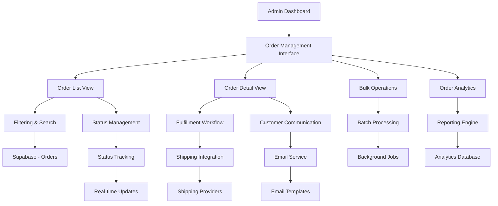

# Design Document

## Overview

The Admin Order Management system provides administrators with comprehensive tools to manage the complete order lifecycle from placement to delivery. The system integrates seamlessly with the existing Nuxt.js/Supabase architecture, following established patterns from the admin dashboard and product management systems.

The design emphasizes efficient order processing workflows, real-time status tracking, and comprehensive order analytics. The system supports both individual order management and bulk operations, with robust error handling and audit trails for all administrative actions.

## Architecture

### System Components



### Data Flow Architecture

The order management system follows a structured data flow:

1. **Order Retrieval** → Database queries with filtering and pagination
2. **Status Updates** → Validation, database updates, and customer notifications
3. **Fulfillment Actions** → Inventory updates, shipping label generation, tracking updates
4. **Bulk Operations** → Queue-based processing with progress tracking
5. **Analytics** → Real-time aggregation and reporting

### Integration Points

- **Existing Admin System**: Leverages admin authentication, layout, and navigation patterns
- **Order Database**: Extends existing Order and OrderItem models
- **Inventory System**: Integrates with product inventory for fulfillment tracking
- **Email System**: Uses existing email infrastructure for customer notifications
- **Analytics**: Connects to admin dashboard analytics for order metrics

## Components and Interfaces

### Core Page Components

#### AdminOrdersIndex.vue
Main order management page with list view and filtering capabilities.

```typescript
interface AdminOrdersIndexProps {
  initialFilters?: OrderFilters
  initialPage?: number
}

interface OrderListState {
  orders: OrderWithDetails[]
  filters: OrderFilters
  pagination: PaginationState
  selectedOrders: number[]
  bulkOperationInProgress: boolean
  loading: boolean
}
```

#### AdminOrderDetail.vue
Detailed order view with fulfillment workflow and management actions.

```typescript
interface AdminOrderDetailProps {
  orderId: number
}

interface OrderDetailState {
  order: OrderWithFullDetails | null
  fulfillmentTasks: FulfillmentTask[]
  statusHistory: OrderStatusChange[]
  customerMessages: CustomerMessage[]
  loading: boolean
  updating: boolean
}
```

### Specialized Components

#### OrderStatusBadge.vue
Reusable status display component with color coding and transitions.

```typescript
interface OrderStatusBadgeProps {
  status: OrderStatus
  size?: 'sm' | 'md' | 'lg'
  showTransition?: boolean
  clickable?: boolean
}
```

#### OrderFulfillmentChecklist.vue
Interactive fulfillment workflow component.

```typescript
interface OrderFulfillmentChecklistProps {
  orderId: number
  currentStatus: OrderStatus
  fulfillmentTasks: FulfillmentTask[]
}

interface FulfillmentTask {
  id: string
  name: string
  description: string
  required: boolean
  completed: boolean
  completedAt?: Date
  completedBy?: string
  dependencies: string[]
}
```

#### BulkOrderActions.vue
Bulk operation interface for multiple order management.

```typescript
interface BulkOrderActionsProps {
  selectedOrderIds: number[]
  availableActions: BulkAction[]
}

interface BulkAction {
  id: string
  name: string
  description: string
  icon: string
  requiresConfirmation: boolean
  validStatuses: OrderStatus[]
}
```

### Store Integration

#### AdminOrdersStore (Pinia)
Manages order data, filtering, and administrative actions.

```typescript
interface AdminOrdersStoreState {
  orders: OrderWithDetails[]
  currentOrder: OrderWithFullDetails | null
  filters: OrderFilters
  pagination: PaginationState
  selectedOrders: number[]
  bulkOperationInProgress: boolean
  loading: boolean
  error: string | null
  lastRefresh: Date | null
}

interface AdminOrdersStoreActions {
  fetchOrders(): Promise<void>
  fetchOrderById(id: number): Promise<OrderWithFullDetails>
  updateOrderStatus(orderId: number, status: OrderStatus, notes?: string): Promise<void>
  updateShippingInfo(orderId: number, trackingNumber: string, carrier: string): Promise<void>
  processRefund(orderId: number, amount: number, reason: string): Promise<void>
  bulkUpdateStatus(orderIds: number[], status: OrderStatus): Promise<void>
  generateShippingLabels(orderIds: number[]): Promise<void>
  sendCustomerMessage(orderId: number, message: string, template?: string): Promise<void>
}
```

## Data Models

### Enhanced Order Types

#### OrderWithDetails
Extended order interface for list views with additional admin data.

```typescript
interface OrderWithDetails extends Order {
  customer: {
    id?: string
    name: string
    email: string
    phone?: string
    totalOrders: number
    lifetimeValue: number
  }
  itemCount: number
  fulfillmentProgress: number
  urgencyLevel: 'low' | 'medium' | 'high'
  estimatedShipDate: Date
  daysSinceOrder: number
  profitMargin: number
}
```

#### OrderWithFullDetails
Complete order interface for detail views.

```typescript
interface OrderWithFullDetails extends OrderWithDetails {
  items: OrderItemWithProduct[]
  statusHistory: OrderStatusChange[]
  fulfillmentTasks: FulfillmentTask[]
  customerMessages: CustomerMessage[]
  shippingDetails?: ShippingDetails
  paymentDetails: PaymentDetails
  refunds: RefundRecord[]
}
```

#### OrderStatusChange
Audit trail for status changes.

```typescript
interface OrderStatusChange {
  id: number
  orderId: number
  fromStatus: OrderStatus
  toStatus: OrderStatus
  changedBy: string
  changedAt: Date
  notes?: string
  automated: boolean
}
```

#### CustomerMessage
Customer communication tracking.

```typescript
interface CustomerMessage {
  id: number
  orderId: number
  direction: 'inbound' | 'outbound'
  message: string
  sentBy?: string
  sentAt: Date
  template?: string
  readAt?: Date
}
```

### Database Schema Extensions

#### Order Management Tables

```sql
-- Enhanced orders table with admin fields
ALTER TABLE orders ADD COLUMN IF NOT EXISTS admin_notes TEXT;
ALTER TABLE orders ADD COLUMN IF NOT EXISTS priority_level INTEGER DEFAULT 1;
ALTER TABLE orders ADD COLUMN IF NOT EXISTS estimated_ship_date DATE;
ALTER TABLE orders ADD COLUMN IF NOT EXISTS tracking_number TEXT;
ALTER TABLE orders ADD COLUMN IF NOT EXISTS shipping_carrier TEXT;
ALTER TABLE orders ADD COLUMN IF NOT EXISTS fulfillment_progress INTEGER DEFAULT 0;

-- Order status history table
CREATE TABLE order_status_history (
  id SERIAL PRIMARY KEY,
  order_id INTEGER REFERENCES orders(id) ON DELETE CASCADE,
  from_status TEXT,
  to_status TEXT NOT NULL,
  changed_by UUID REFERENCES auth.users(id),
  changed_at TIMESTAMP WITH TIME ZONE DEFAULT NOW(),
  notes TEXT,
  automated BOOLEAN DEFAULT FALSE
);

-- Customer messages table
CREATE TABLE order_customer_messages (
  id SERIAL PRIMARY KEY,
  order_id INTEGER REFERENCES orders(id) ON DELETE CASCADE,
  direction TEXT NOT NULL CHECK (direction IN ('inbound', 'outbound')),
  message TEXT NOT NULL,
  sent_by UUID REFERENCES auth.users(id),
  sent_at TIMESTAMP WITH TIME ZONE DEFAULT NOW(),
  template TEXT,
  read_at TIMESTAMP WITH TIME ZONE
);

-- Fulfillment tasks table
CREATE TABLE order_fulfillment_tasks (
  id SERIAL PRIMARY KEY,
  order_id INTEGER REFERENCES orders(id) ON DELETE CASCADE,
  task_type TEXT NOT NULL,
  task_name TEXT NOT NULL,
  description TEXT,
  required BOOLEAN DEFAULT TRUE,
  completed BOOLEAN DEFAULT FALSE,
  completed_at TIMESTAMP WITH TIME ZONE,
  completed_by UUID REFERENCES auth.users(id),
  created_at TIMESTAMP WITH TIME ZONE DEFAULT NOW()
);

-- Indexes for performance
CREATE INDEX idx_orders_status ON orders(status);
CREATE INDEX idx_orders_created_at ON orders(created_at);
CREATE INDEX idx_orders_admin_priority ON orders(priority_level, created_at);
CREATE INDEX idx_order_status_history_order_id ON order_status_history(order_id);
CREATE INDEX idx_order_messages_order_id ON order_customer_messages(order_id);
```

### API Interfaces

#### Order Filtering and Search

```typescript
interface OrderFilters {
  search?: string // Order number, customer name, email
  status?: OrderStatus[]
  paymentStatus?: PaymentStatus[]
  dateRange?: {
    start: Date
    end: Date
  }
  amountRange?: {
    min: number
    max: number
  }
  priority?: number[]
  shippingMethod?: string[]
  sortBy?: 'created_at' | 'total_eur' | 'status' | 'customer_name'
  sortOrder?: 'asc' | 'desc'
}

interface OrderListResponse {
  orders: OrderWithDetails[]
  pagination: PaginationState
  aggregates: {
    totalRevenue: number
    averageOrderValue: number
    statusCounts: Record<OrderStatus, number>
  }
}
```

## Error Handling

### Error Categories

1. **Validation Errors**: Invalid status transitions, missing required fields
2. **Business Logic Errors**: Inventory conflicts, payment processing issues
3. **Integration Errors**: Shipping provider API failures, email delivery issues
4. **Concurrency Errors**: Multiple admin conflicts, stale data updates
5. **System Errors**: Database failures, network timeouts

### Error Handling Strategy

#### Client-Side Error Handling

```typescript
interface AdminOrderError {
  type: 'validation' | 'business' | 'integration' | 'concurrency' | 'system'
  code: string
  message: string
  field?: string
  orderId?: number
  retryable: boolean
  suggestedAction?: string
}

class AdminOrderErrorHandler {
  handleError(error: AdminOrderError): void {
    switch (error.type) {
      case 'validation':
        this.showValidationError(error)
        break
      case 'business':
        this.showBusinessLogicError(error)
        break
      case 'integration':
        this.showIntegrationError(error)
        break
      case 'concurrency':
        this.handleConcurrencyError(error)
        break
      case 'system':
        this.showSystemError(error)
        break
    }
  }
}
```

#### Server-Side Error Responses

```typescript
interface AdminOrderApiResponse<T> {
  success: boolean
  data?: T
  error?: {
    type: string
    code: string
    message: string
    details?: Record<string, any>
    timestamp: string
  }
  warnings?: string[]
}
```

### Recovery Mechanisms

- **Optimistic Updates**: Immediate UI feedback with rollback on failure
- **Conflict Resolution**: Merge strategies for concurrent admin actions
- **Retry Logic**: Automatic retry for transient failures
- **Fallback Options**: Alternative workflows when integrations fail

## Testing Strategy

### Unit Testing

#### Component Testing
- Order list filtering and sorting logic
- Status update validation
- Bulk operation state management
- Error handling scenarios

#### Store Testing
- Order data management
- API integration mocking
- State synchronization
- Pagination logic

### Integration Testing

#### Order Management Flow Testing
```typescript
describe('Admin Order Management Integration', () => {
  test('Complete order fulfillment workflow', async () => {
    // Test full workflow from pending to delivered
  })
  
  test('Bulk status updates with validation', async () => {
    // Test bulk operations with error handling
  })
  
  test('Customer communication integration', async () => {
    // Test message sending and tracking
  })
  
  test('Shipping integration workflow', async () => {
    // Test label generation and tracking updates
  })
})
```

#### Real-time Updates Testing
- WebSocket connection handling
- Status change propagation
- Multi-admin conflict resolution
- Data consistency validation

### End-to-End Testing

#### Critical Admin Workflows
1. **Order Processing**: Complete fulfillment workflow
2. **Bulk Operations**: Multi-order status updates
3. **Customer Communication**: Message sending and tracking
4. **Error Recovery**: Handling of various failure scenarios
5. **Performance**: Large order list handling

#### Performance Testing
- Order list pagination with large datasets
- Real-time update performance
- Bulk operation processing times
- Database query optimization

## Implementation Considerations

### Performance Optimization

#### Client-Side Optimization
- Virtual scrolling for large order lists
- Debounced search and filtering
- Optimistic UI updates
- Efficient state management

#### Server-Side Optimization
- Database query optimization with proper indexing
- Pagination with cursor-based navigation
- Background job processing for bulk operations
- Caching strategies for frequently accessed data

### Security Measures

#### Admin Access Control
- Role-based permissions for order actions
- Audit logging for all administrative actions
- Session management and timeout handling
- IP-based access restrictions

#### Data Protection
- Sensitive data encryption
- PCI compliance for payment information
- GDPR compliance for customer data
- Secure API endpoints with rate limiting

### Accessibility

#### WCAG 2.1 AA Compliance
- Keyboard navigation for all interfaces
- Screen reader compatibility
- High contrast mode support
- Focus management in complex workflows

#### Admin User Experience
- Efficient keyboard shortcuts
- Bulk operation progress indicators
- Clear error messaging and recovery options
- Responsive design for various screen sizes

### Internationalization

#### Multi-language Support
- Localized admin interface
- Translated status labels and messages
- Regional date and currency formatting
- Localized email templates for customer communication

#### Regional Compliance
- Local shipping regulations
- Tax calculation compliance
- Payment method availability
- Legal requirement adherence

## Current Implementation Status

### Foundation Components
- ✅ Admin authentication and layout system
- ✅ Existing Order and OrderItem data models
- ✅ Admin dashboard infrastructure
- ✅ Pinia store patterns established
- ✅ Email notification system

### Required New Components
- 🔧 Admin order management pages
- 🔧 Order filtering and search functionality
- 🔧 Status update workflow components
- 🔧 Fulfillment task management
- 🔧 Bulk operation interfaces
- 🔧 Customer communication system
- 🔧 Order analytics and reporting

### Database Extensions Needed
- 🔧 Order status history tracking
- 🔧 Customer message storage
- 🔧 Fulfillment task definitions
- 🔧 Admin action audit logs
- 🔧 Performance optimization indexes

## Integration Points

### Existing Systems Integration

#### Admin Dashboard Integration
- Leverage existing admin layout and navigation
- Integrate order metrics into dashboard statistics
- Use established admin authentication patterns
- Follow existing admin UI/UX conventions

#### Email System Integration
- Extend existing email templates for order notifications
- Use current email service configuration
- Implement order-specific email triggers
- Maintain email delivery tracking

#### Inventory System Integration
- Connect fulfillment actions to inventory updates
- Implement stock validation during order processing
- Track inventory movements from order fulfillment
- Handle backorder and allocation scenarios

### External Service Integration

#### Shipping Provider Integration
```typescript
interface ShippingProvider {
  name: string
  apiEndpoint: string
  authenticate(): Promise<string>
  createLabel(order: Order, options: ShippingOptions): Promise<ShippingLabel>
  trackPackage(trackingNumber: string): Promise<TrackingInfo>
  calculateRates(order: Order): Promise<ShippingRate[]>
}
```

#### Payment Processing Integration
- Refund processing through existing payment providers
- Payment status synchronization
- Chargeback and dispute handling
- Payment method validation

## Future Enhancements

### Advanced Features
- AI-powered order prioritization
- Automated fulfillment workflows
- Advanced analytics and forecasting
- Mobile admin application
- Voice-activated order processing

### Scalability Considerations
- Microservice architecture migration
- Event-driven order processing
- Distributed caching strategies
- Load balancing for high-volume periods