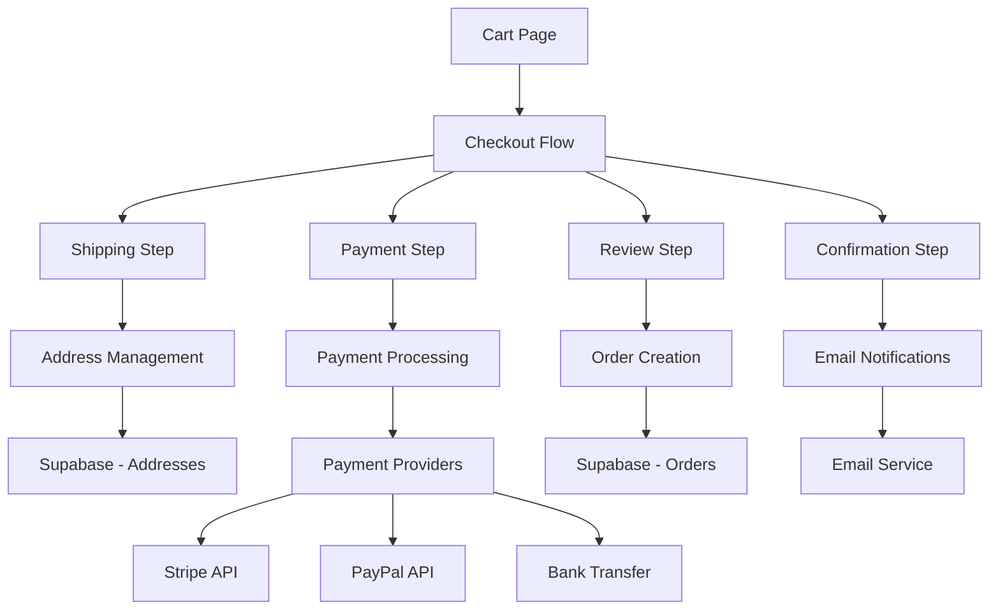

# Design Document

## Overview

The Checkout & Payment Processing system provides a secure, multi-step checkout flow that integrates with the existing cart, authentication, and product catalog systems. The design follows a progressive enhancement approach, supporting both guest and authenticated users while maintaining security best practices and mobile responsiveness.

**Current Implementation:** The system currently operates with cash on delivery as the primary payment method. Online payment methods (credit card, PayPal, bank transfer) are fully implemented and configured but disabled in the UI, allowing for easy future activation when needed.

The system is built on the existing Nuxt.js architecture with Supabase backend, utilizing the established patterns for state management (Pinia stores), internationalization (i18n), and component structure. The checkout flow consists of four main steps: shipping information, payment method selection, order review, and confirmation.

## Architecture

### System Components



### Data Flow Architecture

The checkout system follows a unidirectional data flow pattern:

1. **Cart State** → Checkout initialization with cart validation
2. **User Input** → Form validation and state updates
3. **Payment Processing** → External API integration
4. **Order Creation** → Database persistence
5. **Confirmation** → User notification and cart cleanup

### Integration Points

- **Cart System**: Inherits cart items and validates availability
- **Authentication System**: Supports both guest and authenticated flows
- **Product Catalog**: Validates product availability and pricing
- **Email System**: Sends order confirmations and receipts
- **Analytics**: Tracks checkout funnel and conversion metrics

## Components and Interfaces

### Core Components

#### CheckoutLayout.vue
Main layout component that manages the checkout flow state and navigation.

```typescript
interface CheckoutLayoutProps {
  initialStep?: CheckoutStep
  cartItems: CartItem[]
  user?: AuthUser | null
}

interface CheckoutState {
  currentStep: CheckoutStep
  shippingInfo: ShippingInformation
  paymentMethod: PaymentMethod
  orderSummary: OrderSummary
  loading: boolean
  errors: Record<string, string>
}
```

#### CheckoutSteps Components

**ShippingStep.vue**
- Address form with validation
- Saved addresses for authenticated users
- Guest checkout contact information
- Shipping method selection

**PaymentStep.vue**
- Cash on delivery as primary payment method
- Payment method selection (Credit Card, PayPal, Bank Transfer) - configured but disabled
- Secure payment form integration (ready for future activation)
- Saved payment methods for authenticated users (for future online payments)
- PCI-compliant card input handling (implemented but inactive)

**ReviewStep.vue**
- Complete order summary
- Edit links for previous steps
- Terms and conditions acceptance
- Final price calculation with taxes and shipping

**ConfirmationStep.vue**
- Order confirmation display
- Email confirmation status
- Order tracking information
- Continue shopping options

### Form Components

#### AddressForm.vue
Reusable address input component with validation and country-specific formatting.

```typescript
interface AddressFormProps {
  modelValue: Address
  type: 'shipping' | 'billing'
  savedAddresses?: Address[]
  showSaveOption?: boolean
}

interface Address {
  id?: number
  type: 'shipping' | 'billing'
  firstName: string
  lastName: string
  company?: string
  street: string
  city: string
  postalCode: string
  province?: string
  country: string
  phone?: string
  isDefault?: boolean
}
```

#### PaymentForm.vue
Secure payment method selection and input handling.

```typescript
interface PaymentFormProps {
  modelValue: PaymentMethod
  savedPaymentMethods?: SavedPaymentMethod[]
  showSaveOption?: boolean
}

interface PaymentMethod {
  type: 'cash' | 'credit_card' | 'paypal' | 'bank_transfer'
  cash?: {
    confirmed: boolean
  }
  creditCard?: {
    number: string
    expiryMonth: string
    expiryYear: string
    cvv: string
    holderName: string
  }
  paypal?: {
    email: string
  }
  bankTransfer?: {
    reference: string
  }
  saveForFuture?: boolean
}
```

### Store Integration

#### CheckoutStore (Pinia)
Manages checkout state and orchestrates the checkout process.

```typescript
interface CheckoutStoreState {
  currentStep: CheckoutStep
  shippingInfo: ShippingInformation | null
  paymentMethod: PaymentMethod | null
  orderData: OrderData | null
  processing: boolean
  errors: Record<string, string>
  paymentIntent: string | null
}

interface CheckoutStoreActions {
  initializeCheckout(cartItems: CartItem[]): Promise<void>
  updateShippingInfo(info: ShippingInformation): Promise<void>
  updatePaymentMethod(method: PaymentMethod): Promise<void>
  processPayment(): Promise<PaymentResult>
  createOrder(): Promise<Order>
  completeCheckout(): Promise<void>
  resetCheckout(): void
}
```

## Data Models

### Database Schema Extensions

#### Orders Table
```sql
CREATE TABLE orders (
  id SERIAL PRIMARY KEY,
  order_number TEXT NOT NULL UNIQUE,
  user_id UUID REFERENCES auth.users(id),
  guest_email TEXT,
  status TEXT NOT NULL DEFAULT 'pending',
  payment_method TEXT NOT NULL,
  payment_status TEXT NOT NULL DEFAULT 'pending',
  payment_intent_id TEXT,
  subtotal_eur DECIMAL(10,2) NOT NULL,
  shipping_cost_eur DECIMAL(10,2) NOT NULL,
  tax_eur DECIMAL(10,2) DEFAULT 0,
  total_eur DECIMAL(10,2) NOT NULL,
  shipping_address JSONB NOT NULL,
  billing_address JSONB NOT NULL,
  customer_notes TEXT,
  admin_notes TEXT,
  shipped_at TIMESTAMP WITH TIME ZONE,
  delivered_at TIMESTAMP WITH TIME ZONE,
  created_at TIMESTAMP WITH TIME ZONE DEFAULT NOW(),
  updated_at TIMESTAMP WITH TIME ZONE DEFAULT NOW()
);
```

#### Payment Methods Table (for saved methods)
```sql
CREATE TABLE payment_methods (
  id SERIAL PRIMARY KEY,
  user_id UUID REFERENCES auth.users(id) ON DELETE CASCADE,
  type TEXT NOT NULL CHECK (type IN ('cash', 'credit_card', 'paypal')),
  provider_id TEXT, -- Stripe customer ID, PayPal reference, etc. (NULL for cash)
  last_four TEXT,
  brand TEXT,
  expires_month INTEGER,
  expires_year INTEGER,
  is_default BOOLEAN DEFAULT FALSE,
  created_at TIMESTAMP WITH TIME ZONE DEFAULT NOW()
);
```

### TypeScript Interfaces

#### Checkout Flow Types
```typescript
type CheckoutStep = 'shipping' | 'payment' | 'review' | 'confirmation'

interface CheckoutSession {
  id: string
  cartItems: CartItem[]
  shippingInfo?: ShippingInformation
  paymentMethod?: PaymentMethod
  orderData?: OrderData
  currentStep: CheckoutStep
  expiresAt: Date
}

interface ShippingInformation {
  address: Address
  method: ShippingMethod
  instructions?: string
}

interface ShippingMethod {
  id: string
  name: string
  description: string
  price: number
  estimatedDays: number
}

interface OrderData {
  subtotal: number
  shippingCost: number
  tax: number
  total: number
  currency: string
  items: OrderItem[]
}

interface OrderItem {
  productId: number
  productSnapshot: Product
  quantity: number
  price: number
  total: number
}
```

## Error Handling

### Error Categories

1. **Validation Errors**: Form input validation and business rule violations
2. **Payment Errors**: Payment processing failures and declined transactions
3. **Inventory Errors**: Product availability and stock validation
4. **Network Errors**: API communication failures and timeouts
5. **System Errors**: Database errors and unexpected failures

### Error Handling Strategy

#### Client-Side Error Handling
```typescript
interface CheckoutError {
  type: 'validation' | 'payment' | 'inventory' | 'network' | 'system'
  code: string
  message: string
  field?: string
  retryable: boolean
  userAction?: string
}

class CheckoutErrorHandler {
  handleError(error: CheckoutError): void {
    switch (error.type) {
      case 'validation':
        this.showFieldError(error.field, error.message)
        break
      case 'payment':
        this.showPaymentError(error)
        break
      case 'inventory':
        this.handleInventoryError(error)
        break
      case 'network':
        this.showRetryableError(error)
        break
      case 'system':
        this.showSystemError(error)
        break
    }
  }
}
```

#### Server-Side Error Responses
```typescript
interface ApiErrorResponse {
  success: false
  error: {
    code: string
    message: string
    details?: Record<string, any>
    timestamp: string
  }
}
```

### Recovery Mechanisms

- **Auto-retry**: Network failures with exponential backoff
- **Session Recovery**: Restore checkout state from localStorage
- **Graceful Degradation**: Fallback to simpler payment methods
- **User Guidance**: Clear error messages with suggested actions

## Testing Strategy

### Unit Testing

#### Component Testing
- Form validation logic
- State management actions
- Error handling scenarios
- Payment method integration

#### Store Testing
- Checkout flow state transitions
- API integration mocking
- Error state management
- Data persistence

### Integration Testing

#### Checkout Flow Testing
```typescript
describe('Checkout Flow Integration', () => {
  test('Complete authenticated checkout flow', async () => {
    // Test full flow from cart to confirmation
  })
  
  test('Guest checkout with email collection', async () => {
    // Test guest user flow
  })
  
  test('Payment failure recovery', async () => {
    // Test payment error handling
  })
  
  test('Inventory validation during checkout', async () => {
    // Test stock validation
  })
})
```

#### Payment Integration Testing
- Stripe test card processing
- PayPal sandbox integration
- Bank transfer flow validation
- Saved payment method handling

### End-to-End Testing

#### Critical User Journeys
1. **Happy Path**: Successful order completion
2. **Payment Failures**: Declined card handling
3. **Inventory Issues**: Out-of-stock during checkout
4. **Session Expiry**: Checkout session timeout
5. **Mobile Experience**: Touch-friendly interface testing

#### Performance Testing
- Checkout page load times
- Payment processing latency
- Database query optimization
- Mobile network conditions

### Security Testing

#### Payment Security
- PCI DSS compliance validation
- SSL/TLS certificate verification
- Payment tokenization testing
- Fraud detection integration

#### Data Protection
- Personal information encryption
- GDPR compliance validation
- Session security testing
- Input sanitization verification

## Current Implementation Status

### Active Features
- ✅ Cash on Delivery payment method
- ✅ Complete checkout flow (shipping, payment, review, confirmation)
- ✅ Mobile-responsive design
- ✅ Multi-language support (English, Spanish)
- ✅ Guest and authenticated user support
- ✅ Order management and confirmation emails
- ✅ Comprehensive testing suite

### Configured but Disabled Features
- 🔧 Stripe credit card processing (API integration ready)
- 🔧 PayPal payment integration (SDK integration ready)
- 🔧 Bank transfer payment option (UI and backend ready)
- 🔧 Saved payment methods (database schema and API ready)

### Future Activation Steps

To enable online payment methods:

1. **Environment Configuration**
   ```bash
   # Add to .env
   STRIPE_PUBLISHABLE_KEY=pk_live_...
   STRIPE_SECRET_KEY=sk_live_...
   PAYPAL_CLIENT_ID=...
   PAYPAL_CLIENT_SECRET=...
   PAYPAL_ENVIRONMENT=production
   ```

2. **UI Activation**
   ```typescript
   // In PaymentStep.vue, change:
   const selectPaymentType = (type: PaymentMethod['type']) => {
     // Remove this restriction:
     // if (type !== 'cash') return
     
     paymentMethod.value = { type, saveForFuture: false }
   }
   ```

3. **Testing and Validation**
   - Test payment flows in sandbox environment
   - Validate PCI DSS compliance
   - Perform security audit
   - Test error handling and edge cases

## Implementation Considerations

### Performance Optimization

#### Client-Side Optimization
- Lazy loading of payment provider SDKs
- Form validation debouncing
- Optimistic UI updates
- Progressive enhancement

#### Server-Side Optimization
- Database query optimization
- Payment API response caching
- Order processing queue
- Email delivery optimization

### Security Measures

#### Payment Security
- PCI DSS Level 1 compliance
- Payment tokenization
- SSL/TLS encryption
- Fraud detection integration

#### Data Protection
- Personal data encryption at rest
- Secure session management
- Input validation and sanitization
- GDPR compliance measures

### Accessibility

#### WCAG 2.1 AA Compliance
- Keyboard navigation support
- Screen reader compatibility
- High contrast mode support
- Focus management during flow

#### Mobile Accessibility
- Touch target sizing
- Gesture-based navigation
- Voice input support
- Reduced motion preferences

### Internationalization

#### Multi-language Support
- Localized form labels and validation messages
- Currency formatting and conversion
- Address format localization
- Payment method availability by region

#### Regional Compliance
- EU VAT calculation
- Regional payment method support
- Shipping restriction handling
- Legal requirement compliance