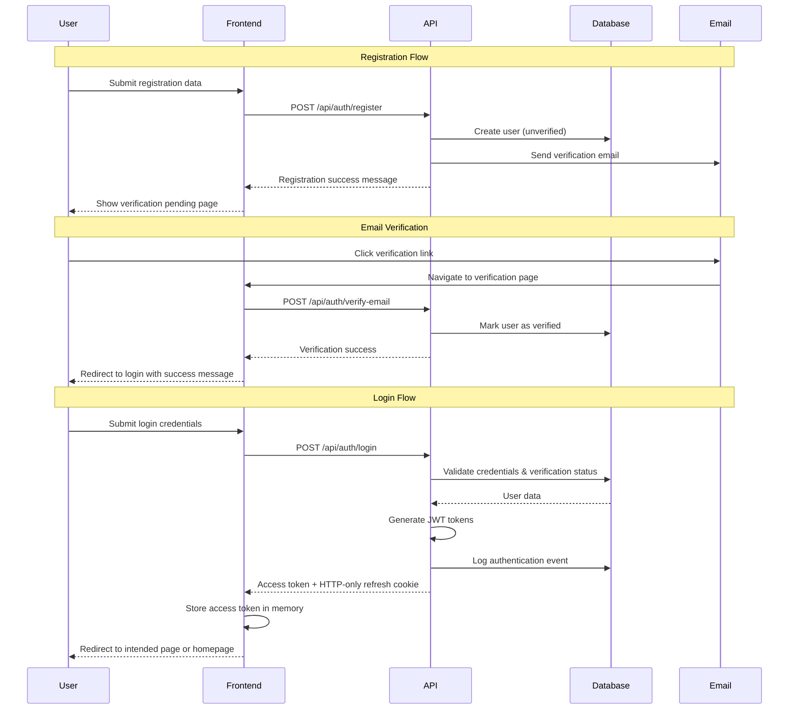

# User Authentication Design Document

## Architecture Overview

The authentication system follows a modern JWT-based approach with refresh token rotation, designed for edge deployment on Cloudflare Workers. The system is mandatory for all transactions as Moldova Direct does not support guest checkout. The architecture prioritizes security, scalability, and seamless user experience while maintaining consistency across all supported languages (Spanish, English, Romanian, Russian).

## System Architecture

### Authentication Flow



### Token Management

#### Access Tokens
- **Type**: JWT with 15-minute expiration
- **Storage**: In-memory (Pinia store) for seamless tab synchronization
- **Claims**: user ID, email, verification status, preferred language, issued timestamp
- **Algorithm**: HS256 with secure signing key
- **Automatic Refresh**: Transparent token refresh during user activity

#### Refresh Tokens
- **Type**: Secure random string with 7-day expiration
- **Storage**: HTTP-only, secure, SameSite cookie for XSS protection
- **Rotation**: New refresh token issued on each use for enhanced security
- **Database**: Stored hashed with user association and expiration tracking
- **Invalidation**: All refresh tokens invalidated on password change or security events

### Database Schema

```sql
-- Users table
CREATE TABLE user (
  id INTEGER PRIMARY KEY AUTOINCREMENT,
  email TEXT UNIQUE NOT NULL,
  password_hash TEXT NOT NULL,
  email_verified BOOLEAN DEFAULT FALSE,
  verification_token TEXT,
  verification_expires DATETIME,
  reset_token TEXT,
  reset_expires DATETIME,
  failed_login_attempts INTEGER DEFAULT 0,
  locked_until DATETIME,
  last_login DATETIME,
  preferred_language TEXT DEFAULT 'es',
  created_at DATETIME DEFAULT CURRENT_TIMESTAMP,
  updated_at DATETIME DEFAULT CURRENT_TIMESTAMP
);

-- Refresh tokens table
CREATE TABLE refresh_token (
  id INTEGER PRIMARY KEY AUTOINCREMENT,
  user_id INTEGER NOT NULL,
  token_hash TEXT NOT NULL,
  expires_at DATETIME NOT NULL,
  created_at DATETIME DEFAULT CURRENT_TIMESTAMP,
  FOREIGN KEY (user_id) REFERENCES user(id) ON DELETE CASCADE
);

-- Security audit log
CREATE TABLE auth_event (
  id INTEGER PRIMARY KEY AUTOINCREMENT,
  user_id INTEGER,
  event_type TEXT NOT NULL, -- 'login', 'logout', 'failed_login', 'password_reset'
  ip_address TEXT,
  user_agent TEXT,
  created_at DATETIME DEFAULT CURRENT_TIMESTAMP,
  FOREIGN KEY (user_id) REFERENCES user(id) ON DELETE SET NULL
);
```

## API Design

### Endpoint Structure

#### Authentication Endpoints

| Method | Endpoint | Description | Request Body | Response |
|--------|----------|-------------|--------------|----------|
| POST | `/api/auth/register` | User registration | `{ email, password, confirmPassword, acceptTerms, language }` | `{ message, requiresVerification }` |
| POST | `/api/auth/verify-email` | Email verification | `{ token }` | `{ message, redirectToLogin }` |
| POST | `/api/auth/resend-verification` | Resend verification email | `{ email }` | `{ message }` |
| POST | `/api/auth/login` | User login | `{ email, password }` | `{ accessToken, user }` + refresh cookie |
| POST | `/api/auth/logout` | User logout | - | `{ message }` |
| POST | `/api/auth/refresh` | Refresh access token | - | `{ accessToken }` |
| POST | `/api/auth/forgot-password` | Request password reset | `{ email }` | `{ message }` |
| POST | `/api/auth/reset-password` | Reset password | `{ token, password, confirmPassword }` | `{ message }` |
| GET | `/api/auth/me` | Get current user | - | `{ user }` |

#### Request/Response Formats

```typescript
// Registration Request
interface RegisterRequest {
  email: string
  password: string
  confirmPassword: string
  acceptTerms: boolean
  language: 'es' | 'en' | 'ro' | 'ru'
}

// Login Request
interface LoginRequest {
  email: string
  password: string
}

// User Response
interface UserResponse {
  id: number
  email: string
  emailVerified: boolean
  preferredLanguage: string
  createdAt: string
  lastLogin: string | null
}

// Error Response
interface ErrorResponse {
  statusCode: number
  statusMessage: string
  details?: {
    field?: string
    code?: string
  }
}
```

### Security Implementation

#### Password Security
- **Hashing**: bcrypt with salt rounds of 12 for secure password storage
- **Requirements**: Minimum 8 characters with uppercase, lowercase, and number
- **Validation**: Real-time client-side validation with server-side verification
- **Storage**: Never store or log plain text passwords in any system component
- **Strength indicator**: Visual password strength meter during registration

#### Rate Limiting and Account Protection
- **Login attempts**: 5 attempts per 15 minutes per IP address with progressive delays
- **Registration**: 3 attempts per hour per IP address to prevent spam
- **Password reset**: 3 requests per hour per email address with cooldown periods
- **Email verification**: Rate limited to prevent abuse and email flooding
- **Implementation**: Cloudflare KV for distributed rate limit tracking across edge locations
- **Account lockout**: 5 failed login attempts locks account for exactly 15 minutes
- **Lockout notification**: Clear messaging showing remaining lockout time

#### Token Security and Session Management
- **JWT signing**: HS256 algorithm with secure, rotated signing keys
- **Token claims**: Minimal necessary data (user ID, email, verification status, language)
- **Access token expiry**: 15 minutes with automatic refresh during user activity
- **Refresh token rotation**: New refresh token issued on each use for enhanced security
- **Session invalidation**: All sessions invalidated on password change or security events
- **Cross-device logout**: Option to logout from all devices simultaneously

#### Attack Prevention
- **User enumeration**: Generic error messages that don't reveal account existence
- **Timing attacks**: Consistent response times regardless of user existence
- **CSRF protection**: CSRF tokens for all state-changing operations
- **XSS prevention**: Input sanitization and Content Security Policy headers
- **SQL injection**: Parameterized queries with Drizzle ORM protection
- **Brute force**: Progressive delays and temporary IP blocking for repeated failures

## Frontend Design

### Component Architecture

```
components/auth/
├── AuthLayout.vue          # Common layout for auth pages
├── LoginForm.vue           # Login form component
├── RegisterForm.vue        # Registration form component
├── ForgotPasswordForm.vue  # Password reset request form
├── ResetPasswordForm.vue   # Password reset form
├── EmailVerification.vue   # Email verification component
└── AuthGuard.vue          # Route protection component
```

### State Management

#### Auth Store (Pinia)

```typescript
// stores/auth.ts
export const useAuthStore = defineStore('auth', () => {
  // State
  const user = ref<User | null>(null)
  const accessToken = ref<string | null>(null)
  const isLoading = ref(false)
  const isAuthenticated = computed(() => !!user.value && !!accessToken.value)

  // Actions
  const login = async (credentials: LoginCredentials) => {
    // Implementation
  }

  const register = async (userData: RegisterData) => {
    // Implementation
  }

  const logout = async () => {
    // Implementation
  }

  const refreshToken = async () => {
    // Implementation
  }

  const verifyEmail = async (token: string) => {
    // Implementation
  }

  return {
    user: readonly(user),
    accessToken: readonly(accessToken),
    isLoading: readonly(isLoading),
    isAuthenticated,
    login,
    register,
    logout,
    refreshToken,
    verifyEmail
  }
})
```

### Form Design

#### Visual Design Principles
- **Consistent spacing**: 24px between sections, 16px between fields
- **Clear hierarchy**: Form titles (text-2xl), field labels (text-sm font-medium)
- **Error states**: Red border on invalid fields, inline error messages
- **Loading states**: Disabled buttons with spinner during submission
- **Mobile optimization**: Full-width inputs, adequate touch targets

#### Form Validation

```typescript
// Validation schemas using Zod with multi-language support
const registerSchema = z.object({
  email: z.string()
    .email('validation.email.invalid')
    .min(1, 'validation.email.required'),
  password: z.string()
    .min(8, 'validation.password.minLength')
    .regex(/[A-Z]/, 'validation.password.uppercase')
    .regex(/[a-z]/, 'validation.password.lowercase')
    .regex(/[0-9]/, 'validation.password.number'),
  confirmPassword: z.string()
    .min(1, 'validation.confirmPassword.required'),
  acceptTerms: z.boolean()
    .refine(val => val === true, 'validation.terms.required'),
  language: z.enum(['es', 'en', 'ro', 'ru'])
    .default('es')
}).refine(data => data.password === data.confirmPassword, {
  message: 'validation.password.mismatch',
  path: ['confirmPassword']
})

const loginSchema = z.object({
  email: z.string()
    .email('validation.email.invalid')
    .min(1, 'validation.email.required'),
  password: z.string()
    .min(1, 'validation.password.required')
})
```

### Routing and Navigation

#### Protected Routes
```typescript
// middleware/auth.ts
export default defineNuxtRouteMiddleware((to) => {
  const { isAuthenticated, user } = useAuthStore()
  
  // Check if user is authenticated and email is verified
  if (!isAuthenticated || !user?.emailVerified) {
    return navigateTo({
      path: '/auth/login',
      query: { redirect: to.fullPath }
    })
  }
})

// middleware/guest.ts - Redirect authenticated users away from auth pages
export default defineNuxtRouteMiddleware((to) => {
  const { isAuthenticated } = useAuthStore()
  
  if (isAuthenticated) {
    const redirect = to.query.redirect as string
    return navigateTo(redirect || '/')
  }
})
```

#### Route Structure
```
pages/
├── auth/
│   ├── login.vue              # Login page (guest middleware)
│   ├── register.vue           # Registration page (guest middleware)
│   ├── verify-email.vue       # Email verification page
│   ├── forgot-password.vue    # Password reset request page
│   └── reset-password.vue     # Password reset page
├── account/
│   └── index.vue              # User profile page (auth middleware)
└── [protected-routes]         # All shopping features require auth
```

## Mobile Design Considerations

### Responsive Layout and Touch Optimization
- **Breakpoints**: Mobile (<768px), Tablet (768px-1024px), Desktop (>1024px)
- **Form adaptation**: Single column layout on mobile with optimized field spacing
- **Touch targets**: Minimum 44px height for all interactive elements (buttons, links, inputs)
- **Input optimization**: Appropriate keyboard types (email, password) with proper autocomplete
- **Visual hierarchy**: Clear form titles, labels, and error messages sized for mobile viewing
- **Spacing**: Adequate padding between form elements for comfortable touch interaction

### Mobile-Specific Authentication Features
- **Password visibility toggle**: Show/hide password button for easier mobile input
- **Auto-capitalization control**: Disabled for email fields, enabled for name fields
- **Input validation**: Real-time validation with mobile-friendly error display
- **Loading states**: Clear loading indicators during form submission
- **Keyboard handling**: Proper keyboard dismissal and form scrolling behavior
- **Biometric authentication**: Support for Touch ID/Face ID where available (future enhancement)

### Progressive Web App Features
- **App-like experience**: PWA installation prompts and app-style navigation
- **Offline handling**: Graceful degradation with clear offline status indicators
- **Performance**: Lazy loading of non-critical components and optimized bundle sizes
- **Push notifications**: Ready for security alerts and account notifications
- **Home screen integration**: Proper app icons and splash screens for installed PWA

## Internationalization

### Language Support
- **Primary**: Spanish (es)
- **Secondary**: English (en), Romanian (ro), Russian (ru)
- **Fallback**: Spanish for missing translations

### Translation Structure
```json
{
  "auth": {
    "login": {
      "title": "Iniciar Sesión",
      "email": "Correo Electrónico",
      "password": "Contraseña",
      "submit": "Iniciar Sesión",
      "forgotPassword": "¿Olvidaste tu contraseña?",
      "noAccount": "¿No tienes cuenta?",
      "register": "Registrarse",
      "loading": "Iniciando sesión..."
    },
    "register": {
      "title": "Crear Cuenta",
      "confirmPassword": "Confirmar Contraseña",
      "acceptTerms": "Acepto los términos y condiciones",
      "submit": "Crear Cuenta",
      "hasAccount": "¿Ya tienes cuenta?",
      "login": "Iniciar Sesión",
      "loading": "Creando cuenta...",
      "success": "Cuenta creada. Revisa tu email para verificar."
    },
    "verification": {
      "title": "Verificar Email",
      "message": "Hemos enviado un enlace de verificación a tu email",
      "resend": "Reenviar email",
      "success": "Email verificado correctamente",
      "expired": "El enlace ha expirado",
      "invalid": "Enlace de verificación inválido"
    },
    "forgotPassword": {
      "title": "Recuperar Contraseña",
      "message": "Ingresa tu email para recibir instrucciones",
      "submit": "Enviar instrucciones",
      "success": "Si el email existe, recibirás instrucciones"
    },
    "resetPassword": {
      "title": "Nueva Contraseña",
      "newPassword": "Nueva Contraseña",
      "confirmPassword": "Confirmar Nueva Contraseña",
      "submit": "Cambiar Contraseña",
      "success": "Contraseña cambiada correctamente"
    },
    "errors": {
      "invalidCredentials": "Email o contraseña incorrectos",
      "emailRequired": "El email es obligatorio",
      "passwordRequired": "La contraseña es obligatoria",
      "accountLocked": "Cuenta bloqueada temporalmente por {minutes} minutos",
      "emailNotVerified": "Por favor verifica tu email antes de continuar",
      "emailExists": "Este email ya está registrado",
      "weakPassword": "La contraseña debe tener al menos 8 caracteres, una mayúscula, una minúscula y un número",
      "passwordMismatch": "Las contraseñas no coinciden",
      "termsRequired": "Debes aceptar los términos y condiciones",
      "sessionExpired": "Tu sesión ha expirado. Por favor inicia sesión nuevamente",
      "rateLimitExceeded": "Demasiados intentos. Intenta nuevamente en {minutes} minutos"
    },
    "validation": {
      "email": {
        "required": "El email es obligatorio",
        "invalid": "Ingresa un email válido"
      },
      "password": {
        "required": "La contraseña es obligatoria",
        "minLength": "La contraseña debe tener al menos 8 caracteres",
        "uppercase": "Debe contener al menos una letra mayúscula",
        "lowercase": "Debe contener al menos una letra minúscula",
        "number": "Debe contener al menos un número",
        "mismatch": "Las contraseñas no coinciden"
      },
      "terms": {
        "required": "Debes aceptar los términos y condiciones"
      }
    }
  }
}
```

### Email Templates and Token Management

#### Template Types and Security
- **Email Verification**: Welcome email with secure verification link (24-hour expiry)
- **Password Reset**: Secure password reset instructions with 30-minute expiry
- **Security Notifications**: Account security alerts for suspicious activity
- **Account Lockout**: Notification when account is temporarily locked
- **Password Change Confirmation**: Confirmation of successful password changes

#### Token Security and Lifecycle
- **Verification tokens**: Cryptographically secure random tokens with 24-hour expiry
- **Reset tokens**: Secure random tokens with 30-minute expiry for password resets
- **Token invalidation**: Automatic invalidation of previous tokens when new ones are generated
- **Single-use tokens**: All tokens are invalidated after successful use
- **Rate limiting**: Prevent token abuse with request limits per email address

#### Email Design Specifications
- **Multi-language support**: Templates in all supported languages (ES, EN, RO, RU)
- **Responsive design**: Mobile-optimized email layouts with proper viewport settings
- **Consistent branding**: Moldova Direct visual identity, colors, and typography
- **Clear CTAs**: Prominent action buttons with expiry time clearly displayed
- **Security information**: Include timestamp, IP address, and browser info for transparency
- **Fallback text**: Plain text versions for all HTML emails for accessibility
- **Anti-phishing**: Clear sender identification and security warnings about legitimate emails

#### Template Structure
```html
<!-- Email Verification Template -->
<div style="max-width: 600px; margin: 0 auto; font-family: Arial, sans-serif;">
  <header style="background: #1a365d; color: white; padding: 20px; text-align: center;">
    <h1>Moldova Direct</h1>
  </header>
  <main style="padding: 30px 20px;">
    <h2>{{$t('email.verification.title')}}</h2>
    <p>{{$t('email.verification.message')}}</p>
    <div style="text-align: center; margin: 30px 0;">
      <a href="{{verificationUrl}}" style="background: #3182ce; color: white; padding: 12px 24px; text-decoration: none; border-radius: 6px;">
        {{$t('email.verification.button')}}
      </a>
    </div>
    <p style="color: #666; font-size: 14px;">
      {{$t('email.verification.expiry')}}
    </p>
  </main>
</div>
```

## Security Considerations

### Data Protection
- **GDPR compliance**: User consent for data processing
- **Data minimization**: Collect only necessary information
- **Right to deletion**: Ability to delete user accounts
- **Data encryption**: Sensitive data encrypted at rest

### Attack Prevention
- **CSRF protection**: CSRF tokens for state-changing operations
- **XSS prevention**: Input sanitization and CSP headers
- **SQL injection**: Parameterized queries with Drizzle ORM
- **Brute force**: Account lockout and rate limiting

### Security Monitoring and Audit Logging
- **Comprehensive event logging**: Log all authentication attempts with timestamp, IP, user agent, and outcome
- **Security event types**: Track login success/failure, registration, password changes, account lockouts, and suspicious activity
- **Anomaly detection**: Monitor for unusual patterns like multiple failed attempts, rapid account creation, or geographic anomalies
- **Real-time alerting**: Immediate notifications for critical security events and potential attacks
- **Audit trail**: Immutable log of all security-related events for compliance and forensic analysis
- **Performance monitoring**: Track authentication response times, error rates, and system health metrics
- **Privacy compliance**: Ensure logging practices comply with GDPR and data protection requirements
- **Log retention**: Secure storage and appropriate retention periods for different types of security logs

## Performance and User Experience

### Loading States and Response Times
- **Form submission**: Disable buttons and show loading spinners during processing
- **Token refresh**: Transparent background refresh without user interruption
- **Page transitions**: Loading indicators for authentication state changes
- **Response time targets**: All operations complete within 3 seconds for normal flows
- **Progressive enhancement**: Core functionality works even with slow connections
- **Optimistic updates**: Immediate UI feedback with server confirmation

### Error Handling and Recovery
- **Inline validation**: Real-time field validation with clear, contextual error messages
- **Form preservation**: Maintain valid field values when errors occur to reduce re-entry
- **Generic security errors**: Prevent user enumeration with consistent, generic messages
- **Actionable guidance**: Provide clear next steps and recovery options for error resolution
- **Multi-language errors**: All error messages translated to user's preferred language
- **Retry mechanisms**: Automatic retry for transient failures with exponential backoff
- **Graceful degradation**: Fallback options when primary authentication methods fail

### Success Feedback and User Guidance
- **Confirmation messages**: Clear success indicators for completed actions with appropriate timing
- **Progress indicators**: Visual progress for multi-step processes (verification pending, password reset sent)
- **Redirect notifications**: Brief success message before automatic redirects with countdown
- **Welcome messages**: Personalized greetings after successful login with user's preferred name
- **Contextual help**: Inline help text and tooltips for complex form fields
- **Accessibility**: Screen reader support and keyboard navigation for all authentication flows

## Integration Points

### Shopping Platform Integration
- **Mandatory authentication**: No guest checkout - all users must be authenticated for any transaction
- **Cart persistence**: Maintain cart contents across authentication state changes and browser sessions
- **Redirect preservation**: Save intended destination URL for seamless post-login redirect
- **Profile integration**: Seamless access to user profile, order history, and account settings
- **Language consistency**: Authentication language preference matches shopping interface
- **Real-time state sync**: Authentication status updates across all open browser tabs
- **Protected route handling**: Automatic redirect to login for unauthenticated access attempts
- **Session restoration**: Restore user context and temporary data after successful login

### User Experience Flow Integration
- **Onboarding**: Smooth transition from registration to email verification to first login
- **Password recovery**: Streamlined password reset flow with clear progress indicators
- **Account verification**: Intuitive email verification process with resend capabilities
- **Error recovery**: Clear guidance and recovery options for authentication failures
- **Success feedback**: Positive reinforcement for completed authentication actions
- **Context preservation**: Maintain shopping context (filters, search, cart) during auth flows

### Email Service
- **Provider**: Cloudflare Email Workers or external SMTP service
- **Templates**: HTML and text versions for all email types in 4 languages
- **Delivery tracking**: Monitor email delivery success rates and bounces
- **Security headers**: SPF, DKIM, and DMARC configuration for email authenticity
- **Rate limiting**: Prevent email abuse with sending limits

### Session Storage
- **Client-side**: Pinia store for access tokens with tab synchronization
- **Server-side**: Cloudflare KV for rate limiting and temporary data
- **Database**: Refresh tokens with automatic cleanup of expired tokens
- **Cookie management**: Secure HTTP-only cookies with proper SameSite settings
- **Cross-tab sync**: Authentication state synchronized across browser tabs

### Analytics and Monitoring
- **Registration funnel**: Track conversion rates from registration to verification
- **Login success rates**: Monitor authentication success and failure patterns
- **Security events**: Track failed attempts, lockouts, and suspicious activity
- **Performance metrics**: Monitor authentication endpoint response times
- **Error tracking**: Identify and alert on authentication system issues
- **User behavior**: Track language preferences and device usage patterns