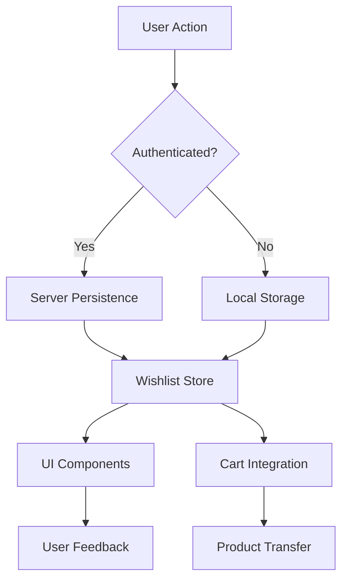

# Wishlist Design Document

## Overview

The wishlist feature will be implemented as a comprehensive system that allows authenticated users to save products for future consideration and purchase. The design integrates seamlessly with the existing shopping cart system, leveraging similar patterns for state management, persistence, and user experience. The wishlist will support both local storage for guest users and server-side persistence for authenticated users, with automatic synchronization across devices.

## Architecture

### System Integration

The wishlist system will integrate with existing components:

- **Authentication System**: Leverages the existing user authentication to provide persistent wishlists
- **Shopping Cart**: Shares similar state management patterns and provides seamless item transfer
- **Product Catalog**: Integrates with product data and real-time inventory validation
- **Notification System**: Uses existing toast notifications for user feedback
- **Internationalization**: Supports all existing languages (EN, ES, RO, RU)

### Data Flow



### State Management Architecture

The wishlist will follow the existing Pinia store pattern used by the cart system:

- **Wishlist Store**: Central state management using Pinia
- **Wishlist Composable**: Reactive interface for components
- **Persistence Layer**: Handles both local and server storage
- **Validation Layer**: Real-time product availability checking

## Components and Interfaces

### Core Components

#### 1. WishlistStore (Pinia Store)
```typescript
interface WishlistState {
  items: WishlistItem[]
  loading: boolean
  error: string | null
  syncStatus: 'idle' | 'syncing' | 'error'
  lastSyncAt: Date | null
  shareableLinks: Map<string, ShareableWishlist>
  notifications: WishlistNotification[]
}
```

#### 2. WishlistComposable
```typescript
interface UseWishlistReturn {
  // State
  items: ComputedRef<WishlistItem[]>
  itemCount: ComputedRef<number>
  isEmpty: ComputedRef<boolean>
  loading: ComputedRef<boolean>
  
  // Actions
  addItem: (product: Product) => Promise<void>
  removeItem: (itemId: string) => Promise<void>
  moveToCart: (itemId: string, quantity?: number) => Promise<void>
  shareWishlist: () => Promise<string>
  
  // Utilities
  isInWishlist: (productId: string) => boolean
  getWishlistItem: (productId: string) => WishlistItem | undefined
}
```

#### 3. UI Components

**WishlistButton.vue**
- Add/remove toggle button for product pages
- Heart icon with animation states
- Loading and success feedback

**WishlistPage.vue**
- Main wishlist view with grid/list toggle
- Sorting and filtering options
- Bulk operations (select all, move to cart)

**WishlistItem.vue**
- Individual wishlist item display
- Price change indicators
- Stock status and availability
- Quick actions (remove, add to cart)

**WishlistShare.vue**
- Share modal with multiple sharing options
- Privacy settings (public/private)
- Link generation and copying

**WishlistNotifications.vue**
- Price drop alerts
- Stock availability notifications
- Wishlist activity summaries

### API Endpoints

#### Server-side Persistence
```typescript
// GET /api/wishlist - Get user's wishlist
// POST /api/wishlist/items - Add item to wishlist
// DELETE /api/wishlist/items/[id] - Remove item from wishlist
// PUT /api/wishlist/items/[id] - Update wishlist item
// POST /api/wishlist/share - Create shareable link
// GET /api/wishlist/shared/[token] - Access shared wishlist
// POST /api/wishlist/notifications/subscribe - Subscribe to notifications
```

#### Integration Endpoints
```typescript
// POST /api/wishlist/move-to-cart - Move items from wishlist to cart
// POST /api/wishlist/sync - Sync guest wishlist with user account
// GET /api/wishlist/recommendations - Get recommended products
```

## Data Models

### Core Data Types

```typescript
interface WishlistItem {
  id: string
  userId?: string // null for guest users
  productId: string
  product: Product
  addedAt: Date
  priceWhenAdded: number
  notifyOnPriceDrop: boolean
  notifyOnAvailability: boolean
  notes?: string
}

interface ShareableWishlist {
  id: string
  token: string
  userId: string
  isPublic: boolean
  expiresAt?: Date
  viewCount: number
  createdAt: Date
}

interface WishlistNotification {
  id: string
  userId: string
  type: 'price_drop' | 'back_in_stock' | 'low_stock' | 'discontinued'
  productId: string
  message: string
  isRead: boolean
  createdAt: Date
}

interface WishlistSync {
  guestItems: WishlistItem[]
  userItems: WishlistItem[]
  conflicts: WishlistConflict[]
}

interface WishlistConflict {
  productId: string
  guestItem: WishlistItem
  userItem: WishlistItem
  resolution: 'keep_guest' | 'keep_user' | 'merge'
}
```

### Database Schema

```sql
-- Wishlist items table
CREATE TABLE wishlist_items (
  id UUID PRIMARY KEY DEFAULT gen_random_uuid(),
  user_id UUID REFERENCES auth.users(id) ON DELETE CASCADE,
  product_id INTEGER REFERENCES products(id) ON DELETE CASCADE,
  added_at TIMESTAMP WITH TIME ZONE DEFAULT NOW(),
  price_when_added DECIMAL(10,2) NOT NULL,
  notify_on_price_drop BOOLEAN DEFAULT true,
  notify_on_availability BOOLEAN DEFAULT true,
  notes TEXT,
  created_at TIMESTAMP WITH TIME ZONE DEFAULT NOW(),
  updated_at TIMESTAMP WITH TIME ZONE DEFAULT NOW(),
  UNIQUE(user_id, product_id)
);

-- Shareable wishlist links
CREATE TABLE wishlist_shares (
  id UUID PRIMARY KEY DEFAULT gen_random_uuid(),
  token VARCHAR(255) UNIQUE NOT NULL,
  user_id UUID REFERENCES auth.users(id) ON DELETE CASCADE,
  is_public BOOLEAN DEFAULT false,
  expires_at TIMESTAMP WITH TIME ZONE,
  view_count INTEGER DEFAULT 0,
  created_at TIMESTAMP WITH TIME ZONE DEFAULT NOW(),
  updated_at TIMESTAMP WITH TIME ZONE DEFAULT NOW()
);

-- Wishlist notifications
CREATE TABLE wishlist_notifications (
  id UUID PRIMARY KEY DEFAULT gen_random_uuid(),
  user_id UUID REFERENCES auth.users(id) ON DELETE CASCADE,
  product_id INTEGER REFERENCES products(id) ON DELETE CASCADE,
  type VARCHAR(50) NOT NULL,
  message TEXT NOT NULL,
  is_read BOOLEAN DEFAULT false,
  created_at TIMESTAMP WITH TIME ZONE DEFAULT NOW()
);

-- Indexes for performance
CREATE INDEX idx_wishlist_items_user_id ON wishlist_items(user_id);
CREATE INDEX idx_wishlist_items_product_id ON wishlist_items(product_id);
CREATE INDEX idx_wishlist_shares_token ON wishlist_shares(token);
CREATE INDEX idx_wishlist_notifications_user_id ON wishlist_notifications(user_id);
```

## Error Handling

### Error Categories

1. **Authentication Errors**
   - User not logged in for persistent operations
   - Session expired during sync
   - Invalid permissions for shared wishlists

2. **Product Errors**
   - Product no longer exists
   - Product discontinued
   - Invalid product data

3. **Storage Errors**
   - Local storage unavailable
   - Server sync failures
   - Database connection issues

4. **Validation Errors**
   - Duplicate items
   - Invalid product IDs
   - Malformed data

### Error Recovery Strategies

```typescript
interface ErrorRecoveryStrategy {
  // Automatic retry with exponential backoff
  retryWithBackoff: (operation: () => Promise<void>, maxRetries: number) => Promise<void>
  
  // Fallback to local storage when server fails
  fallbackToLocal: (operation: () => Promise<void>) => Promise<void>
  
  // Queue operations for later sync
  queueForLaterSync: (operation: WishlistOperation) => void
  
  // Graceful degradation
  degradeGracefully: (error: Error) => void
}
```

### User-Friendly Error Messages

- **Network Issues**: "Unable to sync wishlist. Your items are saved locally and will sync when connection is restored."
- **Product Unavailable**: "This product is no longer available but has been kept in your wishlist for reference."
- **Storage Full**: "Local storage is full. Please clear some data or log in to save your wishlist to your account."

## Testing Strategy

### Unit Tests

1. **Store Logic Tests**
   - Add/remove item operations
   - State mutations and getters
   - Error handling scenarios
   - Persistence mechanisms

2. **Composable Tests**
   - Reactive state updates
   - Action error handling
   - Integration with store
   - Type safety validation

3. **Utility Function Tests**
   - Data validation functions
   - Transformation utilities
   - Cache management
   - Sync conflict resolution

### Integration Tests

1. **API Integration**
   - Server persistence operations
   - Authentication flow
   - Error response handling
   - Rate limiting behavior

2. **Cart Integration**
   - Move items between wishlist and cart
   - Inventory validation
   - Price synchronization
   - Bulk operations

3. **Cross-Device Sync**
   - Login sync behavior
   - Conflict resolution
   - Data consistency
   - Offline/online transitions

### E2E Tests

1. **User Workflows**
   - Complete wishlist journey (add → view → share → purchase)
   - Guest to authenticated user transition
   - Multi-device usage scenarios
   - Notification preferences

2. **Performance Tests**
   - Large wishlist handling (100+ items)
   - Concurrent user operations
   - Real-time sync performance
   - Mobile device performance

3. **Accessibility Tests**
   - Screen reader compatibility
   - Keyboard navigation
   - Color contrast compliance
   - Touch target sizing

### Visual Regression Tests

1. **Component Rendering**
   - Wishlist button states
   - Item grid layouts
   - Empty state displays
   - Loading animations

2. **Responsive Design**
   - Mobile wishlist view
   - Tablet layout adaptation
   - Desktop grid optimization
   - Cross-browser consistency

## Performance Considerations

### Optimization Strategies

1. **Lazy Loading**
   - Load wishlist items on demand
   - Progressive image loading
   - Component code splitting
   - Route-based chunking

2. **Caching Strategy**
   - Product data caching (5-minute TTL)
   - Wishlist state persistence
   - Image caching optimization
   - API response caching

3. **Real-time Updates**
   - Debounced sync operations
   - Batch API requests
   - WebSocket for live updates
   - Optimistic UI updates

4. **Memory Management**
   - Cleanup on component unmount
   - Weak references for large datasets
   - Garbage collection optimization
   - Memory leak prevention

### Performance Metrics

- **Initial Load Time**: < 2 seconds for wishlist page
- **Add/Remove Operations**: < 500ms response time
- **Sync Operations**: < 1 second for up to 50 items
- **Search/Filter**: < 300ms for local operations

### Scalability Considerations

1. **Database Optimization**
   - Proper indexing strategy
   - Query optimization
   - Connection pooling
   - Read replica usage

2. **API Rate Limiting**
   - User-based rate limits
   - Operation-specific limits
   - Graceful degradation
   - Queue management

3. **Storage Efficiency**
   - Data compression for large wishlists
   - Efficient serialization
   - Cleanup of expired data
   - Storage quota management

## Security Considerations

### Data Protection

1. **User Data Privacy**
   - Encrypted storage of sensitive data
   - Minimal data collection
   - GDPR compliance
   - Data retention policies

2. **Access Control**
   - User-specific wishlist isolation
   - Secure sharing mechanisms
   - Token-based access for shared lists
   - Permission validation

3. **Input Validation**
   - Sanitize all user inputs
   - Validate product IDs
   - Prevent injection attacks
   - Rate limiting on operations

### Security Measures

```typescript
interface SecurityConfig {
  // Sharing security
  shareTokenLength: 32
  shareTokenExpiry: '7d' | '30d' | 'never'
  maxSharesPerUser: 10
  
  // Rate limiting
  maxOperationsPerMinute: 60
  maxItemsPerWishlist: 500
  maxNotificationsPerDay: 50
  
  // Data validation
  validateProductExists: boolean
  sanitizeUserInput: boolean
  enforceUserOwnership: boolean
}
```

## Internationalization

### Multi-language Support

The wishlist will support all existing languages with proper localization:

1. **Interface Text**
   - Button labels and tooltips
   - Error messages and notifications
   - Empty state messaging
   - Sharing dialog content

2. **Content Localization**
   - Product names in user's language
   - Price formatting per locale
   - Date/time formatting
   - Cultural adaptation of messaging

3. **Notification Localization**
   - Email notifications in user's language
   - Push notification content
   - SMS alerts (where applicable)
   - In-app notification text

### Translation Keys Structure

```json
{
  "wishlist": {
    "title": "My Wishlist",
    "empty": {
      "title": "Your wishlist is empty",
      "description": "Save products you love for later",
      "action": "Start Shopping"
    },
    "actions": {
      "add": "Add to Wishlist",
      "remove": "Remove from Wishlist",
      "moveToCart": "Add to Cart",
      "share": "Share Wishlist"
    },
    "notifications": {
      "added": "Added to wishlist",
      "removed": "Removed from wishlist",
      "priceDropped": "Price dropped for {product}",
      "backInStock": "{product} is back in stock"
    }
  }
}
```