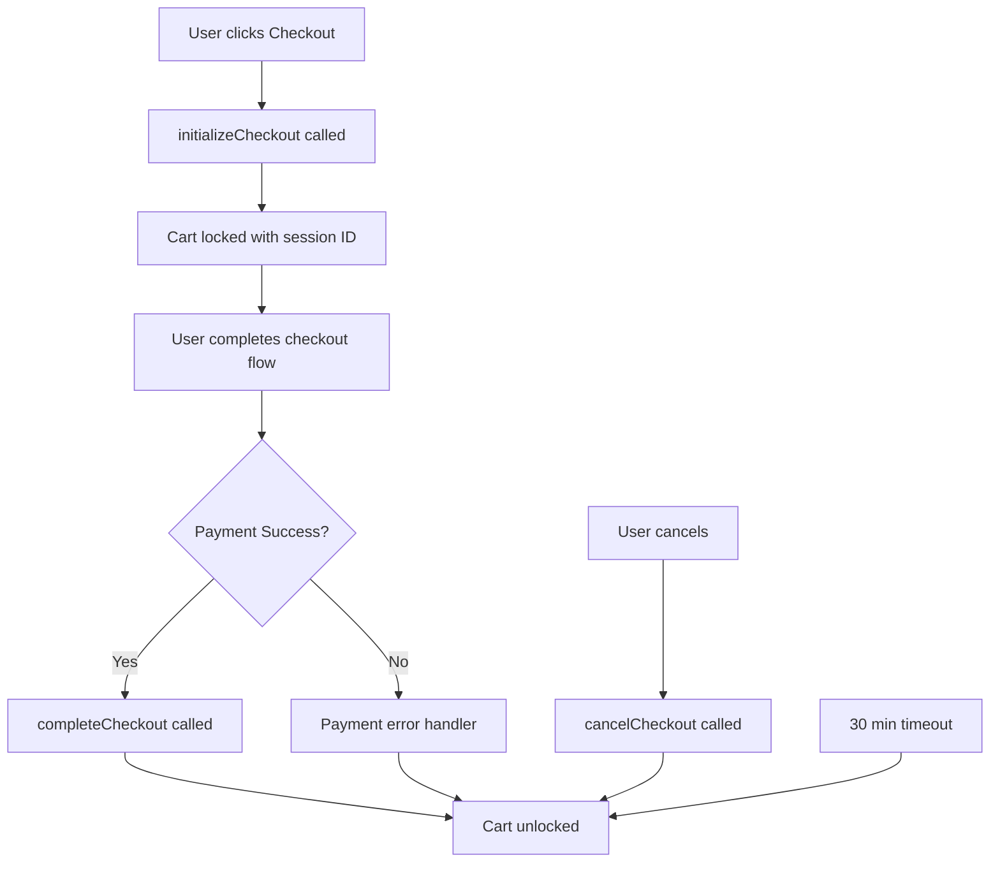

# Cart Locking During Checkout

## Overview

Cart locking is a feature that prevents cart modifications while a user is actively going through the checkout process. This ensures data consistency and prevents race conditions that could occur if a user tries to modify their cart in multiple browser tabs or if cart operations occur during payment processing.

## Architecture

### Client-Side Implementation

The cart locking system is implemented primarily on the client-side using Pinia store state management. When a user enters checkout, the cart is locked for the duration of the checkout session (default: 30 minutes).

### Key Components

1. **Cart Store State** (`stores/cart/core.ts`)
   - `isLocked`: Boolean indicating if cart is currently locked
   - `lockedAt`: Timestamp when cart was locked
   - `lockedUntil`: Timestamp when lock expires
   - `lockedByCheckoutSessionId`: Checkout session that owns the lock

2. **Cart Core Actions**
   - `lockCart(checkoutSessionId, lockDurationMinutes)`: Locks the cart
   - `unlockCart(checkoutSessionId)`: Unlocks the cart
   - `checkLockStatus()`: Returns current lock status
   - `isCartLocked()`: Boolean check with auto-expiry

3. **Checkout Integration** (`stores/checkout.ts`)
   - `initializeCheckout()`: Locks cart when checkout begins
   - `completeCheckout()`: Unlocks cart when order completes
   - `cancelCheckout()`: Unlocks cart when user cancels
   - Payment failure handler: Unlocks cart on payment errors

## How It Works

### Lock Lifecycle



### Lock Duration

- **Default**: 30 minutes
- **Auto-expiry**: Lock automatically expires after duration
- **Configurable**: Can be adjusted via `lockDurationMinutes` parameter

### Lock Enforcement

When cart is locked, the following operations throw `CART_LOCKED` error:
- `addItem()`
- `removeItem()`
- `updateQuantity()`
- `clearCart()`

### Auto-Unlock Scenarios

The cart automatically unlocks in these situations:

1. **Successful Checkout**: After order is created and confirmed
2. **Payment Failure**: After payment processing fails
3. **Checkout Cancellation**: When user explicitly cancels checkout
4. **Timeout**: After lock duration expires (30 minutes default)

## Usage Examples

### Basic Integration

```typescript
import { useCartStore } from '~/stores/cart'
import { useCheckoutStore } from '~/stores/checkout'

const cartStore = useCartStore()
const checkoutStore = useCheckoutStore()

// Check if cart is locked
if (cartStore.isLocked) {
  console.log('Cart is locked until:', cartStore.lockedUntil)
}

// Initialize checkout (auto-locks cart)
await checkoutStore.initializeCheckout()

// Cancel checkout (auto-unlocks cart)
await checkoutStore.cancelCheckout()

// Get detailed lock status
const lockStatus = await cartStore.checkLockStatus()
console.log(lockStatus)
// {
//   isLocked: true,
//   lockedAt: Date,
//   lockedUntil: Date,
//   lockedBySession: 'checkout_1234567890_abc123'
// }
```

### Manual Lock/Unlock

```typescript
const cartStore = useCartStore()

// Manually lock cart
const sessionId = 'checkout_session_123'
await cartStore.lockCart(sessionId, 30) // 30 minutes

// Manually unlock cart
await cartStore.unlockCart(sessionId)

// Check if locked (with auto-expiry)
const isLocked = cartStore.isCartLocked()
```

### Error Handling

```typescript
const cartStore = useCartStore()

try {
  await cartStore.addItem(product, 1)
} catch (error) {
  if (error.code === 'CART_LOCKED') {
    console.error('Cannot modify cart during checkout')
    console.log('Locked until:', error.context.lockedUntil)
    console.log('Locked by session:', error.context.lockedBySession)

    // Inform user
    toast.error('Your cart is locked while checking out. Please complete or cancel your order first.')
  }
}
```

### UI Integration Example

```vue
<template>
  <div>
    <!-- Cart locked indicator -->
    <div v-if="cartStore.isLocked" class="cart-locked-banner">
      <Icon name="lock" />
      <p>Cart is locked during checkout</p>
      <button @click="cancelCheckout">Cancel Checkout</button>
    </div>

    <!-- Cart items with disabled add/remove buttons -->
    <CartItem
      v-for="item in cartStore.items"
      :key="item.id"
      :item="item"
      :disabled="cartStore.isLocked"
    />

    <!-- Add to cart button (disabled when locked) -->
    <button
      @click="addToCart"
      :disabled="cartStore.isLocked"
    >
      {{ cartStore.isLocked ? 'Cart Locked' : 'Add to Cart' }}
    </button>
  </div>
</template>

<script setup lang="ts">
import { useCartStore } from '~/stores/cart'
import { useCheckoutStore } from '~/stores/checkout'

const cartStore = useCartStore()
const checkoutStore = useCheckoutStore()

const cancelCheckout = async () => {
  await checkoutStore.cancelCheckout()
}
</script>
```

## Database Schema (Optional)

While the current implementation is client-side only, a database schema is provided for future server-side cart persistence:

```sql
-- Add locking columns to carts table
ALTER TABLE carts
ADD COLUMN locked_at TIMESTAMP WITH TIME ZONE,
ADD COLUMN locked_until TIMESTAMP WITH TIME ZONE,
ADD COLUMN locked_by_checkout_session_id TEXT;

-- Indexes for efficient queries
CREATE INDEX idx_carts_locked_until
ON carts(locked_until) WHERE locked_until IS NOT NULL;

CREATE INDEX idx_carts_locked_by_session
ON carts(locked_by_checkout_session_id)
WHERE locked_by_checkout_session_id IS NOT NULL;
```

### Database Functions (Future)

For server-side implementation, PostgreSQL functions are provided in:
`supabase/sql/migrations/20251103_add_cart_locking.sql`

Functions include:
- `lock_cart(session_id, duration)`: Lock a cart
- `unlock_cart(session_id)`: Unlock a cart
- `check_cart_lock_status(session_id)`: Check lock status
- `cleanup_expired_cart_locks()`: Clean up expired locks (cron job)

## API Endpoints (Optional)

For server-side implementation, REST API endpoints are provided:

### POST /api/cart/lock
Lock a cart for checkout

**Request:**
```json
{
  "cartId": 123,
  "checkoutSessionId": "checkout_1234567890",
  "lockDurationMinutes": 30
}
```

**Response:**
```json
{
  "success": true,
  "locked": true,
  "lockedAt": "2025-11-03T10:00:00Z",
  "lockedUntil": "2025-11-03T10:30:00Z",
  "checkoutSessionId": "checkout_1234567890"
}
```

### POST /api/cart/unlock
Unlock a cart

**Request:**
```json
{
  "cartId": 123,
  "checkoutSessionId": "checkout_1234567890"
}
```

**Response:**
```json
{
  "success": true,
  "locked": false,
  "message": "Cart unlocked successfully"
}
```

### GET /api/cart/lock-status?cartId=123
Check cart lock status

**Response:**
```json
{
  "success": true,
  "cartId": 123,
  "isLocked": true,
  "lockedAt": "2025-11-03T10:00:00Z",
  "lockedUntil": "2025-11-03T10:30:00Z",
  "lockedBySession": "checkout_1234567890",
  "currentTime": "2025-11-03T10:15:00Z"
}
```

## Testing

### Unit Tests

```typescript
import { describe, it, expect, beforeEach } from 'vitest'
import { setActivePinia, createPinia } from 'pinia'
import { useCartStore } from '~/stores/cart'

describe('Cart Locking', () => {
  beforeEach(() => {
    setActivePinia(createPinia())
  })

  it('should lock cart with session ID', async () => {
    const cart = useCartStore()
    const sessionId = 'test_session_123'

    await cart.lockCart(sessionId, 30)

    expect(cart.isLocked.value).toBe(true)
    expect(cart.lockedByCheckoutSessionId.value).toBe(sessionId)
  })

  it('should prevent adding items when locked', async () => {
    const cart = useCartStore()
    const product = { id: '1', name: 'Test', price: 10, stock: 5 }

    await cart.lockCart('session_123', 30)

    await expect(cart.addItem(product, 1)).rejects.toThrow('CART_LOCKED')
  })

  it('should auto-unlock after expiry', async () => {
    const cart = useCartStore()

    // Lock for 1 second
    await cart.lockCart('session_123', 1/60)
    expect(cart.isLocked.value).toBe(true)

    // Wait for expiry
    await new Promise(resolve => setTimeout(resolve, 1100))

    // Check lock status (triggers auto-unlock)
    const isLocked = cart.isCartLocked()
    expect(isLocked).toBe(false)
  })

  it('should unlock cart after checkout', async () => {
    const cart = useCartStore()
    const checkout = useCheckoutStore()

    await checkout.initializeCheckout()
    expect(cart.isLocked.value).toBe(true)

    await checkout.cancelCheckout()
    expect(cart.isLocked.value).toBe(false)
  })
})
```

### E2E Tests

```typescript
import { test, expect } from '@playwright/test'

test('cart should lock during checkout', async ({ page }) => {
  await page.goto('/cart')

  // Add item to cart
  await page.click('[data-test="add-to-cart"]')

  // Go to checkout
  await page.click('[data-test="checkout-button"]')

  // Cart should be locked
  await expect(page.locator('[data-test="cart-locked-indicator"]')).toBeVisible()

  // Add to cart button should be disabled
  await expect(page.locator('[data-test="add-to-cart"]')).toBeDisabled()

  // Cancel checkout
  await page.click('[data-test="cancel-checkout"]')

  // Cart should be unlocked
  await expect(page.locator('[data-test="cart-locked-indicator"]')).not.toBeVisible()
  await expect(page.locator('[data-test="add-to-cart"]')).toBeEnabled()
})
```

## Security Considerations

1. **Session Validation**: Only the checkout session that locked the cart can unlock it (unless expired)
2. **Timeout Protection**: Locks automatically expire after 30 minutes to prevent permanent locks
3. **Client-Side Only**: Current implementation is client-side, suitable for preventing user errors but not malicious attacks
4. **Future Enhancement**: Server-side validation via database locks for production-level security

## Performance

- **No Network Overhead**: Client-side implementation has zero network latency
- **Memory Efficient**: Uses only 4 additional state properties per cart
- **Automatic Cleanup**: Expired locks are automatically cleaned up on status checks

## Future Enhancements

1. **Server-Side Locking**: Implement database-backed locking for multi-device scenarios
2. **Lock Notifications**: Real-time notifications when cart becomes locked/unlocked
3. **Admin Override**: Allow admin users to forcibly unlock carts
4. **Lock History**: Track lock/unlock events for analytics
5. **Customizable Duration**: Allow users to extend lock duration during checkout

## Troubleshooting

### Cart Stuck in Locked State

If a cart becomes permanently locked:

```typescript
// Force unlock (admin only)
const cartStore = useCartStore()
await cartStore.unlockCart() // No session ID = force unlock

// Or reset entire cart
await cartStore.clearCart() // This bypasses lock check
```

### Lock Not Enforcing

Check that:
1. `isLocked` state is properly set
2. `ensureCartNotLocked()` is called in cart operations
3. Lock hasn't expired (check `lockedUntil`)

### Multiple Tabs Issue

Current client-side implementation is per-tab. For cross-tab locking:
1. Implement server-side locking
2. Use localStorage/BroadcastChannel for cross-tab communication
3. Or migrate to database-backed cart system

## Related Documentation

- [Cart System Architecture](./CART_SYSTEM_ARCHITECTURE.md)
- [Checkout Flow](./CHECKOUT_FLOW.md)
- [Database Schema](../supabase/sql/supabase-schema.sql)

## Issue Reference

GitHub Issue: #121 - Implement Cart Locking During Checkout

## Version History

- **v1.0** (2025-11-03): Initial client-side implementation
  - Lock/unlock functionality
  - Checkout integration
  - Auto-expiry mechanism
  - Error handling
