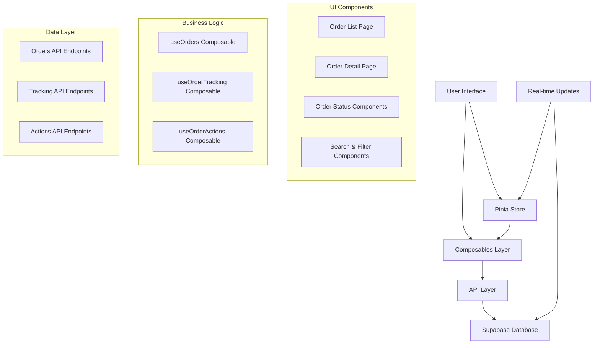

# Design Document

## Overview

The Customer Order History feature provides a comprehensive interface for authenticated users to view, track, and manage their purchase history. The design leverages the existing Nuxt 3 architecture with Supabase backend, following established patterns for authentication, API design, and component structure.

The feature integrates seamlessly with the existing account dashboard and maintains consistency with the current UI/UX patterns while providing enhanced functionality for order management and tracking.

## Architecture

### High-Level Architecture



### Component Architecture

The feature follows the existing component structure with clear separation of concerns:

- **Pages**: Route-level components for order list and detail views
- **Components**: Reusable UI components for order display and interactions
- **Composables**: Business logic and state management
- **Stores**: Global state management with Pinia
- **API**: Server-side endpoints for data operations

## Components and Interfaces

### Core Components

#### 1. Order List Page (`pages/account/orders/index.vue`)
- **Purpose**: Display paginated list of user orders with filtering and search
- **Key Features**:
  - Responsive grid/list layout
  - Pagination controls
  - Status filtering
  - Search functionality
  - Empty state handling
  - Loading states

#### 2. Order Detail Page (`pages/account/orders/[id].vue`)
- **Purpose**: Show comprehensive order information and tracking
- **Key Features**:
  - Complete order information display
  - Order timeline/status tracking
  - Item details with images
  - Address information
  - Action buttons (reorder, return, support)
  - Mobile-optimized layout

#### 3. Order Card Component (`components/order/OrderCard.vue`)
- **Purpose**: Reusable order summary display
- **Props**: `order`, `compact`, `showActions`
- **Features**:
  - Order summary information
  - Status badge
  - Quick actions
  - Responsive design

#### 4. Order Status Component (`components/order/OrderStatus.vue`)
- **Purpose**: Visual status indicator and timeline
- **Props**: `status`, `timeline`, `showTimeline`
- **Features**:
  - Status badge with color coding
  - Progress timeline
  - Estimated delivery dates

#### 5. Order Actions Component (`components/order/OrderActions.vue`)
- **Purpose**: Action buttons for order management
- **Props**: `order`, `availableActions`
- **Features**:
  - Conditional action display
  - Reorder functionality
  - Return initiation
  - Support contact

#### 6. Order Search Component (`components/order/OrderSearch.vue`)
- **Purpose**: Search and filter interface
- **Features**:
  - Text search input
  - Status filter dropdown
  - Date range picker
  - Clear filters button

### Interface Definitions

```typescript
// Core Order Types
interface Order {
  id: number
  orderNumber: string
  userId: string
  status: OrderStatus
  paymentMethod: PaymentMethod
  paymentStatus: PaymentStatus
  paymentIntentId?: string
  subtotalEur: number
  shippingCostEur: number
  taxEur: number
  totalEur: number
  shippingAddress: Address
  billingAddress: Address
  customerNotes?: string
  adminNotes?: string
  shippedAt?: string
  deliveredAt?: string
  createdAt: string
  updatedAt: string
  items: OrderItem[]
  tracking?: TrackingInfo
}

interface OrderItem {
  id: number
  orderId: number
  productId: number
  productSnapshot: ProductSnapshot
  quantity: number
  priceEur: number
  totalEur: number
}

interface ProductSnapshot {
  id: number
  sku: string
  nameTranslations: Record<string, string>
  descriptionTranslations: Record<string, string>
  images: string[]
  attributes: Record<string, any>
}

interface TrackingInfo {
  trackingNumber?: string
  carrier?: string
  status: TrackingStatus
  estimatedDelivery?: string
  lastUpdate: string
  events: TrackingEvent[]
}

interface TrackingEvent {
  timestamp: string
  status: string
  location?: string
  description: string
}

// Enums
enum OrderStatus {
  PENDING = 'pending',
  PROCESSING = 'processing',
  SHIPPED = 'shipped',
  DELIVERED = 'delivered',
  CANCELLED = 'cancelled'
}

enum PaymentStatus {
  PENDING = 'pending',
  PAID = 'paid',
  FAILED = 'failed',
  REFUNDED = 'refunded'
}

enum TrackingStatus {
  LABEL_CREATED = 'label_created',
  IN_TRANSIT = 'in_transit',
  OUT_FOR_DELIVERY = 'out_for_delivery',
  DELIVERED = 'delivered',
  EXCEPTION = 'exception'
}

// API Response Types
interface OrdersResponse {
  success: boolean
  data: {
    orders: Order[]
    pagination: {
      page: number
      limit: number
      total: number
      totalPages: number
    }
  }
}

interface OrderDetailResponse {
  success: boolean
  data: Order
}

// Filter and Search Types
interface OrderFilters {
  status?: OrderStatus
  dateFrom?: string
  dateTo?: string
  search?: string
  page: number
  limit: number
}

interface OrderSearchParams {
  query?: string
  status?: OrderStatus
  dateRange?: {
    start: string
    end: string
  }
}
```

## Data Models

### Database Schema Extensions

The existing database schema already includes the necessary tables. We'll extend with additional fields for tracking:

```sql
-- Add tracking fields to orders table
ALTER TABLE orders ADD COLUMN IF NOT EXISTS tracking_number TEXT;
ALTER TABLE orders ADD COLUMN IF NOT EXISTS carrier TEXT;
ALTER TABLE orders ADD COLUMN IF NOT EXISTS estimated_delivery TIMESTAMP WITH TIME ZONE;

-- Create order tracking events table
CREATE TABLE IF NOT EXISTS order_tracking_events (
  id SERIAL PRIMARY KEY,
  order_id INTEGER REFERENCES orders(id) ON DELETE CASCADE,
  status TEXT NOT NULL,
  location TEXT,
  description TEXT NOT NULL,
  timestamp TIMESTAMP WITH TIME ZONE NOT NULL,
  created_at TIMESTAMP WITH TIME ZONE DEFAULT NOW()
);

-- Add RLS policy for tracking events
ALTER TABLE order_tracking_events ENABLE ROW LEVEL SECURITY;

CREATE POLICY "Users can view own order tracking" ON order_tracking_events
  FOR SELECT USING (
    EXISTS (
      SELECT 1 FROM orders 
      WHERE orders.id = order_tracking_events.order_id 
      AND orders.user_id = auth.uid()
    )
  );

-- Create indexes for performance
CREATE INDEX order_tracking_events_order_id_idx ON order_tracking_events(order_id);
CREATE INDEX order_tracking_events_timestamp_idx ON order_tracking_events(timestamp);
```

### Composables Design

#### useOrders Composable
```typescript
interface UseOrdersReturn {
  // State
  orders: Ref<Order[]>
  loading: Ref<boolean>
  error: Ref<string | null>
  pagination: Ref<PaginationInfo>
  filters: Ref<OrderFilters>
  
  // Actions
  fetchOrders: (params?: OrderFilters) => Promise<void>
  refreshOrders: () => Promise<void>
  searchOrders: (query: string) => Promise<void>
  filterByStatus: (status: OrderStatus) => Promise<void>
  clearFilters: () => void
  
  // Computed
  hasOrders: ComputedRef<boolean>
  filteredOrdersCount: ComputedRef<number>
}
```

#### useOrderDetail Composable
```typescript
interface UseOrderDetailReturn {
  // State
  order: Ref<Order | null>
  loading: Ref<boolean>
  error: Ref<string | null>
  tracking: Ref<TrackingInfo | null>
  
  // Actions
  fetchOrder: (id: number) => Promise<void>
  refreshTracking: () => Promise<void>
  reorder: () => Promise<void>
  initiateReturn: () => Promise<void>
  contactSupport: () => void
  
  // Computed
  canReorder: ComputedRef<boolean>
  canReturn: ComputedRef<boolean>
  isDelivered: ComputedRef<boolean>
}
```

## Error Handling

### Error Types and Handling Strategy

1. **Network Errors**: Connection issues, timeouts
   - Display retry button with exponential backoff
   - Show offline indicator when appropriate
   - Cache last successful data

2. **Authentication Errors**: Invalid or expired tokens
   - Redirect to login page
   - Preserve intended destination
   - Clear sensitive data

3. **Authorization Errors**: Access to orders not owned by user
   - Show 404 page instead of 403 to prevent information leakage
   - Log security events

4. **Validation Errors**: Invalid filter parameters, malformed requests
   - Show inline error messages
   - Reset to valid state
   - Provide helpful suggestions

5. **Server Errors**: Database issues, service unavailable
   - Show generic error message
   - Provide contact information
   - Log detailed error information

### Error Recovery Patterns

```typescript
// Composable error handling pattern
const handleApiError = (error: any, context: string) => {
  if (error.statusCode === 401) {
    // Redirect to login
    navigateTo('/auth/login')
  } else if (error.statusCode === 404) {
    // Show not found state
    showNotFound.value = true
  } else if (error.statusCode >= 500) {
    // Show retry option
    showRetryOption.value = true
  } else {
    // Show generic error
    errorMessage.value = error.message || 'An error occurred'
  }
  
  // Log error for monitoring
  console.error(`${context} error:`, error)
}
```

## Testing Strategy

### Unit Testing
- **Composables**: Test business logic, state management, and API interactions
- **Components**: Test rendering, user interactions, and prop handling
- **Utilities**: Test helper functions and data transformations

### Integration Testing
- **API Endpoints**: Test request/response handling and database operations
- **Component Integration**: Test component communication and data flow
- **Authentication Flow**: Test protected routes and user permissions

### End-to-End Testing
- **Order List Flow**: Navigate to orders, apply filters, view results
- **Order Detail Flow**: View order details, track status, perform actions
- **Mobile Experience**: Test responsive design and touch interactions
- **Error Scenarios**: Test error handling and recovery

### Performance Testing
- **Load Testing**: Test with large order histories
- **Pagination Performance**: Test with various page sizes
- **Search Performance**: Test search with different query types
- **Mobile Performance**: Test on slower devices and connections

### Test Data Strategy
```typescript
// Mock order data for testing
const mockOrders: Order[] = [
  {
    id: 1,
    orderNumber: 'MD-2024-001',
    status: OrderStatus.DELIVERED,
    totalEur: 89.99,
    createdAt: '2024-01-15T10:00:00Z',
    items: [
      {
        id: 1,
        productSnapshot: {
          nameTranslations: { es: 'Producto Test', en: 'Test Product' },
          images: ['/test-image.jpg']
        },
        quantity: 2,
        priceEur: 44.99
      }
    ]
  }
  // Additional test orders...
]
```

## Performance Considerations

### Optimization Strategies

1. **Pagination**: Implement server-side pagination to handle large order histories
2. **Lazy Loading**: Load order details on demand
3. **Caching**: Cache order lists and implement smart refresh strategies
4. **Image Optimization**: Use responsive images and lazy loading for product images
5. **Search Optimization**: Implement debounced search with minimum query length

### Caching Strategy
```typescript
// Order caching implementation
const orderCache = new Map<string, { data: Order[], timestamp: number }>()
const CACHE_DURATION = 5 * 60 * 1000 // 5 minutes

const getCachedOrders = (key: string) => {
  const cached = orderCache.get(key)
  if (cached && Date.now() - cached.timestamp < CACHE_DURATION) {
    return cached.data
  }
  return null
}
```

### Mobile Optimization
- **Virtual Scrolling**: For large order lists on mobile
- **Touch Gestures**: Swipe navigation between order details
- **Offline Support**: Cache critical order information
- **Progressive Loading**: Load essential information first

## Security Considerations

### Data Protection
1. **Row Level Security**: Ensure users can only access their own orders
2. **Input Validation**: Validate all search and filter parameters
3. **Rate Limiting**: Prevent abuse of search and API endpoints
4. **Sensitive Data**: Mask payment information in order history

### Privacy Compliance
1. **Data Minimization**: Only display necessary order information
2. **Retention Policies**: Implement order data retention rules
3. **User Rights**: Support data export and deletion requests
4. **Audit Logging**: Log access to sensitive order information

### API Security
```typescript
// Security middleware for order endpoints
const validateOrderAccess = async (event: H3Event, orderId: number) => {
  const user = await getCurrentUser(event)
  if (!user) {
    throw createError({ statusCode: 401, statusMessage: 'Unauthorized' })
  }
  
  const hasAccess = await checkOrderOwnership(user.id, orderId)
  if (!hasAccess) {
    throw createError({ statusCode: 404, statusMessage: 'Order not found' })
  }
  
  return user
}
```

## Integration Points

### Existing System Integration
1. **Authentication**: Leverage existing auth store and middleware
2. **Navigation**: Integrate with account dashboard navigation
3. **Internationalization**: Use existing i18n setup for translations
4. **Theming**: Follow existing dark/light theme patterns
5. **Toast Notifications**: Use existing toast system for feedback

### External Service Integration
1. **Shipping Carriers**: Integrate with carrier APIs for tracking
2. **Payment Providers**: Link to payment history and receipts
3. **Customer Support**: Integration with support ticket system
4. **Analytics**: Track user interactions and order patterns

### Real-time Updates
```typescript
// Supabase real-time subscription for order updates
const subscribeToOrderUpdates = (userId: string) => {
  return supabase
    .channel('order-updates')
    .on(
      'postgres_changes',
      {
        event: 'UPDATE',
        schema: 'public',
        table: 'orders',
        filter: `user_id=eq.${userId}`
      },
      (payload) => {
        updateOrderInStore(payload.new as Order)
        showOrderUpdateNotification(payload.new as Order)
      }
    )
    .subscribe()
}
```