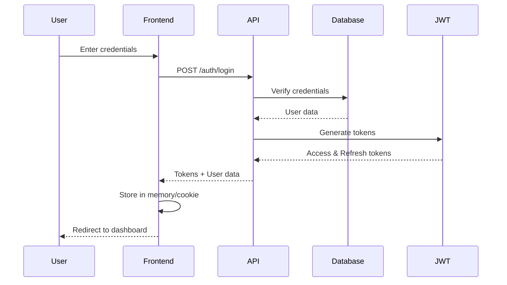
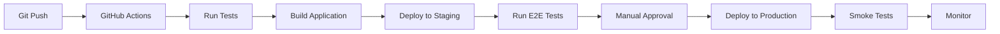

# Design Specification - Moldova Direct E-Commerce Platform

## Architecture Overview

### Technology Stack
- **Frontend**: Nuxt 3 (Vue 3) with TypeScript
- **Styling**: TailwindCSS
- **Backend**: Nitro Server (Edge Runtime)
- **Database**: Cloudflare D1 (SQLite edge database)
- **Storage**: Cloudflare KV (sessions), R2 (files)
- **Deployment**: Cloudflare Pages
- **State Management**: Pinia
- **Internationalization**: @nuxtjs/i18n
- **ORM**: Drizzle ORM

## System Architecture

```
┌─────────────────────────────────────────────────────────────┐
│                         Client Layer                         │
├─────────────────────────────────────────────────────────────┤
│  Browser → Nuxt 3 App → Vue Components → Pinia Stores       │
└─────────────────────────────────────────────────────────────┘
                              │
                              ▼
┌─────────────────────────────────────────────────────────────┐
│                      Edge Network Layer                      │
├─────────────────────────────────────────────────────────────┤
│         Cloudflare CDN (300+ locations worldwide)           │
│              ↓ Cache static assets & pages ↓                │
└─────────────────────────────────────────────────────────────┘
                              │
                              ▼
┌─────────────────────────────────────────────────────────────┐
│                     Application Layer                        │
├─────────────────────────────────────────────────────────────┤
│   Cloudflare Pages → Nitro Server → API Routes → Middleware │
└─────────────────────────────────────────────────────────────┘
                              │
                              ▼
┌─────────────────────────────────────────────────────────────┐
│                        Data Layer                            │
├─────────────────────────────────────────────────────────────┤
│  D1 Database │ KV Storage │ R2 Objects │ External APIs      │
└─────────────────────────────────────────────────────────────┘
```

## Database Schema

### Core Tables

```sql
-- Users table
CREATE TABLE users (
  id TEXT PRIMARY KEY,
  email TEXT UNIQUE NOT NULL,
  password_hash TEXT NOT NULL,
  name TEXT,
  role TEXT DEFAULT 'customer',
  language TEXT DEFAULT 'es',
  created_at INTEGER DEFAULT (unixepoch()),
  updated_at INTEGER DEFAULT (unixepoch())
);

-- Products table
CREATE TABLE products (
  id TEXT PRIMARY KEY,
  slug TEXT UNIQUE NOT NULL,
  name TEXT NOT NULL,
  description TEXT,
  price REAL NOT NULL,
  category_id TEXT,
  stock INTEGER DEFAULT 0,
  images TEXT, -- JSON array
  metadata TEXT, -- JSON object
  created_at INTEGER DEFAULT (unixepoch()),
  updated_at INTEGER DEFAULT (unixepoch()),
  FOREIGN KEY (category_id) REFERENCES categories(id)
);

-- Categories table
CREATE TABLE categories (
  id TEXT PRIMARY KEY,
  slug TEXT UNIQUE NOT NULL,
  name TEXT NOT NULL,
  description TEXT,
  parent_id TEXT,
  created_at INTEGER DEFAULT (unixepoch()),
  FOREIGN KEY (parent_id) REFERENCES categories(id)
);

-- Orders table
CREATE TABLE orders (
  id TEXT PRIMARY KEY,
  user_id TEXT,
  status TEXT DEFAULT 'pending',
  total REAL NOT NULL,
  shipping_address TEXT, -- JSON
  items TEXT, -- JSON array
  created_at INTEGER DEFAULT (unixepoch()),
  updated_at INTEGER DEFAULT (unixepoch()),
  FOREIGN KEY (user_id) REFERENCES users(id)
);

-- Cart items table
CREATE TABLE cart_items (
  id TEXT PRIMARY KEY,
  session_id TEXT NOT NULL,
  product_id TEXT NOT NULL,
  quantity INTEGER DEFAULT 1,
  created_at INTEGER DEFAULT (unixepoch()),
  FOREIGN KEY (product_id) REFERENCES products(id)
);
```

## API Design

### Authentication Endpoints

```typescript
// POST /api/auth/register
{
  email: string,
  password: string,
  name?: string,
  language?: 'es' | 'en' | 'ro' | 'ru'
}
→ { user: User, token: string }

// POST /api/auth/login
{
  email: string,
  password: string
}
→ { user: User, token: string, refreshToken: string }

// POST /api/auth/refresh
{
  refreshToken: string
}
→ { token: string, refreshToken: string }

// GET /api/auth/me
Headers: { Authorization: 'Bearer <token>' }
→ { user: User }

// POST /api/auth/logout
Headers: { Authorization: 'Bearer <token>' }
→ { success: boolean }
```

### Product Endpoints

```typescript
// GET /api/products
Query: {
  category?: string,
  search?: string,
  sort?: 'price' | 'name' | 'created',
  order?: 'asc' | 'desc',
  limit?: number,
  offset?: number
}
→ { products: Product[], total: number }

// GET /api/products/:slug
→ { product: Product }

// GET /api/categories
→ { categories: Category[] }

// GET /api/categories/:slug
→ { category: Category, products: Product[] }
```

### Cart & Order Endpoints

```typescript
// GET /api/cart
Headers: { 'x-session-id': string }
→ { items: CartItem[], total: number }

// POST /api/cart/add
{
  productId: string,
  quantity: number
}
→ { cart: Cart }

// PUT /api/cart/update/:itemId
{
  quantity: number
}
→ { cart: Cart }

// DELETE /api/cart/remove/:itemId
→ { cart: Cart }

// POST /api/orders/create
{
  shippingAddress: Address,
  paymentMethod: string,
  items: CartItem[]
}
→ { order: Order, paymentUrl?: string }

// GET /api/orders/:id
→ { order: Order }

// GET /api/orders
Headers: { Authorization: 'Bearer <token>' }
→ { orders: Order[] }
```

## Security Design

### Authentication Flow



### Security Measures

1. **Password Security**
   - Passwords hashed using Web Crypto API
   - Minimum 8 characters, complexity requirements
   - Password reset via email token

2. **JWT Implementation**
   - Access token: 15 minutes expiry
   - Refresh token: 7 days expiry
   - Tokens signed with RS256 algorithm
   - Refresh token rotation on use

3. **API Security**
   - Rate limiting: 100 requests/minute per IP
   - CORS configuration for allowed origins
   - Input validation with Zod schemas
   - SQL injection prevention via parameterized queries

4. **Edge Security**
   - Cloudflare DDoS protection
   - WAF rules for common attacks
   - Bot management
   - SSL/TLS encryption

## Performance Optimization

### Caching Strategy

```typescript
// Page caching
export default defineCachedEventHandler(async (event) => {
  return await getProducts()
}, {
  maxAge: 60 * 5, // 5 minutes
  name: 'products-list',
  swr: true // Stale-while-revalidate
})

// KV caching for sessions
await env.KV.put(
  `session:${sessionId}`,
  JSON.stringify(sessionData),
  { expirationTtl: 86400 * 7 } // 7 days
)
```

### Image Optimization
- Cloudflare Image Resizing
- WebP/AVIF format delivery
- Lazy loading with Intersection Observer
- Responsive images with srcset

### Database Optimization
- Indexed columns: email, slug, category_id
- Pagination for large datasets
- Query result caching in KV
- Read replicas for high traffic

## Deployment Architecture

### Multi-Environment Setup

```yaml
Production:
  - URL: https://moldovadirect.com
  - Database: moldova-direct-prod
  - KV: moldova-direct-kv-prod
  - Environment: production

Staging:
  - URL: https://staging.moldovadirect.com
  - Database: moldova-direct-staging
  - KV: moldova-direct-kv-staging
  - Environment: staging

Development:
  - URL: http://localhost:3000
  - Database: local SQLite
  - KV: In-memory
  - Environment: development
```

### CI/CD Pipeline



## Monitoring & Analytics

### Application Monitoring
- Cloudflare Analytics for traffic
- Custom metrics in KV
- Error tracking with structured logging
- Performance monitoring with Web Vitals

### Business Metrics
- Order conversion rate
- Cart abandonment rate
- Product view tracking
- User engagement metrics

## Scalability Considerations

### Horizontal Scaling
- Cloudflare Workers auto-scale to millions of requests
- D1 database handles read replicas automatically
- CDN distributes load across 300+ locations

### Vertical Scaling
- Upgrade Cloudflare plan for more resources
- Increase D1 database limits
- Add more KV namespaces for sharding

## Integration Points

### Payment Gateway Integration
```typescript
// Stripe integration
const stripe = new Stripe(process.env.STRIPE_SECRET_KEY)

async function createPaymentIntent(amount: number) {
  return await stripe.paymentIntents.create({
    amount: amount * 100, // Convert to cents
    currency: 'eur',
    metadata: { orderId }
  })
}
```

### Email Service Integration
```typescript
// SendGrid integration
async function sendEmail(to: string, template: string, data: any) {
  return await fetch('https://api.sendgrid.com/v3/mail/send', {
    method: 'POST',
    headers: {
      'Authorization': `Bearer ${process.env.SENDGRID_API_KEY}`,
      'Content-Type': 'application/json'
    },
    body: JSON.stringify({
      personalizations: [{ to: [{ email: to }] }],
      from: { email: 'noreply@moldovadirect.com' },
      template_id: template,
      dynamic_template_data: data
    })
  })
}
```

### Shipping Provider Integration
- API integration with Correos España
- Real-time shipping rate calculation
- Tracking number generation
- Label printing capability

## Disaster Recovery

### Backup Strategy
- Daily automated D1 database backups
- KV data replication across regions
- Git repository for code versioning
- Environment variables in secure vault

### Recovery Plan
1. Database restoration from backup
2. KV namespace recreation
3. DNS failover to backup region
4. Application redeployment
5. Data integrity verification