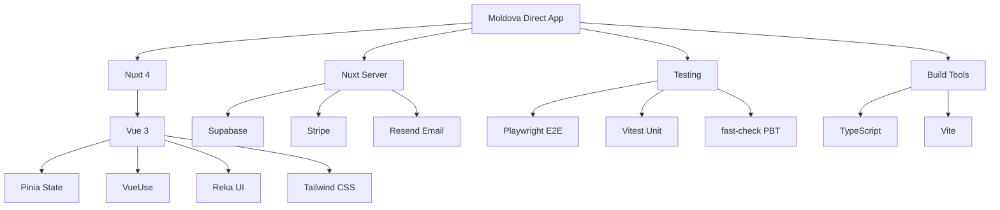

# Project Dependencies

## Prerequisites

- [Add prerequisites here]

## Steps

This document lists all project dependencies and their purposes.

## Critical Dependencies

These dependencies are required for the application to run.

### @nuxt/image

- **Version:** ^1.11.0
- **Purpose:** Image optimization for Nuxt

### @pinia/nuxt

- **Version:** ^0.11.3
- **Purpose:** State management

### @stripe/stripe-js

- **Version:** ^8.6.1
- **Purpose:** Payment processing (client)

### @tanstack/vue-table

- **Version:** ^8.21.3
- **Purpose:** Table component library

### @types/uuid

- **Version:** ^10.0.0
- **Purpose:** Project dependency

### @vueuse/core

- **Version:** ^13.9.0
- **Purpose:** Vue composition utilities

### @vueuse/motion

- **Version:** ^3.0.3
- **Purpose:** Animation utilities

### chart.js

- **Version:** ^4.5.1
- **Purpose:** Data visualization

### chartjs-adapter-date-fns

- **Version:** ^3.0.0
- **Purpose:** Chart.js date adapter

### class-variance-authority

- **Version:** ^0.7.1
- **Purpose:** CSS variant management

### clsx

- **Version:** ^2.1.1
- **Purpose:** Conditional class names

### date-fns

- **Version:** ^4.1.0
- **Purpose:** Date manipulation

### ipx

- **Version:** ^3.1.1
- **Purpose:** Image optimization

### jsonwebtoken

- **Version:** ^9.0.3
- **Purpose:** JWT token handling

### lucide-vue-next

- **Version:** ^0.542.0
- **Purpose:** Icon library

### pinia

- **Version:** ^3.0.4
- **Purpose:** State management library

### reka-ui

- **Version:** ^2.7.0
- **Purpose:** Accessible UI component library

### resend

- **Version:** ^6.4.2
- **Purpose:** Email service

### shadcn-nuxt

- **Version:** ^2.3.2
- **Purpose:** Project dependency

### sharp

- **Version:** ^0.34.5
- **Purpose:** Image processing

### stripe

- **Version:** ^20.1.1
- **Purpose:** Payment processing (server)

### swiper

- **Version:** ^12.0.3
- **Purpose:** Touch slider

### tailwind-merge

- **Version:** ^3.3.1
- **Purpose:** Tailwind class merging

### tailwindcss

- **Version:** ^4.1.17
- **Purpose:** Utility-first CSS framework

### tailwindcss-animate

- **Version:** ^1.0.7
- **Purpose:** Tailwind animations

### uuid

- **Version:** ^11.1.0
- **Purpose:** Unique ID generation

### vue

- **Version:** ^3.5.26
- **Purpose:** Progressive JavaScript framework

### vue-router

- **Version:** ^4.6.3
- **Purpose:** Project dependency

### vue-sonner

- **Version:** ^2.0.8
- **Purpose:** Toast notifications

### vue3-carousel

- **Version:** ^0.17.0
- **Purpose:** Carousel component

### zod

- **Version:** ^4.1.12
- **Purpose:** TypeScript-first schema validation

## Development Dependencies

These dependencies are used during development and testing.

### @axe-core/playwright

- **Version:** ^4.11.0
- **Purpose:** Project dependency

### @nuxt/eslint

- **Version:** ^1.12.1
- **Purpose:** Project dependency

### @nuxt/test-utils

- **Version:** ^3.19.2
- **Purpose:** Project dependency

### @nuxtjs/i18n

- **Version:** ^10.2.1
- **Purpose:** Project dependency

### @nuxtjs/supabase

- **Version:** ^1.6.2
- **Purpose:** Supabase integration for Nuxt

### @pinia/testing

- **Version:** ^1.0.2
- **Purpose:** Project dependency

### @playwright/test

- **Version:** ^1.55.1
- **Purpose:** Project dependency

### @supabase/supabase-js

- **Version:** ^2.87.1
- **Purpose:** Database and authentication

### @tailwindcss/vite

- **Version:** ^4.1.17
- **Purpose:** Project dependency

### @types/jsonwebtoken

- **Version:** ^9.0.10
- **Purpose:** Project dependency

### @types/node

- **Version:** ^24.3.0
- **Purpose:** Project dependency

### @vite-pwa/nuxt

- **Version:** ^1.0.7
- **Purpose:** Project dependency

### @vitejs/plugin-vue

- **Version:** ^6.0.1
- **Purpose:** Project dependency

### @vitest/coverage-v8

- **Version:** ^3.2.4
- **Purpose:** Project dependency

### @vitest/ui

- **Version:** 3.2.4
- **Purpose:** Project dependency

### @vue/test-utils

- **Version:** ^2.4.6
- **Purpose:** Project dependency

### dotenv

- **Version:** ^17.2.1
- **Purpose:** Project dependency

### eslint

- **Version:** ^9.39.1
- **Purpose:** Project dependency

### eslint-plugin-oxlint

- **Version:** ^1.36.0
- **Purpose:** Project dependency

### eslint-plugin-sonarjs

- **Version:** ^3.0.5
- **Purpose:** Project dependency

### fast-check

- **Version:** ^4.5.3
- **Purpose:** Property-based testing library

### husky

- **Version:** ^9.1.7
- **Purpose:** Project dependency

### jsdom

- **Version:** ^26.1.0
- **Purpose:** Project dependency

### knip

- **Version:** ^5.78.0
- **Purpose:** Project dependency

### lint-staged

- **Version:** ^16.2.7
- **Purpose:** Project dependency

### markdown-link-check

- **Version:** ^3.14.2
- **Purpose:** Project dependency

### markdownlint-cli

- **Version:** ^0.47.0
- **Purpose:** Project dependency

### nuxt

- **Version:** ^4.2.2
- **Purpose:** Full-stack Vue framework

### nuxt-swiper

- **Version:** 1.2.0
- **Purpose:** Project dependency

### oxlint

- **Version:** ^1.36.0
- **Purpose:** Project dependency

### playwright

- **Version:** ^1.55.1
- **Purpose:** E2E testing framework

### remark

- **Version:** ^15.0.1
- **Purpose:** Project dependency

### remark-parse

- **Version:** ^11.0.0
- **Purpose:** Project dependency

### terser

- **Version:** ^5.44.1
- **Purpose:** Project dependency

### typescript

- **Version:** ^5.9.3
- **Purpose:** Type-safe JavaScript

### unified

- **Version:** ^11.0.5
- **Purpose:** Project dependency

### unist-util-visit

- **Version:** ^5.0.0
- **Purpose:** Project dependency

### vitest

- **Version:** ^3.2.4
- **Purpose:** Unit testing framework

## Dependency Graph

