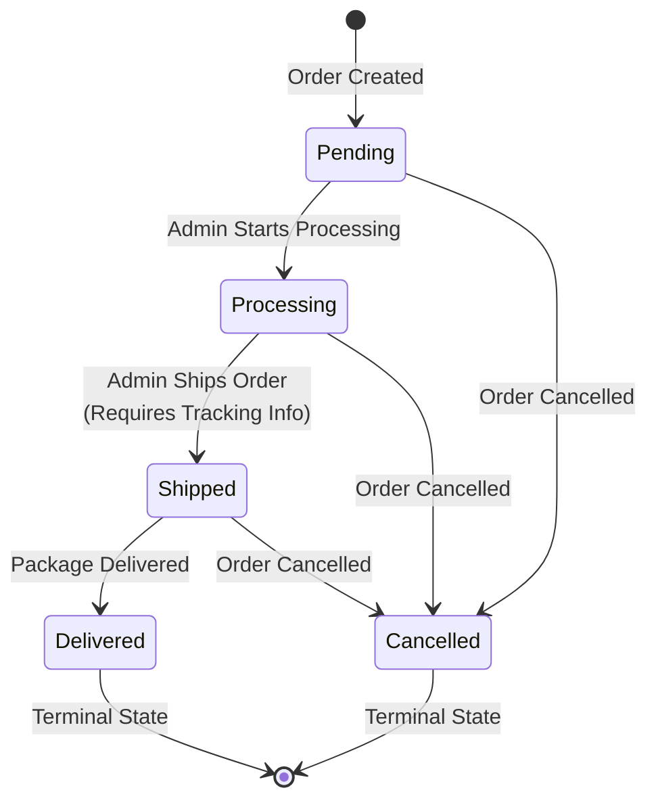

# Order Status Workflow

## Status Transition Diagram

## Status Definitions

### Pending
- **Description**: Order has been placed but not yet started processing
- **Icon**: Clock (lucide:clock)
- **Badge Color**: Secondary (gray)
- **Can Transition To**: Processing, Cancelled
- **Required Actions**: None
- **Typical Duration**: 0-24 hours

### Processing
- **Description**: Order is being prepared for shipment
- **Icon**: Package (lucide:package)
- **Badge Color**: Default (blue)
- **Can Transition To**: Shipped, Cancelled
- **Required Actions**: Pick items, pack order
- **Typical Duration**: 1-3 days

### Shipped
- **Description**: Order has been shipped to customer
- **Icon**: Truck (lucide:truck)
- **Badge Color**: Default (blue)
- **Can Transition To**: Delivered, Cancelled
- **Required Actions**: 
  - ✅ Tracking Number (required)
  - ✅ Carrier Selection (required)
- **Typical Duration**: 3-7 days

### Delivered
- **Description**: Order has been delivered to customer
- **Icon**: Check Circle (lucide:check-circle)
- **Badge Color**: Default (blue)
- **Can Transition To**: None (terminal state)
- **Required Actions**: None
- **Typical Duration**: N/A (final state)

### Cancelled
- **Description**: Order has been cancelled
- **Icon**: X Circle (lucide:x-circle)
- **Badge Color**: Destructive (red)
- **Can Transition To**: None (terminal state)
- **Required Actions**: Process refund, restore inventory
- **Typical Duration**: N/A (final state)

## Transition Rules

### Valid Transitions Matrix

| From Status | To Status | Required Fields | Notes |
|------------|-----------|----------------|-------|
| Pending | Processing | None | Standard workflow |
| Pending | Cancelled | None | Early cancellation |
| Processing | Shipped | Tracking Number, Carrier | Must provide shipping info |
| Processing | Cancelled | None | Cancel during processing |
| Shipped | Delivered | None | Package arrived |
| Shipped | Cancelled | None | Return/refund scenario |
| Delivered | - | - | Terminal state |
| Cancelled | - | - | Terminal state |

### Invalid Transitions

The following transitions are **not allowed**:
- Pending → Shipped (must go through Processing)
- Pending → Delivered (must go through Processing and Shipped)
- Processing → Delivered (must go through Shipped)
- Delivered → Any status (terminal state)
- Cancelled → Any status (terminal state)

## Shipping Carriers

When transitioning to 'Shipped' status, select from:
- **DHL**: International and domestic shipping
- **FedEx**: Express and ground shipping
- **UPS**: Package delivery services
- **USPS**: United States Postal Service
- **Posta Moldovei**: Moldova national postal service
- **Other**: Custom carrier (specify in notes)

## Admin Notes

Admins can add internal notes when updating status:
- Notes are stored in order_status_history table
- Notes are visible only to admins
- Notes help track decision-making
- Notes are optional for all transitions

## Automatic Actions

### When Status Changes to 'Shipped'
- `shipped_at` timestamp is set
- `tracking_number` is stored
- `carrier` is stored
- Customer receives shipping notification email
- Status history record created

### When Status Changes to 'Delivered'
- `delivered_at` timestamp is set
- Customer receives delivery confirmation email
- Status history record created

### When Status Changes to 'Cancelled'
- Inventory is restored (if applicable)
- Refund is processed (if payment was made)
- Customer receives cancellation email
- Status history record created

## Status History Tracking

Every status change is recorded in `order_status_history` table:
- `from_status`: Previous status
- `to_status`: New status
- `changed_by`: Admin user ID
- `changed_at`: Timestamp
- `notes`: Optional admin notes
- `automated`: Whether change was automatic

## UI Components

### StatusBadge
Displays current order status with:
- Color-coded badge
- Status icon
- Status label
- Dark mode support

### StatusUpdateDialog
Provides interface for:
- Viewing current status
- Selecting new status (filtered to valid transitions)
- Visual transition preview
- Tracking information input (for shipped)
- Admin notes input
- Validation feedback
- Submit/cancel actions

## Best Practices

### For Admins
1. Always add notes when cancelling orders
2. Double-check tracking numbers before marking as shipped
3. Update status promptly to keep customers informed
4. Use correct carrier for accurate tracking
5. Review order details before changing status

### For Developers
1. Always validate status transitions server-side
2. Require tracking info for shipped status
3. Send customer notifications on status changes
4. Log all status changes for audit trail
5. Handle errors gracefully with user feedback

## Error Handling

### Common Errors
- **Invalid Transition**: User tries to skip required steps
- **Missing Tracking Info**: Shipped status without tracking number
- **Order Not Found**: Invalid order ID
- **Permission Denied**: User lacks admin privileges
- **Network Error**: API call fails

### Error Messages
All errors display:
- Clear, user-friendly message
- Suggested action to resolve
- Option to retry or cancel
- Toast notification for visibility

## Future Enhancements

Potential improvements:
- Bulk status updates for multiple orders
- Automated status transitions based on carrier tracking
- Custom status workflows per product type
- Status change notifications to multiple admins
- Integration with warehouse management systems
- Automated inventory updates on status changes
