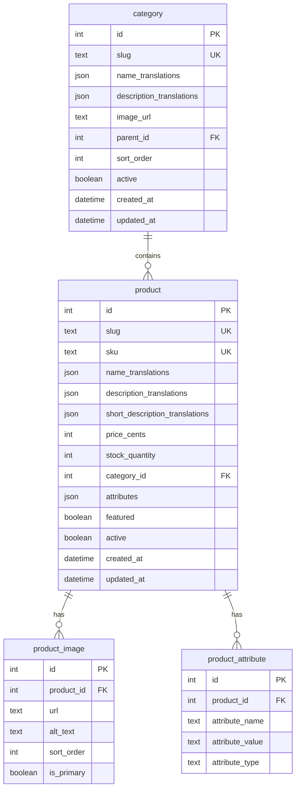
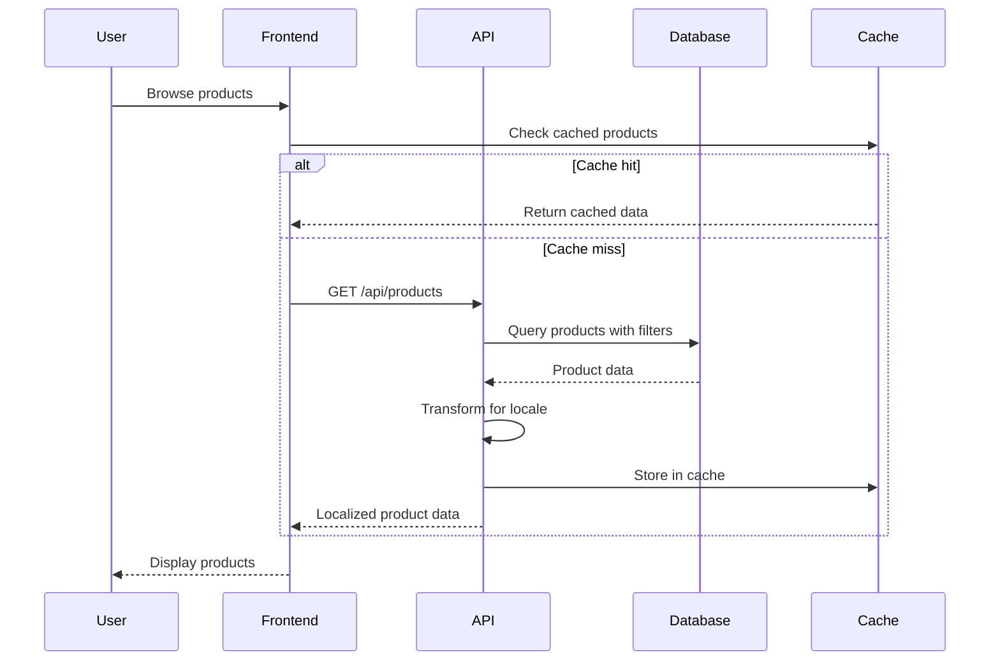

# Product Catalog Design Document


## Overview

The product catalog system is designed as a high-performance, multi-language e-commerce catalog optimized for Moldovan food and wine products. The architecture emphasizes fast loading, excellent mobile experience, and seamless internationalization while maintaining scalability for growing product inventories.

The system supports comprehensive product browsing, advanced search and filtering, multi-language content management, and mobile-first responsive design. It integrates with the existing cart system and provides real-time inventory management with performance optimization through caching and lazy loading strategies.

## Architecture

### Data Architecture



### API Architecture

#### Product Data Flow



## Database Schema Design

### Core Tables

```sql
-- Categories table
CREATE TABLE category (
  id INTEGER PRIMARY KEY AUTOINCREMENT,
  slug TEXT UNIQUE NOT NULL,
  name_translations JSON NOT NULL,
  description_translations JSON,
  image_url TEXT,
  parent_id INTEGER REFERENCES category(id),
  sort_order INTEGER DEFAULT 0,
  active BOOLEAN DEFAULT TRUE,
  created_at DATETIME DEFAULT CURRENT_TIMESTAMP,
  updated_at DATETIME DEFAULT CURRENT_TIMESTAMP
);

-- Products table  
CREATE TABLE product (
  id INTEGER PRIMARY KEY AUTOINCREMENT,
  slug TEXT UNIQUE NOT NULL,
  sku TEXT UNIQUE NOT NULL,
  name_translations JSON NOT NULL,
  description_translations JSON,
  short_description_translations JSON,
  price_cents INTEGER NOT NULL,
  stock_quantity INTEGER DEFAULT 0,
  category_id INTEGER NOT NULL REFERENCES category(id),
  attributes JSON,
  featured BOOLEAN DEFAULT FALSE,
  active BOOLEAN DEFAULT TRUE,
  created_at DATETIME DEFAULT CURRENT_TIMESTAMP,
  updated_at DATETIME DEFAULT CURRENT_TIMESTAMP
);

-- Product images table
CREATE TABLE product_image (
  id INTEGER PRIMARY KEY AUTOINCREMENT,
  product_id INTEGER NOT NULL REFERENCES product(id) ON DELETE CASCADE,
  url TEXT NOT NULL,
  alt_text TEXT,
  sort_order INTEGER DEFAULT 0,
  is_primary BOOLEAN DEFAULT FALSE,
  created_at DATETIME DEFAULT CURRENT_TIMESTAMP
);

-- Search optimization table
CREATE TABLE product_search (
  product_id INTEGER PRIMARY KEY REFERENCES product(id) ON DELETE CASCADE,
  search_vector TEXT, -- Combined searchable text for FTS
  updated_at DATETIME DEFAULT CURRENT_TIMESTAMP
);

-- Indexes for performance
CREATE INDEX idx_product_category ON product(category_id);
CREATE INDEX idx_product_active_featured ON product(active, featured);
CREATE INDEX idx_product_price ON product(price_cents);
CREATE INDEX idx_product_stock ON product(stock_quantity);
CREATE INDEX idx_category_parent ON category(parent_id);
CREATE INDEX idx_category_active_sort ON category(active, sort_order);
CREATE UNIQUE INDEX idx_product_image_primary ON product_image(product_id) WHERE is_primary = TRUE;
```

### Translation Structure

```typescript
// Translation format for products
interface ProductTranslations {
  name: {
    es: string
    en: string
    ro: string
    ru: string
  }
  description: {
    es: string
    en: string
    ro?: string
    ru?: string
  }
  shortDescription: {
    es: string
    en: string
    ro?: string
    ru?: string
  }
}

// Example product with translations
const exampleProduct = {
  id: 1,
  slug: "malbec-purcari-2021",
  sku: "WINE-MALBEC-001",
  nameTranslations: {
    es: "Purcari Malbec 2021",
    en: "Purcari Malbec 2021", 
    ro: "Purcari Malbec 2021",
    ru: "Пуркарь Мальбек 2021"
  },
  descriptionTranslations: {
    es: "Vino tinto premium de Moldova con notas frutales intensas...",
    en: "Premium red wine from Moldova with intense fruity notes...",
    ro: "Vin roșu premium din Moldova cu note fructate intense...",
    ru: "Премиальное красное вино из Молдовы с интенсивными фруктовыми нотами..."
  }
}
```

## API Design

### Product Endpoints

| Method | Endpoint | Description | Query Parameters |
|--------|----------|-------------|------------------|
| GET | `/api/products` | List products with filtering | `category`, `search`, `sort`, `page`, `limit`, `featured` |
| GET | `/api/products/[slug]` | Get product by slug | `locale` |
| GET | `/api/categories` | List all categories | `parent`, `locale` |
| GET | `/api/categories/[slug]` | Get category with products | `sort`, `page`, `limit`, `locale` |
| GET | `/api/search` | Search products | `q`, `category`, `sort`, `page`, `limit` |
| GET | `/api/products/featured` | Get featured products | `limit`, `category` |
| GET | `/api/products/related/[id]` | Get related products | `limit` |

### Response Formats

```typescript
// Product list response
interface ProductListResponse {
  products: Product[]
  pagination: {
    page: number
    limit: number
    total: number
    totalPages: number
  }
  filters: {
    categories: CategoryFilter[]
    priceRange: { min: number; max: number }
    attributes: AttributeFilter[]
  }
}

// Product detail response
interface Product {
  id: number
  slug: string
  sku: string
  name: string
  description: string
  shortDescription: string
  price: number
  formattedPrice: string
  stock: number
  stockStatus: 'in_stock' | 'low_stock' | 'out_of_stock'
  category: Category
  images: ProductImage[]
  attributes: ProductAttribute[]
  relatedProducts: Product[]
}

// Category response
interface Category {
  id: number
  slug: string
  name: string
  description?: string
  image?: string
  parentId?: number
  children?: Category[]
  productCount: number
}
```

### Filtering and Search Logic

```typescript
// Advanced product filtering
interface ProductFilters {
  category?: string
  search?: string
  priceMin?: number
  priceMax?: number
  inStock?: boolean
  featured?: boolean
  attributes?: Record<string, string[]>
  sort?: 'name' | 'price_asc' | 'price_desc' | 'newest' | 'featured'
}

// Search implementation with ranking
const searchProducts = async (query: string, locale: string) => {
  // 1. Exact name matches (highest priority)
  // 2. Name contains query
  // 3. Description contains query
  // 4. Attributes contain query
  // 5. Category name contains query
}
```

## Frontend Component Architecture

### Component Structure

```
components/product/
├── ProductGrid.vue           # Product listing grid
├── ProductCard.vue           # Individual product card
├── ProductDetail.vue         # Product detail page
├── ProductImageGallery.vue   # Image gallery component
├── ProductFilter.vue         # Filtering sidebar
├── ProductSearch.vue         # Search component
├── CategoryNavigation.vue    # Category navigation
├── CategoryBreadcrumb.vue    # Breadcrumb navigation
├── ProductQuickView.vue      # Quick view modal
└── RelatedProducts.vue       # Related products section
```

### State Management

#### Product Store (Pinia)

```typescript
// stores/products.ts
export const useProductStore = defineStore('products', () => {
  // State
  const products = ref<Product[]>([])
  const categories = ref<Category[]>([])
  const currentProduct = ref<Product | null>(null)
  const filters = ref<ProductFilters>({})
  const pagination = ref<Pagination>({ page: 1, limit: 24, total: 0 })
  const loading = ref(false)

  // Getters
  const filteredProducts = computed(() => {
    // Apply client-side filtering for immediate feedback
  })

  const categoriesTree = computed(() => {
    // Build hierarchical category tree
  })

  // Actions
  const fetchProducts = async (filters?: ProductFilters) => {
    // Implementation
  }

  const fetchProductBySlug = async (slug: string) => {
    // Implementation
  }

  const searchProducts = async (query: string) => {
    // Implementation
  }

  return {
    products: readonly(products),
    categories: readonly(categories),
    currentProduct: readonly(currentProduct),
    filteredProducts,
    categoriesTree,
    fetchProducts,
    fetchProductBySlug,
    searchProducts
  }
})
```

### Product Card Design

#### Visual Design Specifications

```vue
<template>
  <article class="product-card group relative">
    <!-- Product Image -->
    <div class="aspect-square bg-gray-100 rounded-lg overflow-hidden">
      <NuxtImg
        :src="product.primaryImage"
        :alt="product.name"
        class="w-full h-full object-cover group-hover:scale-105 transition-transform duration-300"
        loading="lazy"
        sizes="(max-width: 768px) 50vw, (max-width: 1024px) 33vw, 25vw"
      />
      
      <!-- Stock indicator -->
      <div v-if="product.stockStatus === 'low_stock'" 
           class="absolute top-2 left-2 bg-orange-500 text-white text-xs px-2 py-1 rounded">
        {{ $t('products.lowStock') }}
      </div>
      
      <!-- Out of stock overlay -->
      <div v-if="product.stockStatus === 'out_of_stock'"
           class="absolute inset-0 bg-black bg-opacity-50 flex items-center justify-center">
        <span class="text-white font-medium">{{ $t('products.outOfStock') }}</span>
      </div>
    </div>

    <!-- Product Info -->
    <div class="mt-4 space-y-2">
      <h3 class="font-medium text-gray-900 line-clamp-2">
        {{ product.name }}
      </h3>
      
      <p class="text-sm text-gray-500 line-clamp-1">
        {{ product.category.name }}
      </p>
      
      <div class="flex items-center justify-between">
        <span class="text-lg font-semibold text-gray-900">
          {{ product.formattedPrice }}
        </span>
        
        <button 
          v-if="product.stockStatus !== 'out_of_stock'"
          @click="addToCart"
          class="btn btn-primary btn-sm"
          :disabled="loading"
        >
          {{ $t('products.addToCart') }}
        </button>
      </div>
    </div>
  </article>
</template>
```

### Product Filtering Interface

#### Filter Sidebar Design

```vue
<template>
  <aside class="product-filters">
    <!-- Category Filter -->
    <div class="filter-section">
      <h3 class="filter-title">{{ $t('products.filters.categories') }}</h3>
      <CategoryTree 
        :categories="categoriesTree"
        v-model="selectedCategories"
        @change="applyFilters"
      />
    </div>

    <!-- Price Range Filter -->
    <div class="filter-section">
      <h3 class="filter-title">{{ $t('products.filters.priceRange') }}</h3>
      <PriceRangeSlider
        :min="priceRange.min"
        :max="priceRange.max"
        v-model="selectedPriceRange"
        @change="applyFilters"
      />
    </div>

    <!-- Attribute Filters -->
    <div v-for="attribute in availableAttributes" 
         :key="attribute.name"
         class="filter-section">
      <h3 class="filter-title">{{ attribute.label }}</h3>
      <CheckboxGroup
        :options="attribute.values"
        v-model="selectedAttributes[attribute.name]"
        @change="applyFilters"
      />
    </div>

    <!-- Active Filters -->
    <div v-if="hasActiveFilters" class="filter-section">
      <h3 class="filter-title">{{ $t('products.filters.active') }}</h3>
      <div class="flex flex-wrap gap-2">
        <FilterTag
          v-for="filter in activeFilters"
          :key="filter.id"
          :label="filter.label"
          @remove="removeFilter(filter.id)"
        />
      </div>
      <button @click="clearAllFilters" class="btn btn-outline btn-sm mt-2">
        {{ $t('products.filters.clearAll') }}
      </button>
    </div>
  </aside>
</template>
```

## Mobile Design Specifications

### Responsive Breakpoints

```css
/* Mobile-first responsive design */
.product-grid {
  /* Mobile: 2 columns */
  @apply grid grid-cols-2 gap-4;
  
  /* Tablet: 3 columns */
  @screen md {
    @apply grid-cols-3 gap-6;
  }
  
  /* Desktop: 4 columns */
  @screen lg {
    @apply grid-cols-4 gap-8;
  }
  
  /* Large desktop: 5 columns */
  @screen xl {
    @apply grid-cols-5;
  }
}
```

### Mobile-Specific Features

#### Touch-Optimized Interactions
- **Swipe gestures**: Product image galleries support swipe navigation
- **Pull-to-refresh**: Refresh product listings with pull gesture
- **Infinite scroll**: Load more products as user scrolls
- **Touch feedback**: Visual feedback for all touch interactions

#### Mobile Product Card Adaptations
- **Larger touch targets**: Minimum 44px for all interactive elements
- **Optimized images**: Progressive loading with appropriate sizing
- **Simplified layout**: Essential information prioritized
- **Quick actions**: Easy access to add to cart and quick view

### Progressive Web App Features

```typescript
// Service worker for offline caching
const CACHE_NAME = 'moldova-direct-products-v1'
const STATIC_ASSETS = [
  '/products',
  '/categories',
  '/offline.html'
]

// Cache product data for offline viewing
self.addEventListener('fetch', (event) => {
  if (event.request.url.includes('/api/products')) {
    event.respondWith(
      caches.open(CACHE_NAME).then(cache => {
        return cache.match(event.request).then(response => {
          return response || fetch(event.request).then(fetchResponse => {
            cache.put(event.request, fetchResponse.clone())
            return fetchResponse
          })
        })
      })
    )
  }
})
```

## Performance Optimization

### Image Optimization

```typescript
// Nuxt Image configuration
export default defineNuxtConfig({
  image: {
    cloudflare: {
      baseURL: 'https://moldovadirect.com/cdn-cgi/image'
    },
    screens: {
      xs: 320,
      sm: 640,
      md: 768,
      lg: 1024,
      xl: 1280,
      xxl: 1536
    },
    quality: 80,
    format: ['webp', 'jpg']
  }
})

// Product image component with optimization
<NuxtImg
  :src="product.image"
  :alt="product.name"
  sizes="(max-width: 768px) 50vw, (max-width: 1024px) 33vw, 25vw"
  quality="80"
  format="webp"
  loading="lazy"
  placeholder
/>
```

### Caching Strategy

#### Client-Side Caching
- **Product listings**: Cache for 5 minutes
- **Product details**: Cache for 10 minutes
- **Categories**: Cache for 30 minutes
- **Search results**: Cache for 2 minutes

#### Server-Side Caching
- **Database queries**: Redis cache for 10 minutes
- **Image transformations**: CDN cache for 24 hours
- **API responses**: Edge cache for 5 minutes

### Lazy Loading Implementation

```vue
<script setup>
// Intersection Observer for lazy loading
const productCards = ref([])
const { stop } = useIntersectionObserver(
  productCards,
  ([{ isIntersecting }]) => {
    if (isIntersecting) {
      loadMoreProducts()
    }
  },
  { threshold: 0.1 }
)

onUnmounted(() => {
  stop()
})
</script>

<template>
  <div class="product-grid">
    <ProductCard
      v-for="product in products"
      :key="product.id"
      :product="product"
      ref="productCards"
    />
  </div>
</template>
```

## Search and Filtering

### Search Implementation

#### Full-Text Search
```sql
-- SQLite FTS5 implementation
CREATE VIRTUAL TABLE product_fts USING fts5(
  name_es, name_en, name_ro, name_ru,
  description_es, description_en, description_ro, description_ru,
  category_name,
  sku,
  content='product',
  content_rowid='id'
);

-- Search query with ranking
SELECT p.*, rank
FROM product p
JOIN product_fts pf ON p.id = pf.rowid
WHERE product_fts MATCH ?
ORDER BY rank;
```

#### Search Suggestions
```typescript
// Search suggestions with debouncing
const searchSuggestions = ref<string[]>([])
const debouncedSearch = useDebounceFn(async (query: string) => {
  if (query.length < 2) return
  
  const suggestions = await $fetch<string[]>('/api/search/suggestions', {
    query: { q: query, limit: 8 }
  })
  
  searchSuggestions.value = suggestions
}, 300)
```

### Advanced Filtering

#### Dynamic Filter Options
```typescript
// Generate filter options based on current results
const generateFilterOptions = (products: Product[]) => {
  const categories = new Set()
  const attributes = new Map()
  let minPrice = Infinity
  let maxPrice = 0

  products.forEach(product => {
    categories.add(product.category)
    minPrice = Math.min(minPrice, product.price)
    maxPrice = Math.max(maxPrice, product.price)
    
    Object.entries(product.attributes).forEach(([key, value]) => {
      if (!attributes.has(key)) {
        attributes.set(key, new Set())
      }
      attributes.get(key).add(value)
    })
  })

  return {
    categories: Array.from(categories),
    priceRange: { min: minPrice, max: maxPrice },
    attributes: Object.fromEntries(attributes)
  }
}
```

## Internationalization

### Multi-Language Content Management

#### Content Fallback Strategy
```typescript
const getLocalizedContent = (content: Record<string, string>, locale: string) => {
  // 1. Try requested locale
  if (content[locale]) return content[locale]
  
  // 2. Try default locale (Spanish)
  if (content.es) return content.es
  
  // 3. Try English as fallback
  if (content.en) return content.en
  
  // 4. Return first available translation
  return Object.values(content)[0] || ''
}
```

#### Translation Management
```typescript
// Product translation composable
export const useProductTranslations = () => {
  const { locale } = useI18n()
  
  const getProductName = (product: Product) => {
    return getLocalizedContent(product.nameTranslations, locale.value)
  }
  
  const getProductDescription = (product: Product) => {
    return getLocalizedContent(product.descriptionTranslations, locale.value)
  }
  
  return {
    getProductName,
    getProductDescription
  }
}
```

## Components and Interfaces

### Frontend Components
- **ProductGrid.vue**: Main product listing component with responsive grid layout
- **ProductCard.vue**: Individual product display with image, name, price, and actions
- **ProductDetail.vue**: Comprehensive product detail page with gallery and specifications
- **ProductFilter.vue**: Advanced filtering sidebar with category, price, and attribute filters
- **ProductSearch.vue**: Search component with autocomplete and suggestions
- **CategoryNavigation.vue**: Hierarchical category navigation with breadcrumbs

### API Interfaces
- **Product API**: RESTful endpoints for product CRUD operations and filtering
- **Search API**: Full-text search with ranking and suggestions
- **Category API**: Hierarchical category management with localization
- **Image API**: Optimized image serving with multiple formats and sizes

### Integration Points
- **Cart Integration**: Seamless add-to-cart functionality with stock validation
- **User Preferences**: Favorites, recently viewed, and personalized recommendations
- **Analytics Integration**: Product view tracking and conversion analytics

## Data Models

### Core Data Structures

#### Product Model
```typescript
interface Product {
  id: number
  slug: string
  sku: string
  nameTranslations: Record<string, string>
  descriptionTranslations: Record<string, string>
  shortDescriptionTranslations: Record<string, string>
  priceCents: number
  stockQuantity: number
  categoryId: number
  attributes: Record<string, any>
  featured: boolean
  active: boolean
  images: ProductImage[]
  category: Category
}
```

#### Category Model
```typescript
interface Category {
  id: number
  slug: string
  nameTranslations: Record<string, string>
  descriptionTranslations: Record<string, string>
  imageUrl?: string
  parentId?: number
  sortOrder: number
  active: boolean
  children?: Category[]
  productCount: number
}
```

#### Database Schema
- **SQLite-based schema** with JSON columns for translations
- **Optimized indexes** for performance on category, price, and stock queries
- **Full-text search** implementation using SQLite FTS5
- **Image management** with multiple sizes and formats

## Error Handling

### Client-Side Error Handling
- **Network failures**: Graceful degradation with cached content and retry mechanisms
- **Image loading errors**: Fallback to placeholder images with proper alt text
- **Search failures**: Display helpful error messages with suggested actions
- **Filter errors**: Reset to safe state with user notification

### Server-Side Error Handling
- **Database connection issues**: Automatic retry with exponential backoff
- **Invalid product data**: Validation with detailed error responses
- **Search service failures**: Fallback to basic database queries
- **Cache failures**: Direct database queries with performance logging

### Error Recovery Strategies
- **Progressive enhancement**: Core functionality works without JavaScript
- **Offline support**: Service worker caching for essential product data
- **Graceful degradation**: Simplified experience when advanced features fail
- **User feedback**: Clear error messages with actionable next steps

## Testing Strategy

### Unit Testing
- **Component testing**: Vue Test Utils for all product components
- **API testing**: Comprehensive endpoint testing with mock data
- **Utility functions**: Full coverage of search, filtering, and localization logic
- **Data validation**: Schema validation and transformation testing

### Integration Testing
- **Database operations**: Test product queries, filtering, and search functionality
- **API integration**: End-to-end testing of product catalog workflows
- **Cache behavior**: Verify caching strategies and invalidation logic
- **Multi-language support**: Test content fallback and localization

### Performance Testing
- **Load testing**: Simulate high traffic on product listing pages
- **Image optimization**: Verify lazy loading and responsive image delivery
- **Search performance**: Test search response times with large datasets
- **Mobile performance**: Lighthouse audits for mobile user experience

### User Acceptance Testing
- **Cross-browser compatibility**: Test on major browsers and devices
- **Accessibility compliance**: WCAG 2.1 AA compliance verification
- **Mobile usability**: Touch interaction and responsive design validation
- **Multi-language functionality**: Complete workflow testing in all supported languages