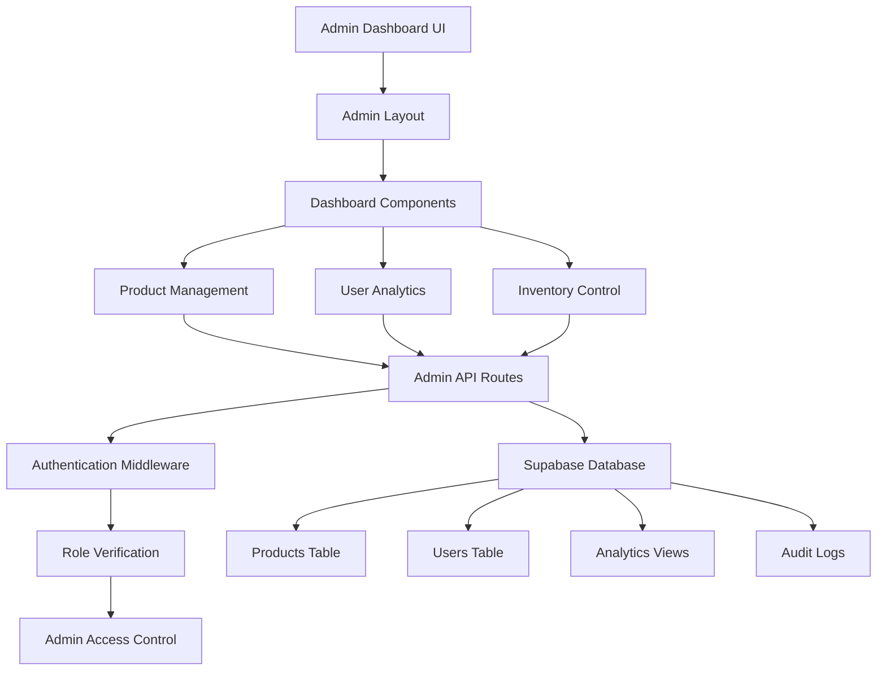

# Admin Dashboard Design Document

## Overview

The admin dashboard is a comprehensive management interface built on the existing Nuxt 3 + Supabase architecture. It provides administrators with tools for product management, inventory control, user analytics, and system administration. The design leverages the current tech stack including Tailwind CSS for styling, Pinia for state management, and the existing authentication system.

## Architecture

### Technology Stack Integration
- **Frontend**: Nuxt 3 with Vue 3 Composition API
- **Styling**: Tailwind CSS (existing configuration)
- **State Management**: Pinia stores for dashboard data
- **Authentication**: Supabase Auth with role-based access control
- **Database**: Supabase PostgreSQL with existing schema extensions
- **API Layer**: Nuxt server API routes for admin operations
- **Charts/Analytics**: Chart.js or similar lightweight charting library
- **Internationalization**: Existing @nuxtjs/i18n setup

### System Architecture



## Components and Interfaces

### 1. Admin Layout Component
**Location**: `layouts/admin.vue`

```vue
<template>
  <div class="min-h-screen bg-gray-50">
    <!-- Admin Navigation Sidebar -->
    <AdminSidebar :collapsed="sidebarCollapsed" />
    
    <!-- Main Content Area -->
    <div :class="['transition-all duration-300', sidebarCollapsed ? 'ml-16' : 'ml-64']">
      <!-- Top Navigation Bar -->
      <AdminHeader @toggle-sidebar="toggleSidebar" />
      
      <!-- Page Content -->
      <main class="p-6">
        <slot />
      </main>
    </div>
  </div>
</template>
```

### 2. Dashboard Components Structure

#### Core Dashboard Components
- `AdminSidebar.vue` - Navigation menu with role-based visibility
- `AdminHeader.vue` - Top bar with user info and quick actions
- `DashboardStats.vue` - Key metrics display cards
- `QuickActions.vue` - Common administrative actions
- `RecentActivity.vue` - Latest system activities

#### Product Management Components
- `ProductTable.vue` - Paginated product listing with filters
- `ProductForm.vue` - Create/edit product form
- `ProductBulkActions.vue` - Bulk operations interface
- `InventoryManager.vue` - Stock level management
- `ProductImageUpload.vue` - Image management interface

#### Analytics Components
- `AnalyticsDashboard.vue` - Main analytics overview
- `UserMetricsChart.vue` - User engagement charts
- `SalesAnalytics.vue` - Revenue and conversion metrics
- `ProductPerformance.vue` - Product-specific analytics
- `DateRangePicker.vue` - Time period selection

#### User Management Components
- `UserTable.vue` - User listing and search
- `UserProfile.vue` - Detailed user information
- `UserActions.vue` - Account management actions
- `PermissionManager.vue` - Role and permission controls

### 3. API Interface Design

#### Admin API Routes Structure
```
/api/admin/
├── dashboard/
│   ├── stats.get.ts          # Dashboard statistics
│   └── activity.get.ts       # Recent activity feed
├── products/
│   ├── index.get.ts          # List products with admin filters
│   ├── index.post.ts         # Create new product
│   ├── [id].get.ts          # Get product details
│   ├── [id].put.ts          # Update product
│   ├── [id].delete.ts       # Delete product
│   ├── bulk.post.ts         # Bulk operations
│   └── inventory.put.ts     # Update inventory
├── users/
│   ├── index.get.ts         # List users with filters
│   ├── [id].get.ts         # Get user details
│   ├── [id].put.ts         # Update user
│   └── [id]/actions.post.ts # User actions (suspend, etc.)
├── analytics/
│   ├── overview.get.ts      # General analytics
│   ├── users.get.ts         # User analytics
│   ├── products.get.ts      # Product analytics
│   └── sales.get.ts         # Sales analytics
└── audit/
    └── logs.get.ts          # Audit trail
```

#### API Response Interfaces
```typescript
interface DashboardStats {
  totalProducts: number
  activeProducts: number
  lowStockProducts: number
  totalUsers: number
  activeUsers: number
  totalOrders: number
  revenue: number
  conversionRate: number
}

interface AdminProductResponse {
  products: ProductWithRelations[]
  total: number
  page: number
  limit: number
  totalPages: number
  filters: {
    categories: Category[]
    stockLevels: StockLevel[]
  }
}

interface UserAnalytics {
  registrationTrend: TimeSeriesData[]
  activeUsers: TimeSeriesData[]
  userActivity: ActivityData[]
  demographics: DemographicData
}
```

## Data Models

### 1. Database Schema Extensions

#### Admin-specific Tables
```sql
-- Admin roles and permissions
CREATE TABLE admin_roles (
  id SERIAL PRIMARY KEY,
  name VARCHAR(50) UNIQUE NOT NULL,
  permissions JSONB NOT NULL,
  created_at TIMESTAMP DEFAULT NOW(),
  updated_at TIMESTAMP DEFAULT NOW()
);

-- User role assignments
CREATE TABLE user_roles (
  user_id UUID REFERENCES auth.users(id),
  role_id INTEGER REFERENCES admin_roles(id),
  assigned_at TIMESTAMP DEFAULT NOW(),
  assigned_by UUID REFERENCES auth.users(id),
  PRIMARY KEY (user_id, role_id)
);

-- Audit logs for admin actions
CREATE TABLE audit_logs (
  id SERIAL PRIMARY KEY,
  user_id UUID REFERENCES auth.users(id),
  action VARCHAR(100) NOT NULL,
  resource_type VARCHAR(50) NOT NULL,
  resource_id VARCHAR(100),
  old_values JSONB,
  new_values JSONB,
  ip_address INET,
  user_agent TEXT,
  created_at TIMESTAMP DEFAULT NOW()
);

-- Analytics aggregation tables
CREATE TABLE daily_analytics (
  date DATE PRIMARY KEY,
  total_users INTEGER DEFAULT 0,
  active_users INTEGER DEFAULT 0,
  new_registrations INTEGER DEFAULT 0,
  page_views INTEGER DEFAULT 0,
  unique_visitors INTEGER DEFAULT 0,
  orders_count INTEGER DEFAULT 0,
  revenue DECIMAL(10,2) DEFAULT 0,
  created_at TIMESTAMP DEFAULT NOW()
);

-- Product analytics
CREATE TABLE product_analytics (
  id SERIAL PRIMARY KEY,
  product_id INTEGER REFERENCES products(id),
  date DATE NOT NULL,
  views INTEGER DEFAULT 0,
  cart_additions INTEGER DEFAULT 0,
  purchases INTEGER DEFAULT 0,
  revenue DECIMAL(10,2) DEFAULT 0,
  UNIQUE(product_id, date)
);
```

#### Enhanced Product Management
```sql
-- Add admin-specific columns to products
ALTER TABLE products ADD COLUMN IF NOT EXISTS 
  low_stock_threshold INTEGER DEFAULT 5,
  reorder_point INTEGER DEFAULT 10,
  supplier_info JSONB,
  admin_notes TEXT;

-- Inventory tracking
CREATE TABLE inventory_movements (
  id SERIAL PRIMARY KEY,
  product_id INTEGER REFERENCES products(id),
  movement_type VARCHAR(20) NOT NULL, -- 'in', 'out', 'adjustment'
  quantity INTEGER NOT NULL,
  reason VARCHAR(100),
  reference_id VARCHAR(100), -- order_id, adjustment_id, etc.
  performed_by UUID REFERENCES auth.users(id),
  created_at TIMESTAMP DEFAULT NOW()
);
```

### 2. Pinia Store Definitions

#### Admin Dashboard Store
```typescript
export const useAdminDashboardStore = defineStore('adminDashboard', () => {
  const stats = ref<DashboardStats | null>(null)
  const recentActivity = ref<ActivityItem[]>([])
  const loading = ref(false)
  
  const fetchDashboardData = async () => {
    loading.value = true
    try {
      const [statsData, activityData] = await Promise.all([
        $fetch('/api/admin/dashboard/stats'),
        $fetch('/api/admin/dashboard/activity')
      ])
      stats.value = statsData
      recentActivity.value = activityData
    } finally {
      loading.value = false
    }
  }
  
  return {
    stats: readonly(stats),
    recentActivity: readonly(recentActivity),
    loading: readonly(loading),
    fetchDashboardData
  }
})
```

#### Admin Products Store
```typescript
export const useAdminProductsStore = defineStore('adminProducts', () => {
  const products = ref<ProductWithRelations[]>([])
  const filters = ref<ProductFilters>({})
  const pagination = ref<PaginationState>({})
  
  const fetchProducts = async (params: ProductQueryParams) => {
    const response = await $fetch('/api/admin/products', { query: params })
    products.value = response.products
    pagination.value = {
      total: response.total,
      page: response.page,
      totalPages: response.totalPages
    }
  }
  
  const updateInventory = async (productId: number, quantity: number) => {
    await $fetch(`/api/admin/products/inventory`, {
      method: 'PUT',
      body: { productId, quantity }
    })
    // Update local state
    const product = products.value.find(p => p.id === productId)
    if (product) product.stockQuantity = quantity
  }
  
  return {
    products: readonly(products),
    filters: readonly(filters),
    pagination: readonly(pagination),
    fetchProducts,
    updateInventory
  }
})
```

## Error Handling

### 1. Authentication & Authorization Errors
- **401 Unauthorized**: Redirect to login page
- **403 Forbidden**: Show access denied message with contact info
- **Role Verification**: Middleware checks for admin role on all admin routes

### 2. Data Validation Errors
- **Form Validation**: Client-side validation with Zod schemas
- **API Validation**: Server-side validation with detailed error messages
- **File Upload Errors**: Size, type, and security validation

### 3. System Errors
- **Database Errors**: Graceful degradation with retry mechanisms
- **Network Errors**: Offline detection and queue failed requests
- **Performance Issues**: Loading states and pagination for large datasets

### 4. Error Logging and Monitoring
```typescript
// Error logging service
export const useErrorLogger = () => {
  const logError = async (error: Error, context: string) => {
    await $fetch('/api/admin/audit/error', {
      method: 'POST',
      body: {
        message: error.message,
        stack: error.stack,
        context,
        timestamp: new Date().toISOString(),
        userAgent: navigator.userAgent,
        url: window.location.href
      }
    })
  }
  
  return { logError }
}
```

## Testing Strategy

### 1. Unit Testing
- **Component Testing**: Vue Test Utils for component logic
- **Store Testing**: Pinia store actions and getters
- **Utility Functions**: Pure function testing with Vitest

### 2. Integration Testing
- **API Route Testing**: Nuxt test utils for server endpoints
- **Authentication Flow**: Login, role verification, and access control
- **Database Operations**: CRUD operations with test database

### 3. End-to-End Testing
- **Admin Workflows**: Complete user journeys with Playwright
- **Cross-browser Testing**: Chrome, Firefox, Safari compatibility
- **Mobile Responsiveness**: Touch interactions and responsive layouts

### 4. Performance Testing
- **Load Testing**: Large dataset handling and pagination
- **Memory Usage**: Component lifecycle and memory leaks
- **Bundle Size**: Code splitting and lazy loading verification

### Test Structure
```
tests/
├── unit/
│   ├── components/admin/
│   ├── stores/admin/
│   └── utils/admin/
├── integration/
│   ├── api/admin/
│   └── auth/admin/
└── e2e/
    ├── admin-dashboard.spec.ts
    ├── product-management.spec.ts
    ├── user-analytics.spec.ts
    └── admin-auth.spec.ts
```

## Security Considerations

### 1. Authentication & Authorization
- **Role-Based Access Control**: Admin role verification on all routes
- **Session Management**: Secure token handling and refresh
- **Multi-Factor Authentication**: Optional 2FA for admin accounts

### 2. Data Protection
- **Input Sanitization**: XSS prevention on all user inputs
- **SQL Injection Prevention**: Parameterized queries and ORM usage
- **File Upload Security**: Type validation and virus scanning

### 3. Audit Trail
- **Action Logging**: All admin actions logged with user, timestamp, and changes
- **Data Change Tracking**: Before/after values for sensitive operations
- **Access Logging**: Login attempts, failed authentications, and suspicious activity

### 4. Rate Limiting
- **API Rate Limits**: Prevent abuse of admin endpoints
- **Bulk Operation Limits**: Prevent system overload from large operations
- **File Upload Limits**: Size and frequency restrictions

## Performance Optimization

### 1. Frontend Performance
- **Code Splitting**: Lazy load admin components
- **Virtual Scrolling**: Handle large product/user lists efficiently
- **Caching Strategy**: Cache dashboard data with appropriate TTL
- **Image Optimization**: Nuxt Image for product thumbnails

### 2. Backend Performance
- **Database Indexing**: Optimize queries for admin operations
- **Query Optimization**: Efficient joins and aggregations for analytics
- **Caching Layer**: Redis for frequently accessed data
- **Background Jobs**: Async processing for bulk operations

### 3. Real-time Updates
- **WebSocket Integration**: Live updates for inventory changes
- **Server-Sent Events**: Real-time notifications for admin actions
- **Optimistic Updates**: Immediate UI feedback with rollback capability

## Accessibility and Internationalization

### 1. Accessibility (WCAG 2.1 AA)
- **Keyboard Navigation**: Full keyboard accessibility for all features
- **Screen Reader Support**: Proper ARIA labels and semantic HTML
- **Color Contrast**: High contrast mode support
- **Focus Management**: Clear focus indicators and logical tab order

### 2. Internationalization
- **Multi-language Support**: Extend existing i18n for admin interface
- **RTL Support**: Right-to-left language compatibility
- **Date/Number Formatting**: Locale-specific formatting
- **Currency Display**: Multi-currency support for international operations

### 3. Responsive Design
- **Mobile-First**: Touch-friendly interface for tablet administration
- **Breakpoint Strategy**: Tailwind responsive utilities
- **Progressive Enhancement**: Core functionality works without JavaScript
- **Offline Capability**: Service worker for basic offline functionality