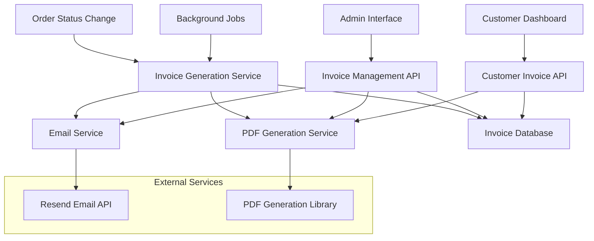

# Invoice Generation Design Document

## Overview

The Invoice Generation system is designed as a comprehensive solution for automatically creating, managing, and delivering professional invoices for completed orders. The system integrates seamlessly with the existing Nuxt 3 + Supabase architecture, leveraging the current email infrastructure (Resend), i18n system, and order management workflow.

The design follows a modular approach with clear separation of concerns: database layer for persistence, service layer for business logic, API layer for external interfaces, and presentation layer for user interactions. The system supports automatic invoice generation triggered by order status changes, manual generation for historical orders, and comprehensive management capabilities for administrators.

## Architecture

### System Components



### Data Flow

1. **Automatic Generation**: Order status changes to "delivered" → Trigger invoice generation → Generate PDF → Send email → Update delivery status
2. **Manual Generation**: Admin request → Validate order → Generate invoice → Store in database → Optional email sending
3. **Customer Access**: Customer login → Fetch user invoices → Generate PDF on demand → Download
4. **Admin Management**: Admin interface → Search/filter invoices → View/regenerate/resend → Track delivery status

## Components and Interfaces

### Database Schema Extensions

```sql
-- Invoices table
CREATE TABLE invoices (
  id SERIAL PRIMARY KEY,
  invoice_number TEXT NOT NULL UNIQUE,
  order_id INTEGER REFERENCES orders(id) ON DELETE CASCADE,
  user_id UUID REFERENCES auth.users(id),
  status TEXT NOT NULL DEFAULT 'generated' CHECK (status IN ('generated', 'sent', 'delivered', 'failed')),
  invoice_data JSONB NOT NULL, -- Snapshot of order data at invoice generation
  pdf_url TEXT, -- URL to stored PDF file
  language TEXT NOT NULL DEFAULT 'es' CHECK (language IN ('es', 'en', 'ro', 'ru')),
  generated_by UUID REFERENCES auth.users(id), -- Admin who generated (for manual generation)
  generated_at TIMESTAMP WITH TIME ZONE DEFAULT NOW(),
  sent_at TIMESTAMP WITH TIME ZONE,
  delivered_at TIMESTAMP WITH TIME ZONE,
  created_at TIMESTAMP WITH TIME ZONE DEFAULT NOW(),
  updated_at TIMESTAMP WITH TIME ZONE DEFAULT NOW()
);

-- Invoice delivery logs
CREATE TABLE invoice_delivery_logs (
  id SERIAL PRIMARY KEY,
  invoice_id INTEGER REFERENCES invoices(id) ON DELETE CASCADE,
  delivery_attempt INTEGER NOT NULL DEFAULT 1,
  status TEXT NOT NULL CHECK (status IN ('pending', 'sent', 'delivered', 'failed', 'bounced')),
  email_provider_id TEXT, -- Resend email ID
  error_message TEXT,
  attempted_by UUID REFERENCES auth.users(id), -- Admin who triggered resend
  attempted_at TIMESTAMP WITH TIME ZONE DEFAULT NOW()
);
```

### TypeScript Interfaces

```typescript
// Core invoice types
export interface Invoice {
  id: number
  invoiceNumber: string
  orderId: number
  userId: string
  status: 'generated' | 'sent' | 'delivered' | 'failed'
  invoiceData: OrderSnapshot
  pdfUrl?: string
  language: 'es' | 'en' | 'ro' | 'ru'
  generatedBy?: string
  generatedAt: string
  sentAt?: string
  deliveredAt?: string
  createdAt: string
  updatedAt: string
}

export interface OrderSnapshot {
  orderNumber: string
  customerInfo: {
    name: string
    email: string
    billingAddress: Address
    shippingAddress: Address
  }
  items: Array<{
    productName: Translations
    sku: string
    quantity: number
    unitPrice: number
    totalPrice: number
  }>
  pricing: {
    subtotal: number
    shipping: number
    tax: number
    total: number
  }
  paymentInfo: {
    method: string
    status: string
  }
  dates: {
    orderDate: string
    shippedDate?: string
    deliveredDate?: string
  }
}

export interface InvoiceDeliveryLog {
  id: number
  invoiceId: number
  deliveryAttempt: number
  status: 'pending' | 'sent' | 'delivered' | 'failed' | 'bounced'
  emailProviderId?: string
  errorMessage?: string
  attemptedBy?: string
  attemptedAt: string
}
```

### Service Layer

#### InvoiceGenerationService

```typescript
export class InvoiceGenerationService {
  // Generate invoice for completed order
  async generateInvoice(orderId: number, options?: GenerationOptions): Promise<Invoice>
  
  // Generate invoice number following format INV-YYYY-NNNNNN
  private generateInvoiceNumber(): string
  
  // Create order snapshot for invoice data
  private createOrderSnapshot(order: OrderWithItems): Promise<OrderSnapshot>
  
  // Trigger automatic generation on order status change
  async handleOrderStatusChange(orderId: number, newStatus: string): Promise<void>
}
```

#### PDFGenerationService

```typescript
export class PDFGenerationService {
  // Generate PDF from invoice data
  async generateInvoicePDF(invoice: Invoice): Promise<Buffer>
  
  // Create HTML template for PDF generation
  private createInvoiceHTML(invoice: Invoice): string
  
  // Apply localization to invoice template
  private localizeInvoice(template: string, language: string): string
  
  // Store PDF file and return URL
  private storePDF(pdfBuffer: Buffer, invoiceNumber: string): Promise<string>
}
```

#### InvoiceEmailService

```typescript
export class InvoiceEmailService {
  // Send invoice via email
  async sendInvoiceEmail(invoice: Invoice): Promise<DeliveryResult>
  
  // Create email template for invoice delivery
  private createInvoiceEmailTemplate(invoice: Invoice): EmailTemplate
  
  // Handle email delivery status updates
  async updateDeliveryStatus(invoiceId: number, status: string, providerId?: string): Promise<void>
  
  // Retry failed email deliveries
  async retryFailedDelivery(invoiceId: number): Promise<DeliveryResult>
}
```

### API Endpoints

#### Customer Endpoints
- `GET /api/invoices` - List user's invoices
- `GET /api/invoices/[id]` - Get specific invoice details
- `GET /api/invoices/[id]/download` - Download invoice PDF

#### Admin Endpoints
- `GET /api/admin/invoices` - List all invoices with filtering
- `POST /api/admin/invoices/generate` - Manually generate invoice
- `PUT /api/admin/invoices/[id]/resend` - Resend invoice email
- `GET /api/admin/invoices/[id]/logs` - Get delivery logs
- `PUT /api/admin/invoices/[id]/regenerate` - Regenerate invoice

### Frontend Components

#### Customer Components
- `InvoiceList.vue` - Display user's invoices in account dashboard
- `InvoiceCard.vue` - Individual invoice display with download action
- `InvoiceViewer.vue` - Modal for viewing invoice details

#### Admin Components
- `AdminInvoiceTable.vue` - Searchable table of all invoices
- `InvoiceFilters.vue` - Filtering interface for admin
- `InvoiceActions.vue` - Action buttons (view, resend, regenerate)
- `InvoiceDeliveryStatus.vue` - Status indicator with delivery logs
- `BulkInvoiceActions.vue` - Bulk operations for multiple invoices

## Data Models

### Invoice Data Structure

The invoice data is stored as a JSONB snapshot to ensure historical accuracy even if order or product data changes later. This includes:

- Complete customer information at time of order
- Itemized product details with translations
- Pricing breakdown including taxes and shipping
- Payment information and status
- All relevant dates and timestamps

### PDF Template Structure

The PDF template follows a professional invoice layout:

1. **Header**: Company logo, name, contact information
2. **Invoice Details**: Invoice number, date, due date (if applicable)
3. **Customer Information**: Billing and shipping addresses
4. **Itemized List**: Products with quantities, prices, totals
5. **Pricing Summary**: Subtotal, shipping, taxes, grand total
6. **Payment Information**: Method used, status
7. **Footer**: Legal information, tax IDs, terms

### Localization Strategy

All invoice content supports the four platform languages (Spanish, English, Romanian, Russian):

- Static labels and text are translated using the i18n system
- Product names maintain original translations from the database
- Currency formatting follows locale conventions
- Date formatting adapts to regional preferences
- Legal text and terms are localized appropriately

## Error Handling

### Generation Errors
- **Missing Order Data**: Validate order completeness before generation
- **PDF Generation Failure**: Retry with fallback template, log detailed errors
- **Database Constraints**: Handle unique constraint violations gracefully

### Email Delivery Errors
- **SMTP Failures**: Implement exponential backoff retry mechanism
- **Invalid Email Addresses**: Mark as failed, notify admin
- **Rate Limiting**: Queue emails and respect provider limits
- **Bounce Handling**: Process webhook notifications from Resend

### User Experience Errors
- **Download Failures**: Regenerate PDF on demand if file missing
- **Permission Errors**: Clear messaging for unauthorized access
- **Network Issues**: Graceful degradation with offline indicators

## Testing Strategy

### Unit Tests
- Invoice generation logic with various order scenarios
- PDF generation with different languages and layouts
- Email template generation and localization
- Invoice number generation and uniqueness
- Error handling for edge cases

### Integration Tests
- End-to-end invoice generation workflow
- Email delivery integration with Resend
- Database operations and constraints
- File storage and retrieval operations
- Admin and customer API endpoints

### E2E Tests
- Complete order-to-invoice workflow
- Customer invoice access and download
- Admin invoice management operations
- Multi-language invoice generation
- Email delivery and status tracking

### Performance Tests
- Bulk invoice generation scenarios
- PDF generation under load
- Database query performance with large datasets
- Email queue processing efficiency

## Security Considerations

### Access Control
- Customers can only access their own invoices
- Admin access requires proper role verification
- Invoice URLs include secure tokens for download
- Rate limiting on PDF generation endpoints

### Data Protection
- Invoice data snapshots protect against data tampering
- Sensitive payment information is masked in invoices
- PDF files are stored securely with access controls
- Email delivery logs maintain audit trail

### Privacy Compliance
- Customer data handling follows GDPR requirements
- Invoice data retention policies implemented
- Secure deletion of old invoice files
- Anonymization options for data exports

## Performance Optimization

### Caching Strategy
- Generated PDFs cached for repeated downloads
- Invoice lists cached with appropriate TTL
- Email templates cached to reduce generation time
- Database queries optimized with proper indexing

### Background Processing
- Invoice generation moved to background jobs for large orders
- Email sending queued to prevent blocking operations
- PDF generation optimized with template reuse
- Batch processing for bulk operations

### Scalability Considerations
- Database partitioning for large invoice volumes
- CDN integration for PDF file delivery
- Horizontal scaling of background job processors
- Monitoring and alerting for system health