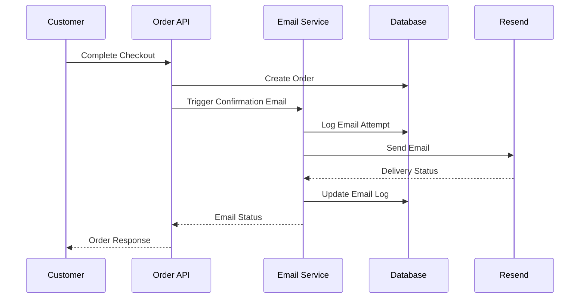

# Design Document

## Overview

The Order Confirmation Emails feature provides automated email notifications to customers when they complete purchases. The system integrates with the existing order creation flow and email infrastructure to deliver professional, branded confirmation emails with comprehensive order details. The design leverages the current Resend email service and extends the existing email utility functions to support order-specific templates and multi-language content.

## Architecture

### System Integration Points

1. **Order Creation Hook**: Integrates with the existing `/api/orders/create` endpoint to trigger email sending after successful order creation
2. **Email Service**: Extends the current `server/utils/email.ts` utility that uses Resend for email delivery
3. **Database Integration**: Adds email logging table to track delivery status and retry attempts
4. **Template System**: Implements responsive HTML email templates with internationalization support
5. **Queue System**: Implements retry logic with exponential backoff for failed deliveries

### Email Trigger Flow



## Components and Interfaces

### Email Service Extensions

**File**: `server/utils/orderEmails.ts`

```typescript
interface OrderEmailData {
  order: OrderDetails
  customer: CustomerInfo
  items: OrderItem[]
  addresses: {
    shipping: Address
    billing: Address
  }
  totals: OrderTotals
  locale: string
}

interface OrderDetails {
  id: string
  orderNumber: string
  status: string
  createdAt: string
  estimatedDelivery?: string
  trackingNumber?: string
  carrier?: string
}

interface CustomerInfo {
  name: string
  email: string
  isGuest: boolean
}

interface OrderItem {
  productId: string
  name: string
  sku: string
  quantity: number
  price: number
  total: number
  image?: string
}

interface OrderTotals {
  subtotal: number
  shipping: number
  tax: number
  total: number
}
```

### Email Templates

**File**: `server/utils/emailTemplates/orderConfirmation.ts`

- Responsive HTML template supporting desktop and mobile
- Multi-language support (Spanish, English, Romanian, Russian)
- Brand-consistent styling matching existing email templates
- Accessible markup with proper semantic structure
- Dynamic content sections for order details, items, and addresses

### Email Logging System

**Database Table**: `email_logs`

```sql
CREATE TABLE email_logs (
  id SERIAL PRIMARY KEY,
  order_id INTEGER REFERENCES orders(id),
  email_type VARCHAR(50) NOT NULL,
  recipient_email VARCHAR(255) NOT NULL,
  subject VARCHAR(500) NOT NULL,
  status VARCHAR(20) DEFAULT 'pending',
  attempts INTEGER DEFAULT 0,
  last_attempt_at TIMESTAMP WITH TIME ZONE,
  delivered_at TIMESTAMP WITH TIME ZONE,
  bounce_reason TEXT,
  external_id VARCHAR(255),
  created_at TIMESTAMP WITH TIME ZONE DEFAULT NOW(),
  updated_at TIMESTAMP WITH TIME ZONE DEFAULT NOW()
);
```

### API Integration

**Modified**: `server/api/orders/create.post.ts`

- Add email sending after successful order creation
- Handle both authenticated users and guest checkout emails
- Implement error handling that doesn't block order creation
- Log email attempts and failures

## Data Models

### Email Configuration

```typescript
interface EmailConfig {
  templates: {
    [locale: string]: {
      subject: string
      headerText: string
      footerText: string
      ctaText: string
    }
  }
  retryPolicy: {
    maxAttempts: number
    backoffMultiplier: number
    initialDelay: number
  }
  deliverySettings: {
    fromEmail: string
    replyToEmail: string
    trackDelivery: boolean
  }
}
```

### Template Variables

```typescript
interface TemplateVariables {
  customerName: string
  orderNumber: string
  orderDate: string
  estimatedDelivery: string
  orderItems: OrderItem[]
  shippingAddress: Address
  billingAddress: Address
  subtotal: string
  shippingCost: string
  tax: string
  total: string
  trackingUrl?: string
  accountUrl: string
  supportEmail: string
  companyInfo: CompanyInfo
}
```

## Error Handling

### Email Delivery Failures

1. **Retry Logic**: Implement exponential backoff with maximum 3 attempts
2. **Failure Logging**: Record all bounce reasons and delivery failures
3. **Admin Alerts**: Notify administrators of persistent delivery issues
4. **Graceful Degradation**: Order creation succeeds even if email fails

### Template Rendering Errors

1. **Validation**: Pre-validate template syntax and required variables
2. **Fallback Templates**: Use simplified templates if complex rendering fails
3. **Error Logging**: Log template rendering errors for debugging
4. **Preview Mode**: Admin preview function to test templates before deployment

### Configuration Errors

1. **Environment Validation**: Check email service configuration on startup
2. **Template Validation**: Validate template completeness for all locales
3. **Fallback Behavior**: Use default templates if custom templates are invalid

## Testing Strategy

### Unit Tests

1. **Template Rendering**: Test email template generation with various order data
2. **Email Service**: Test email sending logic and retry mechanisms
3. **Data Transformation**: Test order data to email template variable mapping
4. **Localization**: Test template rendering in all supported languages

### Integration Tests

1. **Order Flow**: Test complete order creation to email delivery flow
2. **Database Integration**: Test email logging and status updates
3. **External Service**: Test Resend API integration and error handling
4. **Retry Logic**: Test email retry behavior with simulated failures

### End-to-End Tests

1. **Complete Checkout**: Test full checkout flow with email confirmation
2. **Guest Checkout**: Test email delivery for guest orders
3. **Multi-language**: Test email delivery in different locales
4. **Email Rendering**: Test email appearance across different email clients

### Performance Tests

1. **Email Queue**: Test email sending performance under load
2. **Template Rendering**: Test template generation performance
3. **Database Logging**: Test email log insertion performance
4. **Retry Handling**: Test system behavior with high failure rates

## Security Considerations

### Email Content Security

1. **Data Sanitization**: Sanitize all user-provided content in emails
2. **Template Injection**: Prevent template injection attacks
3. **Sensitive Data**: Avoid including sensitive payment information
4. **Link Security**: Use secure, time-limited links for order tracking

### Email Delivery Security

1. **Rate Limiting**: Implement rate limiting for email sending
2. **Spam Prevention**: Follow email best practices to avoid spam filters
3. **Authentication**: Use proper SPF, DKIM, and DMARC records
4. **Bounce Handling**: Properly handle bounced emails and invalid addresses

### Data Privacy

1. **GDPR Compliance**: Handle email addresses according to privacy regulations
2. **Unsubscribe**: Provide unsubscribe options for marketing content
3. **Data Retention**: Implement appropriate email log retention policies
4. **Guest Data**: Handle guest email addresses with appropriate privacy controls

## Internationalization

### Multi-language Support

1. **Template Localization**: Separate templates for each supported locale (es, en, ro, ru)
2. **Dynamic Content**: Localize order status messages and shipping information
3. **Currency Formatting**: Format prices according to locale conventions
4. **Date Formatting**: Format dates according to locale preferences

### Content Management

1. **Admin Interface**: Allow administrators to edit email content per locale
2. **Template Versioning**: Maintain version history for template changes
3. **Preview System**: Preview emails in different languages before sending
4. **Fallback Logic**: Use default language if customer's preferred locale is unavailable

## Performance Optimization

### Email Queue Management

1. **Asynchronous Processing**: Send emails asynchronously to avoid blocking order creation
2. **Batch Processing**: Process multiple emails in batches for efficiency
3. **Priority Queue**: Prioritize order confirmation emails over other email types
4. **Resource Management**: Limit concurrent email sending to prevent service overload

### Template Caching

1. **Compiled Templates**: Cache compiled email templates in memory
2. **Static Assets**: Cache email images and styling assets
3. **Configuration Caching**: Cache email configuration to reduce database queries
4. **Invalidation Strategy**: Implement cache invalidation when templates are updated

### Database Optimization

1. **Indexing**: Add appropriate indexes for email log queries
2. **Archival**: Archive old email logs to maintain performance
3. **Connection Pooling**: Use connection pooling for database operations
4. **Query Optimization**: Optimize queries for email status reporting

## Monitoring and Analytics

### Email Delivery Metrics

1. **Delivery Rate**: Track successful email delivery percentage
2. **Bounce Rate**: Monitor email bounce rates and reasons
3. **Open Rate**: Track email open rates (if supported by email service)
4. **Response Time**: Monitor email sending response times

### System Health Monitoring

1. **Queue Depth**: Monitor email queue depth and processing times
2. **Error Rates**: Track email sending error rates and types
3. **Service Availability**: Monitor Resend service availability and response times
4. **Database Performance**: Monitor email log database performance

### Business Analytics

1. **Email Engagement**: Track customer engagement with order emails
2. **Delivery Success**: Measure email delivery success by customer segment
3. **Template Performance**: Compare performance of different email templates
4. **Locale Analysis**: Analyze email performance by language/locale