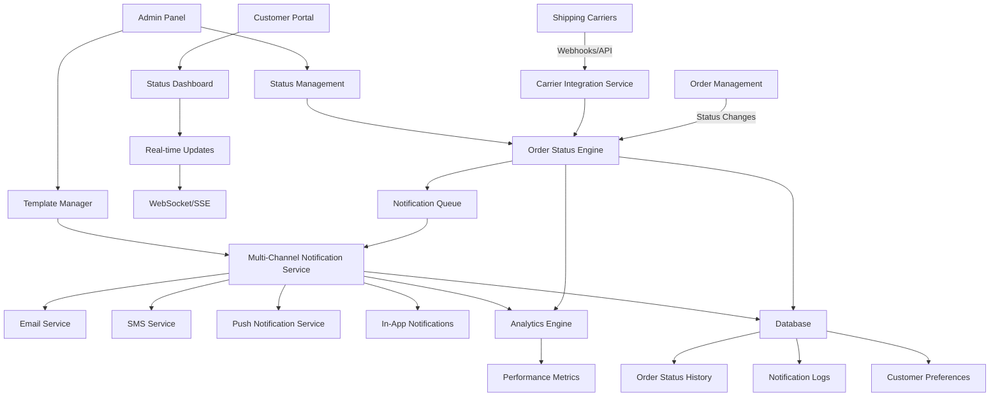

# Order Status Updates Design Document

## Overview

The Order Status Updates system provides comprehensive real-time order tracking and notification capabilities for customers and administrators. The system integrates with existing order management, shipping carriers, and notification infrastructure to deliver proactive status updates through multiple channels. It extends the current email service architecture and leverages the existing toast notification system for in-app updates.

## Architecture

### High-Level System Architecture



### System Components

1. **Order Status Engine**: Core component that processes status changes and triggers notifications
2. **Carrier Integration Service**: Handles communication with shipping carriers via APIs and webhooks
3. **Multi-Channel Notification Service**: Manages notification delivery across different channels
4. **Status Dashboard**: Customer-facing interface for order tracking
5. **Real-time Updates**: WebSocket/Server-Sent Events for live status updates
6. **Template Manager**: Manages notification templates and content
7. **Analytics Engine**: Tracks performance metrics and customer engagement
8. **Admin Management Interface**: Tools for managing workflows and templates

## Components and Interfaces

### Database Schema Extensions

#### Order Status Tracking Tables

```sql
-- Order status history
CREATE TABLE order_status_history (
    id UUID PRIMARY KEY DEFAULT gen_random_uuid(),
    order_id UUID REFERENCES orders(id) ON DELETE CASCADE,
    status VARCHAR(50) NOT NULL,
    previous_status VARCHAR(50),
    status_details TEXT,
    location TEXT,
    estimated_delivery TIMESTAMP WITH TIME ZONE,
    tracking_number TEXT,
    carrier TEXT,
    notes TEXT,
    created_by UUID REFERENCES auth.users(id),
    created_at TIMESTAMP WITH TIME ZONE DEFAULT NOW(),
    
    -- Indexes for performance
    INDEX idx_order_status_history_order_id (order_id),
    INDEX idx_order_status_history_status (status),
    INDEX idx_order_status_history_created_at (created_at)
);

-- Customer notification preferences
CREATE TABLE customer_notification_preferences (
    id UUID PRIMARY KEY DEFAULT gen_random_uuid(),
    user_id UUID REFERENCES auth.users(id) ON DELETE CASCADE,
    email_notifications JSONB DEFAULT '{
        "order_confirmed": true,
        "processing": true,
        "shipped": true,
        "out_for_delivery": true,
        "delivered": true,
        "delayed": true,
        "exception": true,
        "cancelled": true
    }',
    sms_notifications JSONB DEFAULT '{
        "order_confirmed": false,
        "processing": false,
        "shipped": true,
        "out_for_delivery": true,
        "delivered": true,
        "delayed": true,
        "exception": true,
        "cancelled": false
    }',
    push_notifications JSONB DEFAULT '{
        "order_confirmed": true,
        "processing": false,
        "shipped": true,
        "out_for_delivery": true,
        "delivered": true,
        "delayed": true,
        "exception": true,
        "cancelled": true
    }',
    phone_number TEXT,
    phone_verified BOOLEAN DEFAULT false,
    language_preference TEXT DEFAULT 'es',
    timezone TEXT DEFAULT 'Europe/Madrid',
    quiet_hours_start TIME DEFAULT '22:00',
    quiet_hours_end TIME DEFAULT '08:00',
    created_at TIMESTAMP WITH TIME ZONE DEFAULT NOW(),
    updated_at TIMESTAMP WITH TIME ZONE DEFAULT NOW(),
    
    UNIQUE(user_id)
);

-- Order status notification log
CREATE TABLE order_status_notifications (
    id UUID PRIMARY KEY DEFAULT gen_random_uuid(),
    order_id UUID REFERENCES orders(id) ON DELETE CASCADE,
    user_id UUID REFERENCES auth.users(id),
    guest_email TEXT,
    notification_type VARCHAR(50) NOT NULL,
    channel VARCHAR(20) NOT NULL, -- 'email', 'sms', 'push', 'in_app'
    status VARCHAR(20) DEFAULT 'pending', -- 'pending', 'sent', 'delivered', 'failed', 'clicked'
    template_id TEXT,
    subject TEXT,
    content_preview TEXT,
    recipient_address TEXT NOT NULL,
    external_id TEXT,
    error_message TEXT,
    retry_count INTEGER DEFAULT 0,
    scheduled_at TIMESTAMP WITH TIME ZONE,
    sent_at TIMESTAMP WITH TIME ZONE,
    delivered_at TIMESTAMP WITH TIME ZONE,
    clicked_at TIMESTAMP WITH TIME ZONE,
    created_at TIMESTAMP WITH TIME ZONE DEFAULT NOW(),
    
    -- Indexes for performance and analytics
    INDEX idx_order_notifications_order_id (order_id),
    INDEX idx_order_notifications_user_id (user_id),
    INDEX idx_order_notifications_type (notification_type),
    INDEX idx_order_notifications_status (status),
    INDEX idx_order_notifications_sent_at (sent_at)
);

-- Notification templates
CREATE TABLE order_notification_templates (
    id UUID PRIMARY KEY DEFAULT gen_random_uuid(),
    name TEXT NOT NULL,
    type VARCHAR(50) NOT NULL, -- 'order_confirmed', 'processing', 'shipped', etc.
    channel VARCHAR(20) NOT NULL, -- 'email', 'sms', 'push'
    language TEXT NOT NULL DEFAULT 'es',
    subject TEXT,
    content TEXT NOT NULL,
    variables JSONB,
    is_active BOOLEAN DEFAULT true,
    is_default BOOLEAN DEFAULT false,
    created_at TIMESTAMP WITH TIME ZONE DEFAULT NOW(),
    updated_at TIMESTAMP WITH TIME ZONE DEFAULT NOW(),
    
    UNIQUE(type, channel, language, is_default) WHERE is_default = true
);

-- Carrier tracking integration
CREATE TABLE carrier_tracking_info (
    id UUID PRIMARY KEY DEFAULT gen_random_uuid(),
    order_id UUID REFERENCES orders(id) ON DELETE CASCADE,
    tracking_number TEXT NOT NULL,
    carrier TEXT NOT NULL,
    carrier_service TEXT,
    tracking_url TEXT,
    last_sync TIMESTAMP WITH TIME ZONE,
    sync_status VARCHAR(20) DEFAULT 'active', -- 'active', 'completed', 'failed'
    created_at TIMESTAMP WITH TIME ZONE DEFAULT NOW(),
    
    UNIQUE(order_id, tracking_number)
);

-- Status workflow configuration
CREATE TABLE order_status_workflows (
    id UUID PRIMARY KEY DEFAULT gen_random_uuid(),
    name TEXT NOT NULL,
    order_type TEXT DEFAULT 'standard', -- 'standard', 'digital', 'subscription'
    status_flow JSONB NOT NULL, -- Array of status transitions
    notification_rules JSONB NOT NULL, -- Rules for when to send notifications
    is_active BOOLEAN DEFAULT true,
    created_at TIMESTAMP WITH TIME ZONE DEFAULT NOW(),
    updated_at TIMESTAMP WITH TIME ZONE DEFAULT NOW()
);
```

### API Endpoints

#### Customer Status Tracking Endpoints
- `GET /api/orders/:id/status` - Get order status and history
- `GET /api/orders/:id/timeline` - Get detailed order timeline
- `GET /api/orders/track/:trackingNumber` - Track order by tracking number
- `GET /api/orders/user/active` - Get all active orders for user
- `POST /api/orders/:id/delivery-preferences` - Update delivery preferences for specific order

#### Notification Preference Endpoints
- `GET /api/notifications/preferences` - Get user notification preferences
- `PUT /api/notifications/preferences` - Update notification preferences
- `POST /api/notifications/verify-phone` - Verify phone number for SMS
- `GET /api/notifications/history` - Get notification history
- `POST /api/notifications/test` - Send test notification

#### Webhook Endpoints
- `POST /api/webhooks/carriers/fedex` - FedEx tracking webhook
- `POST /api/webhooks/carriers/ups` - UPS tracking webhook
- `POST /api/webhooks/carriers/dhl` - DHL tracking webhook
- `POST /api/webhooks/carriers/correos` - Correos España webhook

#### Admin Management Endpoints
- `GET /api/admin/orders/status-overview` - Dashboard overview of order statuses
- `POST /api/admin/orders/:id/status` - Manually update order status
- `GET /api/admin/notifications/templates` - List notification templates
- `POST /api/admin/notifications/templates` - Create notification template
- `PUT /api/admin/notifications/templates/:id` - Update template
- `GET /api/admin/notifications/analytics` - Get notification analytics
- `POST /api/admin/notifications/bulk-send` - Send bulk notifications

### Core Services

#### OrderStatusService
```typescript
interface OrderStatusService {
  updateOrderStatus(orderId: string, status: OrderStatus, details?: StatusUpdateDetails): Promise<void>
  getOrderTimeline(orderId: string): Promise<OrderTimeline>
  getActiveOrdersForUser(userId: string): Promise<OrderSummary[]>
  trackOrderByNumber(trackingNumber: string): Promise<TrackingInfo>
  scheduleStatusCheck(orderId: string, checkTime: Date): Promise<void>
  processCarrierUpdate(carrierData: CarrierWebhookData): Promise<void>
}

interface StatusUpdateDetails {
  location?: string
  estimatedDelivery?: Date
  trackingNumber?: string
  carrier?: string
  notes?: string
  createdBy?: string
}
```

#### NotificationService (Extended)
```typescript
interface NotificationService {
  sendOrderStatusNotification(notification: OrderStatusNotification): Promise<NotificationResult>
  scheduleNotification(notification: OrderStatusNotification, sendAt: Date): Promise<void>
  getUserPreferences(userId: string): Promise<NotificationPreferences>
  updateUserPreferences(userId: string, preferences: Partial<NotificationPreferences>): Promise<void>
  renderTemplate(templateId: string, variables: TemplateVariables): Promise<RenderedNotification>
  logNotification(log: NotificationLog): Promise<void>
  retryFailedNotifications(): Promise<void>
}
```

#### CarrierIntegrationService
```typescript
interface CarrierIntegrationService {
  validateWebhook(carrier: string, payload: any, signature: string): boolean
  parseTrackingUpdate(carrier: string, payload: any): TrackingUpdate
  pollCarrierStatus(trackingNumber: string, carrier: string): Promise<TrackingUpdate>
  getTrackingUrl(trackingNumber: string, carrier: string): string
  registerTrackingNumber(orderId: string, trackingNumber: string, carrier: string): Promise<void>
}
```

#### RealTimeService
```typescript
interface RealTimeService {
  subscribeToOrderUpdates(userId: string, orderId?: string): EventSource
  broadcastStatusUpdate(orderId: string, update: StatusUpdate): Promise<void>
  notifyUserDevices(userId: string, notification: PushNotification): Promise<void>
}
```

## Data Models

### Core Types

```typescript
enum OrderStatus {
  PENDING = 'pending',
  CONFIRMED = 'confirmed',
  PROCESSING = 'processing',
  SHIPPED = 'shipped',
  OUT_FOR_DELIVERY = 'out_for_delivery',
  DELIVERED = 'delivered',
  DELAYED = 'delayed',
  EXCEPTION = 'exception',
  CANCELLED = 'cancelled',
  RETURNED = 'returned'
}

interface OrderTimeline {
  orderId: string
  orderNumber: string
  currentStatus: OrderStatus
  estimatedDelivery?: Date
  trackingInfo?: TrackingInfo
  statusHistory: StatusHistoryEntry[]
  notifications: NotificationSummary[]
}

interface StatusHistoryEntry {
  id: string
  status: OrderStatus
  previousStatus?: OrderStatus
  statusDetails?: string
  location?: string
  estimatedDelivery?: Date
  trackingNumber?: string
  carrier?: string
  notes?: string
  createdBy?: string
  createdAt: Date
}

interface TrackingInfo {
  trackingNumber: string
  carrier: string
  carrierService?: string
  trackingUrl: string
  currentLocation?: string
  estimatedDelivery?: Date
  deliveryAttempts: DeliveryAttempt[]
  lastSync: Date
}

interface DeliveryAttempt {
  attemptNumber: number
  attemptDate: Date
  status: 'attempted' | 'successful' | 'failed'
  reason?: string
  nextAttemptDate?: Date
}

interface OrderStatusNotification {
  orderId: string
  userId?: string
  guestEmail?: string
  notificationType: OrderStatus
  channels: NotificationChannel[]
  templateVariables: TemplateVariables
  scheduledAt?: Date
  priority: 'low' | 'normal' | 'high' | 'urgent'
}

interface NotificationPreferences {
  userId: string
  emailNotifications: Record<OrderStatus, boolean>
  smsNotifications: Record<OrderStatus, boolean>
  pushNotifications: Record<OrderStatus, boolean>
  phoneNumber?: string
  phoneVerified: boolean
  languagePreference: string
  timezone: string
  quietHours: {
    start: string // HH:MM format
    end: string   // HH:MM format
  }
}

interface TemplateVariables {
  customerName: string
  orderNumber: string
  orderDate: string
  currentStatus: string
  statusMessage: string
  estimatedDelivery?: string
  trackingNumber?: string
  trackingUrl?: string
  carrierName?: string
  deliveryAddress: string
  orderItems: OrderItemSummary[]
  supportContact: string
  accountUrl: string
  unsubscribeUrl?: string
}

interface OrderItemSummary {
  name: string
  quantity: number
  image?: string
}
```

## Error Handling

### Status Update Errors
- **Invalid Status Transition**: Validate status transitions according to workflow rules
- **Concurrent Updates**: Handle race conditions with optimistic locking
- **Missing Order**: Return appropriate error for non-existent orders
- **Permission Denied**: Validate user permissions for status updates

### Notification Delivery Errors
- **Invalid Contact Information**: Mark as failed, disable future notifications
- **Service Outages**: Implement circuit breaker pattern with fallback queuing
- **Rate Limiting**: Implement exponential backoff and respect carrier limits
- **Template Errors**: Use fallback templates, log errors for admin review

### Carrier Integration Errors
- **Authentication Failures**: Alert admin, disable carrier integration temporarily
- **Invalid Tracking Numbers**: Log warnings, mark tracking as inactive
- **Webhook Validation Failures**: Log security events, reject invalid requests
- **API Rate Limits**: Implement intelligent backoff strategies

### Real-time Communication Errors
- **WebSocket Connection Failures**: Implement automatic reconnection with exponential backoff
- **Push Notification Failures**: Handle device token invalidation gracefully
- **Server-Sent Events Issues**: Provide fallback polling mechanism

## Testing Strategy

### Unit Tests
- **Status Transition Logic**: Test all valid and invalid status transitions
- **Notification Rendering**: Test template rendering with various data combinations
- **Preference Management**: Test CRUD operations and validation
- **Carrier Integration**: Test webhook parsing and API communication

### Integration Tests
- **End-to-End Status Flow**: Test complete status update to notification delivery
- **Multi-Channel Notifications**: Test simultaneous delivery across channels
- **Real-time Updates**: Test WebSocket and SSE functionality
- **Database Transactions**: Test data consistency during concurrent operations

### Performance Tests
- **High Volume Processing**: Test with thousands of simultaneous status updates
- **Notification Queue Performance**: Test queue processing under load
- **Real-time Scalability**: Test WebSocket connections at scale
- **Database Performance**: Test query performance with large datasets

### User Experience Tests
- **Cross-Device Synchronization**: Test status updates across multiple devices
- **Notification Timing**: Test delivery timing and quiet hours functionality
- **Mobile Responsiveness**: Test timeline and dashboard on mobile devices
- **Accessibility**: Test screen reader compatibility and keyboard navigation

## Security Considerations

### Data Protection
- **PII Encryption**: Encrypt phone numbers and sensitive customer data
- **Access Control**: Implement role-based access for admin functions
- **Audit Logging**: Log all status changes and administrative actions
- **Data Retention**: Implement appropriate retention policies for notification logs

### Webhook Security
- **Signature Validation**: Validate all carrier webhook signatures using HMAC
- **Rate Limiting**: Implement rate limiting on webhook endpoints
- **IP Whitelisting**: Restrict webhook access to known carrier IP ranges
- **Request Validation**: Validate all incoming webhook payloads

### Communication Security
- **TLS Encryption**: Ensure all external communications use TLS 1.2+
- **API Key Management**: Secure storage and rotation of carrier API keys
- **Token Validation**: Validate all authentication tokens for API access
- **CORS Configuration**: Properly configure CORS for real-time endpoints

## Performance Optimization

### Database Optimization
- **Indexing Strategy**: Optimize indexes for common query patterns
- **Partitioning**: Consider partitioning large tables by date
- **Connection Pooling**: Implement efficient database connection management
- **Query Optimization**: Optimize complex timeline and analytics queries

### Caching Strategy
- **Template Caching**: Cache compiled notification templates
- **User Preference Caching**: Cache frequently accessed preferences
- **Status Caching**: Cache current order statuses for quick access
- **CDN Integration**: Use CDN for static notification assets

### Queue Management
- **Priority Queues**: Implement priority-based notification processing
- **Batch Processing**: Process notifications in batches for efficiency
- **Dead Letter Queues**: Handle failed notifications appropriately
- **Queue Monitoring**: Monitor queue depth and processing times

### Real-time Optimization
- **Connection Pooling**: Efficiently manage WebSocket connections
- **Message Batching**: Batch real-time updates when appropriate
- **Selective Updates**: Only send updates to interested clients
- **Compression**: Compress real-time messages for bandwidth efficiency

## Monitoring and Analytics

### System Health Monitoring
- **Notification Delivery Rates**: Track delivery success rates by channel
- **Processing Latency**: Monitor time from status change to notification delivery
- **Error Rates**: Track and alert on error rate increases
- **Queue Performance**: Monitor queue depth and processing times
- **Carrier API Health**: Monitor carrier API response times and availability

### Business Analytics
- **Customer Engagement**: Track notification open rates and click-through rates
- **Status Distribution**: Analyze order status distribution and timing
- **Channel Effectiveness**: Compare performance across notification channels
- **Customer Satisfaction**: Correlate notification timing with satisfaction scores
- **Operational Efficiency**: Track manual vs. automated status updates

### Performance Metrics
- **Response Times**: Monitor API response times for all endpoints
- **Database Performance**: Track query execution times and connection usage
- **Real-time Performance**: Monitor WebSocket connection counts and message latency
- **Resource Utilization**: Monitor CPU, memory, and network usage

## Internationalization

### Multi-language Support
- **Template Localization**: Support for Spanish, English, Romanian, and Russian
- **Dynamic Content**: Localize status messages and carrier information
- **Date/Time Formatting**: Format dates and times according to locale
- **Timezone Handling**: Display times in customer's local timezone

### Cultural Considerations
- **Notification Timing**: Respect cultural differences in communication preferences
- **Content Adaptation**: Adapt notification content for cultural context
- **Carrier Integration**: Support local carriers for different regions
- **Legal Compliance**: Ensure compliance with local notification regulations

## Integration Points

### Existing System Integration
- **Order Management**: Integrate with existing order creation and management
- **Email Service**: Extend current Resend-based email infrastructure
- **Toast Notifications**: Integrate with existing toast notification system
- **Authentication**: Use existing Supabase authentication system
- **Database**: Extend current Supabase database schema

### External Service Integration
- **Shipping Carriers**: Integrate with FedEx, UPS, DHL, Correos España APIs
- **SMS Service**: Integrate with Twilio or similar SMS provider
- **Push Notifications**: Integrate with Firebase Cloud Messaging
- **Analytics**: Integrate with existing analytics infrastructure

### Future Integration Possibilities
- **Customer Service**: Integration with helpdesk systems
- **Inventory Management**: Real-time inventory updates affecting delivery
- **Marketing Automation**: Trigger marketing campaigns based on delivery status
- **Business Intelligence**: Advanced analytics and reporting integration