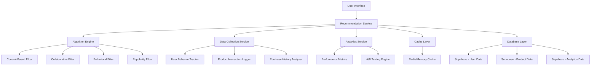

# Product Recommendations Design Document

## Overview

The Product Recommendations system will provide intelligent, personalized product suggestions throughout the Moldova Direct e-commerce platform. The system will leverage multiple recommendation algorithms including collaborative filtering, content-based filtering, and behavioral analysis to enhance user engagement and increase sales conversion.

The design integrates seamlessly with the existing Nuxt 3 application architecture, utilizing the current product catalog, shopping cart, and user authentication systems. The recommendation engine will be built as a modular system that can be easily extended with new algorithms and recommendation types.

## Architecture

### High-Level Architecture



### System Components

1. **Recommendation Service**: Central orchestrator that manages recommendation requests and responses
2. **Algorithm Engine**: Core recommendation algorithms and scoring logic
3. **Data Collection Service**: Tracks user interactions and builds behavioral profiles
4. **Analytics Service**: Monitors recommendation performance and provides insights
5. **Cache Layer**: High-performance caching for frequently requested recommendations
6. **Database Layer**: Persistent storage for user data, product data, and analytics

### Integration Points

- **Product Catalog**: Leverages existing `ProductWithRelations` interface and product data
- **Shopping Cart**: Integrates with `useCart` composable for cart-based recommendations
- **User Authentication**: Uses existing auth system for personalized recommendations
- **Analytics**: Extends current `useAnalytics` composable for recommendation tracking

## Components and Interfaces

### Core Interfaces

```typescript
// Recommendation Types
export interface RecommendationRequest {
  userId?: string
  productId?: number
  categoryId?: number
  cartItems?: CartItem[]
  context: RecommendationContext
  limit?: number
  excludeProductIds?: number[]
}

export interface RecommendationResponse {
  recommendations: ProductRecommendation[]
  metadata: RecommendationMetadata
  requestId: string
}

export interface ProductRecommendation {
  product: ProductWithRelations
  score: number
  reason: RecommendationReason
  algorithm: RecommendationAlgorithm
  position: number
}

export interface RecommendationReason {
  type: 'similar_category' | 'frequently_bought_together' | 'based_on_history' | 'trending' | 'complementary'
  explanation: string
  confidence: number
}

export interface RecommendationMetadata {
  totalCount: number
  algorithms: RecommendationAlgorithm[]
  generatedAt: string
  cacheHit: boolean
  processingTimeMs: number
}

export type RecommendationContext = 
  | 'product_detail'
  | 'cart_view'
  | 'homepage'
  | 'category_browse'
  | 'search_results'
  | 'checkout'

export type RecommendationAlgorithm = 
  | 'content_based'
  | 'collaborative_filtering'
  | 'behavioral'
  | 'popularity'
  | 'hybrid'
```

### Vue Components

```typescript
// ProductRecommendations.vue - Main recommendation component
interface ProductRecommendationsProps {
  context: RecommendationContext
  productId?: number
  categoryId?: number
  title?: string
  limit?: number
  showExplanations?: boolean
  layout?: 'grid' | 'carousel' | 'list'
}

// RecommendationCard.vue - Individual recommendation display
interface RecommendationCardProps {
  recommendation: ProductRecommendation
  showReason?: boolean
  showDismiss?: boolean
  compact?: boolean
}

// RecentlyViewed.vue - Recently viewed products component
interface RecentlyViewedProps {
  limit?: number
  showTitle?: boolean
  layout?: 'horizontal' | 'vertical'
}
```

### Composables

```typescript
// useRecommendations.ts
export interface UseRecommendationsReturn {
  recommendations: Ref<ProductRecommendation[]>
  loading: Ref<boolean>
  error: Ref<string | null>
  fetchRecommendations: (request: RecommendationRequest) => Promise<void>
  dismissRecommendation: (productId: number) => void
  trackInteraction: (recommendation: ProductRecommendation, action: string) => void
}

// useRecentlyViewed.ts
export interface UseRecentlyViewedReturn {
  recentlyViewed: Ref<ProductWithRelations[]>
  addToRecentlyViewed: (product: ProductWithRelations) => void
  clearRecentlyViewed: () => void
  removeFromRecentlyViewed: (productId: number) => void
}

// useRecommendationAnalytics.ts
export interface UseRecommendationAnalyticsReturn {
  trackImpression: (recommendations: ProductRecommendation[]) => void
  trackClick: (recommendation: ProductRecommendation) => void
  trackConversion: (recommendation: ProductRecommendation, orderId: string) => void
  trackDismissal: (recommendation: ProductRecommendation) => void
}
```

## Data Models

### Database Schema Extensions

```sql
-- Recommendation Analytics Table
CREATE TABLE recommendation_analytics (
  id SERIAL PRIMARY KEY,
  user_id UUID REFERENCES auth.users(id),
  session_id VARCHAR(255),
  product_id INTEGER REFERENCES products(id),
  recommended_product_id INTEGER REFERENCES products(id),
  context VARCHAR(50) NOT NULL,
  algorithm VARCHAR(50) NOT NULL,
  action VARCHAR(50) NOT NULL, -- 'impression', 'click', 'conversion', 'dismissal'
  score DECIMAL(5,4),
  position INTEGER,
  request_id VARCHAR(255),
  metadata JSONB,
  created_at TIMESTAMP WITH TIME ZONE DEFAULT NOW()
);

-- User Preferences Table
CREATE TABLE user_recommendation_preferences (
  id SERIAL PRIMARY KEY,
  user_id UUID REFERENCES auth.users(id) UNIQUE,
  dismissed_products INTEGER[] DEFAULT '{}',
  preferred_categories INTEGER[] DEFAULT '{}',
  algorithm_weights JSONB DEFAULT '{}',
  updated_at TIMESTAMP WITH TIME ZONE DEFAULT NOW()
);

-- Product Similarity Matrix (for content-based recommendations)
CREATE TABLE product_similarities (
  id SERIAL PRIMARY KEY,
  product_id INTEGER REFERENCES products(id),
  similar_product_id INTEGER REFERENCES products(id),
  similarity_score DECIMAL(5,4) NOT NULL,
  algorithm VARCHAR(50) NOT NULL,
  updated_at TIMESTAMP WITH TIME ZONE DEFAULT NOW(),
  UNIQUE(product_id, similar_product_id, algorithm)
);

-- Frequently Bought Together
CREATE TABLE product_associations (
  id SERIAL PRIMARY KEY,
  product_id INTEGER REFERENCES products(id),
  associated_product_id INTEGER REFERENCES products(id),
  support DECIMAL(5,4) NOT NULL, -- frequency of co-occurrence
  confidence DECIMAL(5,4) NOT NULL, -- conditional probability
  lift DECIMAL(5,4) NOT NULL, -- lift metric
  updated_at TIMESTAMP WITH TIME ZONE DEFAULT NOW(),
  UNIQUE(product_id, associated_product_id)
);
```

### Local Storage Schema

```typescript
// Recently Viewed Products (localStorage)
interface RecentlyViewedStorage {
  products: Array<{
    id: number
    slug: string
    viewedAt: string
  }>
  maxItems: number
  expiryDays: number
}

// User Dismissals (localStorage for anonymous users)
interface DismissedRecommendations {
  productIds: number[]
  dismissedAt: Record<number, string>
  expiryDays: number
}
```

## Error Handling

### Error Types and Responses

```typescript
export interface RecommendationError {
  code: string
  message: string
  context?: RecommendationContext
  fallbackStrategy?: 'popular_products' | 'category_products' | 'empty_state'
}

export const RecommendationErrorCodes = {
  INSUFFICIENT_DATA: 'INSUFFICIENT_DATA',
  ALGORITHM_FAILURE: 'ALGORITHM_FAILURE',
  NETWORK_ERROR: 'NETWORK_ERROR',
  INVALID_REQUEST: 'INVALID_REQUEST',
  RATE_LIMIT_EXCEEDED: 'RATE_LIMIT_EXCEEDED'
} as const
```

### Fallback Strategies

1. **Insufficient Data**: Fall back to popular products in the same category
2. **Algorithm Failure**: Use simpler content-based recommendations
3. **Network Error**: Show cached recommendations or empty state with retry option
4. **Invalid Request**: Log error and show default popular products
5. **Rate Limiting**: Implement exponential backoff and show cached results

### Graceful Degradation

- **No JavaScript**: Server-side rendered popular products
- **Slow Network**: Progressive loading with skeleton states
- **API Failures**: Cached recommendations with stale-while-revalidate strategy
- **No User Data**: Anonymous recommendations based on popular and trending products

## Testing Strategy

### Unit Testing

```typescript
// Algorithm Testing
describe('ContentBasedRecommendations', () => {
  test('should recommend products from same category', () => {})
  test('should score products based on attribute similarity', () => {})
  test('should exclude out-of-stock products', () => {})
})

// Component Testing
describe('ProductRecommendations.vue', () => {
  test('should render recommendations correctly', () => {})
  test('should handle loading states', () => {})
  test('should track user interactions', () => {})
})

// Composable Testing
describe('useRecommendations', () => {
  test('should fetch recommendations on mount', () => {})
  test('should handle errors gracefully', () => {})
  test('should cache results appropriately', () => {})
})
```

### Integration Testing

```typescript
// API Integration
describe('Recommendation API', () => {
  test('should return valid recommendations for product context', () => {})
  test('should respect user preferences and dismissals', () => {})
  test('should handle concurrent requests correctly', () => {})
})

// Database Integration
describe('Recommendation Analytics', () => {
  test('should track impressions correctly', () => {})
  test('should calculate conversion rates accurately', () => {})
  test('should handle bulk analytics inserts', () => {})
})
```

### Performance Testing

```typescript
// Load Testing
describe('Recommendation Performance', () => {
  test('should handle 1000 concurrent recommendation requests', () => {})
  test('should maintain sub-200ms response times', () => {})
  test('should efficiently use cache for repeated requests', () => {})
})

// Algorithm Performance
describe('Algorithm Efficiency', () => {
  test('should generate recommendations within 100ms', () => {})
  test('should scale linearly with product catalog size', () => {})
  test('should optimize memory usage for large datasets', () => {})
})
```

### A/B Testing Framework

```typescript
interface RecommendationExperiment {
  id: string
  name: string
  variants: Array<{
    id: string
    algorithm: RecommendationAlgorithm
    weight: number
  }>
  trafficAllocation: number
  metrics: string[]
  startDate: string
  endDate: string
}

// A/B Testing Service
export class RecommendationABTesting {
  assignVariant(userId: string, experimentId: string): string
  trackExperimentMetric(userId: string, experimentId: string, metric: string, value: number): void
  getExperimentResults(experimentId: string): ExperimentResults
}
```

### Quality Assurance

1. **Recommendation Quality Metrics**:
   - Click-through rate (CTR)
   - Conversion rate
   - Revenue per recommendation
   - User engagement time
   - Recommendation diversity

2. **Algorithm Validation**:
   - Cross-validation with historical data
   - Offline evaluation metrics (precision, recall, F1-score)
   - Online A/B testing for algorithm comparison
   - User satisfaction surveys

3. **Data Quality Checks**:
   - Product data completeness validation
   - User behavior data consistency checks
   - Recommendation freshness monitoring
   - Cache invalidation verification

### Monitoring and Alerting

```typescript
interface RecommendationMetrics {
  impressions: number
  clicks: number
  conversions: number
  ctr: number
  conversionRate: number
  averageResponseTime: number
  errorRate: number
  cacheHitRate: number
}

// Monitoring Service
export class RecommendationMonitoring {
  trackMetrics(metrics: RecommendationMetrics): void
  alertOnThreshold(metric: string, threshold: number): void
  generateDashboard(): RecommendationDashboard
}
```

This design provides a comprehensive, scalable, and maintainable foundation for the Product Recommendations feature that integrates seamlessly with the existing Moldova Direct e-commerce platform while providing room for future enhancements and algorithm improvements.