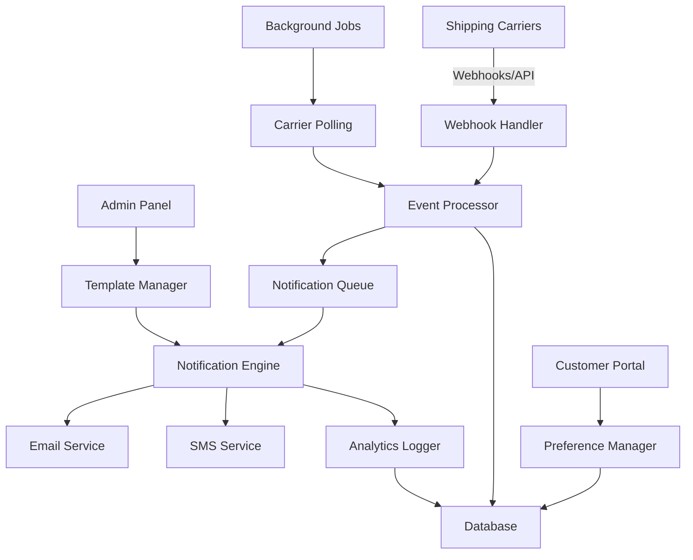

# Shipping Notifications Design Document

## Overview

The shipping notifications system provides automated, real-time updates to customers about their order shipping status. The system integrates with multiple shipping carriers through APIs and webhooks, processes status updates, and delivers personalized notifications via email and SMS based on customer preferences.

## Architecture

### High-Level Architecture



### System Components

1. **Webhook Handler**: Receives real-time updates from shipping carriers
2. **Event Processor**: Processes shipping events and determines notification actions
3. **Notification Queue**: Manages notification delivery with retry logic
4. **Notification Engine**: Renders templates and sends notifications
5. **Template Manager**: Manages notification templates and content
6. **Preference Manager**: Handles customer notification preferences
7. **Analytics Logger**: Tracks notification performance and engagement
8. **Background Jobs**: Handles carrier polling and maintenance tasks

## Components and Interfaces

### Database Schema

#### Shipping Notifications Tables

```sql
-- Customer notification preferences
CREATE TABLE notification_preferences (
    id UUID PRIMARY KEY DEFAULT gen_random_uuid(),
    user_id UUID REFERENCES auth.users(id),
    email_notifications JSONB DEFAULT '{"shipped": true, "out_for_delivery": true, "delivered": true, "exception": true}',
    sms_notifications JSONB DEFAULT '{"shipped": false, "out_for_delivery": true, "delivered": true, "exception": true}',
    phone_number TEXT,
    phone_verified BOOLEAN DEFAULT false,
    language_preference TEXT DEFAULT 'en',
    created_at TIMESTAMP WITH TIME ZONE DEFAULT NOW(),
    updated_at TIMESTAMP WITH TIME ZONE DEFAULT NOW()
);

-- Shipping tracking information
CREATE TABLE shipping_tracking (
    id UUID PRIMARY KEY DEFAULT gen_random_uuid(),
    order_id UUID REFERENCES orders(id),
    tracking_number TEXT NOT NULL,
    carrier TEXT NOT NULL,
    status TEXT NOT NULL,
    status_details TEXT,
    estimated_delivery TIMESTAMP WITH TIME ZONE,
    actual_delivery TIMESTAMP WITH TIME ZONE,
    delivery_location TEXT,
    signature_required BOOLEAN DEFAULT false,
    last_updated TIMESTAMP WITH TIME ZONE DEFAULT NOW(),
    created_at TIMESTAMP WITH TIME ZONE DEFAULT NOW()
);

-- Notification log
CREATE TABLE notification_log (
    id UUID PRIMARY KEY DEFAULT gen_random_uuid(),
    user_id UUID REFERENCES auth.users(id),
    order_id UUID REFERENCES orders(id),
    tracking_id UUID REFERENCES shipping_tracking(id),
    notification_type TEXT NOT NULL,
    channel TEXT NOT NULL, -- 'email' or 'sms'
    status TEXT NOT NULL, -- 'sent', 'failed', 'delivered', 'clicked'
    template_id TEXT,
    content_preview TEXT,
    error_message TEXT,
    sent_at TIMESTAMP WITH TIME ZONE,
    delivered_at TIMESTAMP WITH TIME ZONE,
    clicked_at TIMESTAMP WITH TIME ZONE,
    created_at TIMESTAMP WITH TIME ZONE DEFAULT NOW()
);

-- Notification templates
CREATE TABLE notification_templates (
    id UUID PRIMARY KEY DEFAULT gen_random_uuid(),
    name TEXT NOT NULL,
    type TEXT NOT NULL, -- 'shipped', 'out_for_delivery', 'delivered', 'exception'
    channel TEXT NOT NULL, -- 'email' or 'sms'
    language TEXT NOT NULL DEFAULT 'en',
    subject TEXT,
    content TEXT NOT NULL,
    variables JSONB,
    is_active BOOLEAN DEFAULT true,
    created_at TIMESTAMP WITH TIME ZONE DEFAULT NOW(),
    updated_at TIMESTAMP WITH TIME ZONE DEFAULT NOW()
);

-- Carrier webhook configurations
CREATE TABLE carrier_webhooks (
    id UUID PRIMARY KEY DEFAULT gen_random_uuid(),
    carrier TEXT NOT NULL,
    webhook_url TEXT NOT NULL,
    secret_key TEXT NOT NULL,
    is_active BOOLEAN DEFAULT true,
    last_received TIMESTAMP WITH TIME ZONE,
    created_at TIMESTAMP WITH TIME ZONE DEFAULT NOW()
);
```

### API Endpoints

#### Webhook Endpoints
- `POST /api/webhooks/shipping/fedex` - FedEx webhook handler
- `POST /api/webhooks/shipping/ups` - UPS webhook handler  
- `POST /api/webhooks/shipping/usps` - USPS webhook handler
- `POST /api/webhooks/shipping/dhl` - DHL webhook handler

#### Customer Preference Endpoints
- `GET /api/notifications/preferences` - Get user notification preferences
- `PUT /api/notifications/preferences` - Update notification preferences
- `POST /api/notifications/verify-phone` - Verify phone number for SMS
- `GET /api/notifications/history` - Get notification history

#### Admin Management Endpoints
- `GET /api/admin/notifications/templates` - List notification templates
- `POST /api/admin/notifications/templates` - Create notification template
- `PUT /api/admin/notifications/templates/:id` - Update template
- `GET /api/admin/notifications/analytics` - Get notification analytics
- `POST /api/admin/notifications/test` - Send test notification

### Core Services

#### NotificationService
```typescript
interface NotificationService {
  processShippingEvent(event: ShippingEvent): Promise<void>
  sendNotification(notification: NotificationRequest): Promise<NotificationResult>
  renderTemplate(templateId: string, variables: Record<string, any>): Promise<string>
  getUserPreferences(userId: string): Promise<NotificationPreferences>
  logNotification(log: NotificationLog): Promise<void>
}
```

#### CarrierService
```typescript
interface CarrierService {
  validateWebhook(carrier: string, payload: any, signature: string): boolean
  parseTrackingUpdate(carrier: string, payload: any): ShippingEvent
  pollTrackingStatus(trackingNumber: string, carrier: string): Promise<ShippingEvent>
  getTrackingUrl(trackingNumber: string, carrier: string): string
}
```

#### TemplateService
```typescript
interface TemplateService {
  getTemplate(type: string, channel: string, language: string): Promise<NotificationTemplate>
  renderTemplate(template: NotificationTemplate, variables: Record<string, any>): Promise<RenderedTemplate>
  validateTemplate(template: NotificationTemplate): ValidationResult
}
```

## Data Models

### Core Types

```typescript
interface ShippingEvent {
  trackingNumber: string
  carrier: string
  status: ShippingStatus
  statusDetails?: string
  estimatedDelivery?: Date
  actualDelivery?: Date
  location?: string
  signatureRequired?: boolean
  timestamp: Date
}

enum ShippingStatus {
  LABEL_CREATED = 'label_created',
  PICKED_UP = 'picked_up',
  IN_TRANSIT = 'in_transit',
  OUT_FOR_DELIVERY = 'out_for_delivery',
  DELIVERED = 'delivered',
  EXCEPTION = 'exception',
  RETURNED = 'returned'
}

interface NotificationPreferences {
  userId: string
  emailNotifications: {
    shipped: boolean
    outForDelivery: boolean
    delivered: boolean
    exception: boolean
  }
  smsNotifications: {
    shipped: boolean
    outForDelivery: boolean
    delivered: boolean
    exception: boolean
  }
  phoneNumber?: string
  phoneVerified: boolean
  languagePreference: string
}

interface NotificationRequest {
  userId: string
  orderId: string
  trackingId: string
  type: NotificationType
  channel: NotificationChannel
  templateVariables: Record<string, any>
}

enum NotificationType {
  SHIPPED = 'shipped',
  OUT_FOR_DELIVERY = 'out_for_delivery',
  DELIVERED = 'delivered',
  EXCEPTION = 'exception'
}

enum NotificationChannel {
  EMAIL = 'email',
  SMS = 'sms'
}
```

## Error Handling

### Webhook Processing Errors
- **Invalid Signature**: Log security event, return 401
- **Malformed Payload**: Log error, return 400 with details
- **Unknown Carrier**: Log warning, return 404
- **Processing Failure**: Log error, queue for retry, return 500

### Notification Delivery Errors
- **Invalid Email/Phone**: Mark as failed, disable future notifications
- **Service Outage**: Queue for retry with exponential backoff
- **Rate Limiting**: Implement circuit breaker, queue for later
- **Template Errors**: Log error, use fallback template

### Carrier API Errors
- **Authentication Failure**: Alert admin, disable carrier integration
- **Rate Limiting**: Implement backoff strategy
- **Invalid Tracking Number**: Log warning, mark as invalid
- **Service Unavailable**: Switch to polling mode

### Retry Strategy
```typescript
interface RetryConfig {
  maxAttempts: number
  initialDelay: number
  maxDelay: number
  backoffMultiplier: number
  retryableErrors: string[]
}

const notificationRetryConfig: RetryConfig = {
  maxAttempts: 3,
  initialDelay: 60000, // 1 minute
  maxDelay: 3600000, // 1 hour
  backoffMultiplier: 2,
  retryableErrors: ['RATE_LIMIT', 'SERVICE_UNAVAILABLE', 'TIMEOUT']
}
```

## Testing Strategy

### Unit Tests
- **Template Rendering**: Test variable substitution, error handling
- **Preference Management**: Test CRUD operations, validation
- **Webhook Validation**: Test signature verification, payload parsing
- **Notification Logic**: Test delivery rules, deduplication

### Integration Tests
- **Carrier APIs**: Test webhook processing, polling mechanisms
- **Email/SMS Services**: Test delivery with mock services
- **Database Operations**: Test data persistence, migrations
- **Queue Processing**: Test job execution, retry logic

### End-to-End Tests
- **Complete Notification Flow**: From shipping event to delivery
- **Multi-language Support**: Test template rendering in different languages
- **Preference Updates**: Test real-time preference changes
- **Error Recovery**: Test system behavior during failures

### Performance Tests
- **High Volume Processing**: Test with thousands of simultaneous events
- **Queue Performance**: Test job processing under load
- **Database Performance**: Test query performance with large datasets
- **Memory Usage**: Monitor memory consumption during processing

### Monitoring and Alerting
- **Notification Delivery Rates**: Alert if delivery rate drops below 95%
- **Processing Latency**: Alert if events take longer than 5 minutes to process
- **Error Rates**: Alert if error rate exceeds 1%
- **Queue Depth**: Alert if queue depth exceeds threshold
- **Carrier API Health**: Monitor API response times and error rates

## Security Considerations

### Webhook Security
- Validate carrier webhook signatures using HMAC
- Implement rate limiting on webhook endpoints
- Log all webhook attempts for security monitoring
- Use HTTPS only for webhook URLs

### Data Protection
- Encrypt sensitive data (phone numbers, API keys) at rest
- Implement PII anonymization in logs
- Use secure key management for carrier API credentials
- Regular security audits of notification content

### Access Control
- Role-based access for admin functions
- User authentication for preference management
- API key rotation for carrier integrations
- Audit logging for all administrative actions