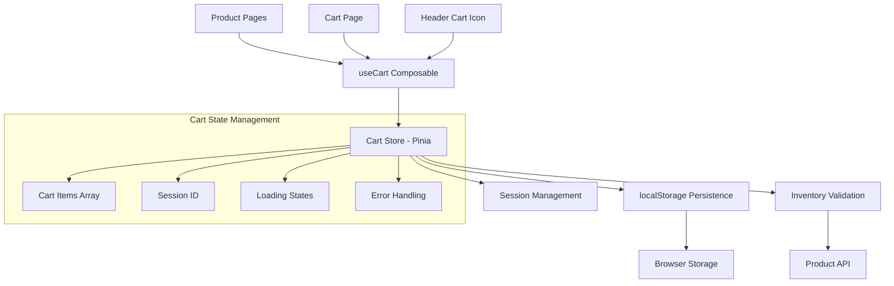

# Shopping Cart Design Document

## Overview

The shopping cart system for Moldova Direct is designed as a client-side state management solution with persistent storage capabilities. It provides a seamless user experience for collecting, managing, and reviewing products before checkout. The system is built using Pinia for state management, localStorage for persistence, and Vue 3 Composition API for reactive interfaces.

## Architecture

### High-Level Architecture



### System Components

1. **Cart Store (Pinia)**: Central state management for cart data
2. **useCart Composable**: Abstraction layer providing cart functionality to components
3. **localStorage Persistence**: Client-side data persistence across sessions
4. **Inventory Validation**: Real-time stock checking and cart synchronization
5. **Session Management**: Unique session tracking for cart identification

## Components and Interfaces

### Core Data Models

```typescript
interface Product {
  id: string
  slug: string
  name: string
  price: number
  images: string[]
  stock: number
}

interface CartItem {
  id: string
  product: Product
  quantity: number
  addedAt: Date
}

interface CartState {
  items: CartItem[]
  sessionId: string | null
  loading: boolean
  error: string | null
}
```

### Cart Store Interface

```typescript
interface CartStore {
  // State
  state: CartState
  
  // Getters
  itemCount: number
  subtotal: number
  isEmpty: boolean
  isInCart: (productId: string) => boolean
  getItemByProductId: (productId: string) => CartItem | undefined
  
  // Actions
  initializeCart: () => void
  addItem: (product: Product, quantity?: number) => Promise<void>
  updateQuantity: (itemId: string, quantity: number) => Promise<void>
  removeItem: (itemId: string) => Promise<void>
  clearCart: () => Promise<void>
  validateCart: () => Promise<void>
  
  // Persistence
  saveToLocalStorage: () => void
  loadFromLocalStorage: () => void
}
```

### useCart Composable Interface

```typescript
interface UseCart {
  // Reactive State
  items: ComputedRef<CartItem[]>
  itemCount: ComputedRef<number>
  subtotal: ComputedRef<number>
  isEmpty: ComputedRef<boolean>
  loading: ComputedRef<boolean>
  error: ComputedRef<string | null>
  
  // Utility Functions
  isInCart: (productId: string) => boolean
  formatPrice: (price: number) => string
  formattedSubtotal: ComputedRef<string>
  
  // Actions
  addItem: (product: Product, quantity?: number) => Promise<void>
  updateQuantity: (itemId: string, quantity: number) => Promise<void>
  removeItem: (itemId: string) => Promise<void>
  clearCart: () => Promise<void>
  validateCart: () => Promise<void>
}
```

## Data Models

### Cart Item Structure

```typescript
interface CartItem {
  id: string              // Unique identifier for cart item
  product: {
    id: string           // Product database ID
    slug: string         // URL-friendly product identifier
    name: string         // Localized product name
    price: number        // Current product price in EUR
    images: string[]     // Array of product image URLs
    stock: number        // Available inventory quantity
  }
  quantity: number       // Quantity selected by customer
  addedAt: Date         // Timestamp when item was added
}
```

### Persistence Data Structure

```typescript
interface CartPersistenceData {
  items: CartItem[]
  sessionId: string
  updatedAt: string     // ISO timestamp for expiration checking
}
```

## Error Handling

### Error Categories

1. **Stock Validation Errors**
   - Insufficient inventory
   - Product out of stock
   - Quantity exceeds available stock

2. **Persistence Errors**
   - localStorage unavailable
   - Data corruption
   - Storage quota exceeded

3. **Network Errors**
   - API validation failures
   - Product data fetch errors
   - Connectivity issues

### Error Handling Strategy

```typescript
interface ErrorHandling {
  // Error Display
  displayError: (message: string) => void
  clearError: () => void
  
  // Graceful Degradation
  fallbackToSessionStorage: () => void
  skipValidationOnFailure: () => void
  
  // User Feedback
  showSuccessMessage: (message: string) => void
  showWarningMessage: (message: string) => void
}
```

### Error Recovery Mechanisms

1. **Storage Fallback**: If localStorage fails, maintain cart in memory for session
2. **Validation Retry**: Retry inventory validation with exponential backoff
3. **Partial Success**: Allow cart operations to succeed even if some validations fail
4. **User Notification**: Clear error messages with actionable guidance

## Testing Strategy

### Unit Testing

```typescript
// Cart Store Tests
describe('Cart Store', () => {
  test('adds item to empty cart')
  test('increases quantity for existing item')
  test('prevents adding items exceeding stock')
  test('removes item completely')
  test('updates quantity correctly')
  test('calculates subtotal accurately')
  test('validates cart items against inventory')
  test('persists cart data to localStorage')
  test('loads cart data from localStorage')
  test('handles expired cart data')
})

// useCart Composable Tests
describe('useCart Composable', () => {
  test('provides reactive cart state')
  test('formats prices correctly for locale')
  test('initializes cart on first use')
  test('handles loading states properly')
})
```

### Integration Testing

```typescript
// Cart Integration Tests
describe('Cart Integration', () => {
  test('add to cart from product page')
  test('cart persistence across page reloads')
  test('cart synchronization with inventory')
  test('multi-language cart interface')
  test('mobile cart functionality')
})
```

### E2E Testing Scenarios

1. **Complete Cart Flow**
   - Add products from different pages
   - Modify quantities
   - Remove items
   - Proceed to checkout

2. **Persistence Testing**
   - Add items, close browser, reopen
   - Test cart expiration (30 days)
   - Test storage failure scenarios

3. **Inventory Validation**
   - Add items, reduce stock externally
   - Validate cart updates appropriately
   - Test out-of-stock scenarios

## Performance Considerations

### Optimization Strategies

1. **Lazy Loading**: Initialize cart only when needed
2. **Debounced Updates**: Batch quantity changes to reduce API calls
3. **Efficient Persistence**: Only save to localStorage when cart changes
4. **Memory Management**: Clean up expired cart data automatically

### Performance Metrics

- Cart initialization: < 100ms
- Add to cart operation: < 200ms
- Quantity update: < 150ms
- Cart validation: < 500ms
- localStorage operations: < 50ms

### Caching Strategy

```typescript
interface CacheStrategy {
  // Product Data Caching
  cacheProductData: (product: Product) => void
  getCachedProduct: (productId: string) => Product | null
  
  // Validation Caching
  cacheValidationResult: (productId: string, isValid: boolean) => void
  isValidationCached: (productId: string) => boolean
  
  // Cache Invalidation
  invalidateProductCache: (productId: string) => void
  clearExpiredCache: () => void
}
```

## Security Considerations

### Client-Side Security

1. **Data Validation**: Validate all cart data before processing
2. **XSS Prevention**: Sanitize product names and descriptions
3. **Storage Security**: Avoid storing sensitive data in localStorage
4. **Session Management**: Generate cryptographically secure session IDs

### Server-Side Validation

1. **Inventory Verification**: Always validate stock on server before checkout
2. **Price Verification**: Confirm current prices during checkout process
3. **Product Availability**: Verify products still exist and are active

## Internationalization

### Multi-Language Support

```typescript
interface I18nSupport {
  // Price Formatting
  formatPrice: (price: number, locale: string) => string
  
  // Error Messages
  getLocalizedError: (errorKey: string, locale: string) => string
  
  // Product Names
  getLocalizedProductName: (product: Product, locale: string) => string
  
  // Cart Interface
  getCartLabels: (locale: string) => CartLabels
}
```

### Supported Locales

- Spanish (es) - Default
- English (en)
- Romanian (ro)
- Russian (ru)

### Localization Requirements

1. **Price Display**: Format according to locale (€ symbol placement)
2. **Error Messages**: Translate all user-facing error messages
3. **Product Information**: Display localized product names and descriptions
4. **Interface Text**: Translate all cart interface elements

## Mobile Responsiveness

### Mobile-First Design Principles

1. **Touch-Friendly Controls**: Minimum 44px touch targets
2. **Readable Text**: Minimum 16px font size
3. **Efficient Layouts**: Stack elements vertically on small screens
4. **Performance**: Optimize for slower mobile connections

### Responsive Breakpoints

```css
/* Mobile First Approach */
.cart-container {
  /* Base styles for mobile */
}

@media (min-width: 768px) {
  /* Tablet styles */
}

@media (min-width: 1024px) {
  /* Desktop styles */
}
```

### Mobile-Specific Features

1. **Swipe Gestures**: Consider swipe-to-remove functionality
2. **Sticky Cart Summary**: Keep totals visible during scrolling
3. **Optimized Images**: Serve appropriate image sizes for mobile
4. **Reduced Animation**: Minimize animations for better performance

## Integration Points

### Product Catalog Integration

```typescript
interface ProductIntegration {
  // Add to Cart from Product Pages
  addFromProductPage: (productId: string, quantity: number) => Promise<void>
  
  // Quick Add from Product Lists
  quickAdd: (productId: string) => Promise<void>
  
  // Product Data Synchronization
  syncProductData: (productId: string) => Promise<Product>
}
```

### Checkout Integration

```typescript
interface CheckoutIntegration {
  // Cart Data Transfer
  getCartForCheckout: () => CartCheckoutData
  
  // Inventory Lock
  lockInventory: (items: CartItem[]) => Promise<boolean>
  
  // Cart Clearing
  clearAfterCheckout: () => Promise<void>
}
```

### Analytics Integration

```typescript
interface AnalyticsIntegration {
  // Cart Events
  trackAddToCart: (product: Product, quantity: number) => void
  trackRemoveFromCart: (product: Product) => void
  trackCartView: () => void
  trackCheckoutStart: () => void
  
  // Cart Metrics
  trackCartAbandonment: () => void
  trackCartValue: (value: number) => void
}
```

## Future Enhancements

### Planned Features

1. **Wishlist Integration**: Move items between cart and wishlist
2. **Recently Viewed**: Show recently viewed products in cart area
3. **Recommended Products**: Suggest related items in cart
4. **Save for Later**: Temporarily remove items without losing them
5. **Guest Cart Migration**: Transfer guest cart to user account on login

### Advanced Features

1. **Cart Sharing**: Share cart contents via URL
2. **Bulk Operations**: Select multiple items for bulk actions
3. **Cart Templates**: Save cart configurations for repeat orders
4. **Price Alerts**: Notify when cart items go on sale
5. **Inventory Notifications**: Alert when out-of-stock items return

### Performance Improvements

1. **Service Worker Caching**: Cache cart data for offline access
2. **Background Sync**: Sync cart changes when connection returns
3. **Predictive Loading**: Preload likely next products
4. **Image Optimization**: Progressive loading for cart item images