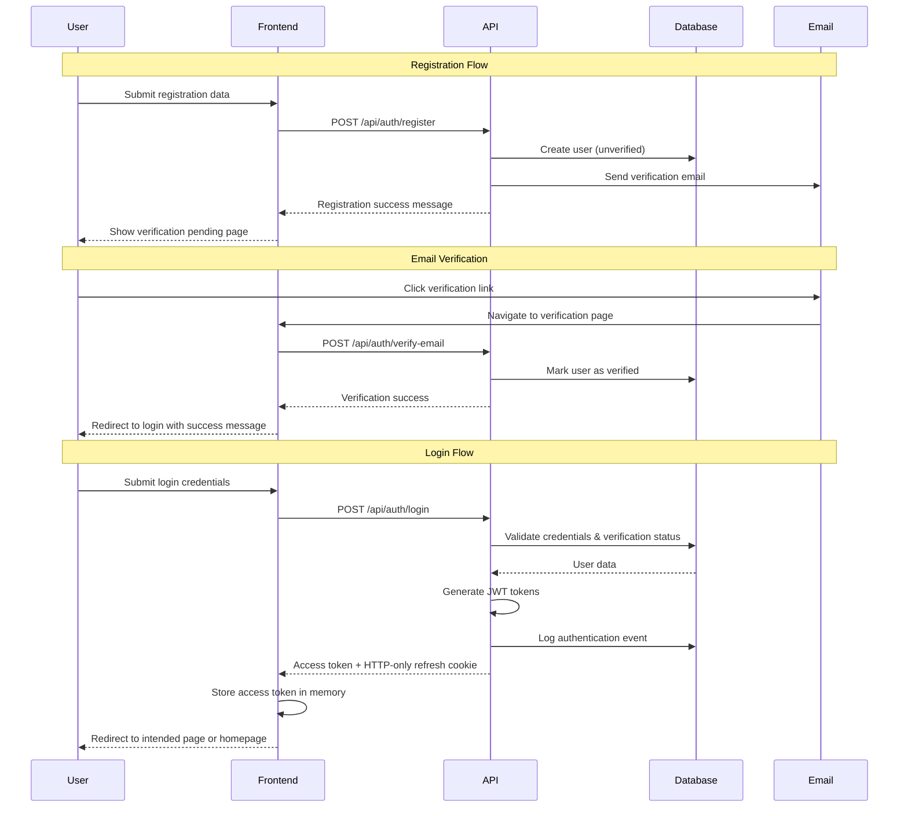

# User Authentication Design Document

## Architecture Overview

The authentication system follows a modern JWT-based approach with refresh token rotation, designed for edge deployment on Vercel. The system is mandatory for all transactions as Moldova Direct does not support guest checkout. The architecture prioritizes security, scalability, and seamless user experience while maintaining consistency across all supported languages (Spanish, English, Romanian, Russian).

## System Architecture

### Authentication Flow



### Token Management

#### Access Tokens

- **Type**: JWT with 15-minute expiration
- **Storage**: In-memory (Pinia store) for seamless tab synchronization
- **Claims**: user ID, email, verification status, preferred language, issued timestamp
- **Algorithm**: HS256 with secure signing key
- **Automatic Refresh**: Transparent token refresh during user activity

#### Refresh Tokens

- **Type**: Secure random string with 7-day expiration
- **Storage**: HTTP-only, secure, SameSite cookie for XSS protection
- **Rotation**: New refresh token issued on each use for enhanced security
- **Database**: Stored hashed with user association and expiration tracking
- **Invalidation**: All refresh tokens invalidated on password change or security events

### Database Schema

```sql
-- Users table
CREATE TABLE user (
  id INTEGER PRIMARY KEY AUTOINCREMENT,
  email TEXT UNIQUE NOT NULL,
  password_hash TEXT NOT NULL,
  email_verified BOOLEAN DEFAULT FALSE,
  verification_token TEXT,
  verification_expires DATETIME,
  reset_token TEXT,
  reset_expires DATETIME,
  failed_login_attempts INTEGER DEFAULT 0,
  locked_until DATETIME,
  last_login DATETIME, -- Updated on successful login (Requirement 3.4)
  preferred_language TEXT DEFAULT 'es',
  created_at DATETIME DEFAULT CURRENT_TIMESTAMP,
  updated_at DATETIME DEFAULT CURRENT_TIMESTAMP
);

-- Refresh tokens table
CREATE TABLE refresh_token (
  id INTEGER PRIMARY KEY AUTOINCREMENT,
  user_id INTEGER NOT NULL,
  token_hash TEXT NOT NULL,
  expires_at DATETIME NOT NULL,
  created_at DATETIME DEFAULT CURRENT_TIMESTAMP,
  FOREIGN KEY (user_id) REFERENCES user(id) ON DELETE CASCADE
);

-- Security audit log
CREATE TABLE auth_event (
  id INTEGER PRIMARY KEY AUTOINCREMENT,
  user_id INTEGER,
  event_type TEXT NOT NULL, -- 'login', 'logout', 'failed_login', 'password_reset'
  ip_address TEXT,
  user_agent TEXT,
  created_at DATETIME DEFAULT CURRENT_TIMESTAMP,
  FOREIGN KEY (user_id) REFERENCES user(id) ON DELETE SET NULL
);
```

## API Design

### Endpoint Structure

#### Authentication Endpoints

| Method | Endpoint                        | Description               | Request Body                                                  | Response                                 |
| ------ | ------------------------------- | ------------------------- | ------------------------------------------------------------- | ---------------------------------------- |
| POST   | `/api/auth/register`            | User registration         | `{ email, password, confirmPassword, acceptTerms, language }` | `{ message, requiresVerification }`      |
| POST   | `/api/auth/verify-email`        | Email verification        | `{ token }`                                                   | `{ message, redirectToLogin }`           |
| POST   | `/api/auth/resend-verification` | Resend verification email | `{ email }`                                                   | `{ message }`                            |
| POST   | `/api/auth/login`               | User login                | `{ email, password }`                                         | `{ accessToken, user }` + refresh cookie |
| POST   | `/api/auth/logout`              | User logout               | -                                                             | `{ message }`                            |
| POST   | `/api/auth/refresh`             | Refresh access token      | -                                                             | `{ accessToken }`                        |
| POST   | `/api/auth/forgot-password`     | Request password reset    | `{ email }`                                                   | `{ message }`                            |
| POST   | `/api/auth/reset-password`      | Reset password            | `{ token, password, confirmPassword }`                        | `{ message }`                            |
| GET    | `/api/auth/me`                  | Get current user          | -                                                             | `{ user }`                               |

#### Request/Response Formats

```typescript
// Registration Request
interface RegisterRequest {
  email: string;
  password: string;
  confirmPassword: string;
  acceptTerms: boolean; // Required field for terms acceptance - must be true (Requirements 1.9, 1.10)
  language: "es" | "en" | "ro" | "ru"; // User language preference stored in profile (Requirements 6.6, 6.7)
}

// Login Request
interface LoginRequest {
  email: string;
  password: string;
}

// User Response
interface UserResponse {
  id: number;
  email: string;
  emailVerified: boolean;
  preferredLanguage: string;
  createdAt: string;
  lastLogin: string | null;
}

// Error Response
interface ErrorResponse {
  statusCode: number;
  statusMessage: string;
  details?: {
    field?: string;
    code?: string;
  };
}
```

### Security Implementation

#### Password Security

- **Hashing**: bcrypt with salt rounds of 12 for secure password storage
- **Requirements**: Minimum 8 characters with uppercase, lowercase, and number
- **Validation**: Real-time client-side validation with server-side verification
- **Storage**: Never store or log plain text passwords in any system component
- **Strength indicator**: Visual password strength meter during registration

#### Rate Limiting and Account Protection

- **Login attempts**: Exactly 5 attempts per 15 minutes per IP address with progressive delays (Requirement 3.10)
- **Account lockout**: Exactly 5 failed login attempts locks account for exactly 15 minutes (Requirements 3.10, 3.11)
- **Registration**: 3 attempts per hour per IP address to prevent spam
- **Password reset**: 3 requests per hour per email address with cooldown periods (Requirement 7.4)
- **Email verification**: Rate limited to prevent abuse and email flooding
- **Implementation**: Supabase for distributed rate limit tracking
- **Lockout notification**: Clear messaging showing remaining lockout time with countdown (Requirement 3.11)

#### Token Security and Session Management

- **JWT signing**: HS256 algorithm with secure, rotated signing keys
- **Token claims**: Minimal necessary data (user ID, email, verification status, language)
- **Access token expiry**: 15 minutes with automatic refresh during user activity
- **Refresh token rotation**: New refresh token issued on each use for enhanced security
- **Session invalidation**: All sessions invalidated on password change or security events
- **Cross-device logout**: Option to logout from all devices simultaneously

#### Attack Prevention

- **User enumeration**: Generic error messages that don't reveal account existence
- **Timing attacks**: Consistent response times regardless of user existence
- **CSRF protection**: CSRF tokens for all state-changing operations
- **XSS prevention**: Input sanitization and Content Security Policy headers
- **SQL injection**: Parameterized queries with Drizzle ORM protection
- **Brute force**: Progressive delays and temporary IP blocking for repeated failures

## Frontend Design

### Component Architecture

The component architecture follows a modular approach with reusable components for consistent user experience. This design addresses Requirements 2.1, 4.1, 8.1, and 9.1 for comprehensive authentication flows.

**Design Rationale**: Modular components promote code reusability and maintainability while ensuring consistent UI patterns across all authentication flows.

```
components/auth/
├── AuthLayout.vue              # Common layout for auth pages with responsive design
├── LoginForm.vue               # Login form with lockout handling and verification checks
├── RegisterForm.vue            # Registration form with terms acceptance and language selection
├── ForgotPasswordForm.vue      # Password reset request form with rate limiting feedback (Requirements 4.1, 4.2, 4.3)
├── ResetPasswordForm.vue       # Password reset form with token validation (Requirements 4.4, 4.5, 4.6, 4.7-4.13)
├── EmailVerification.vue       # Email verification component with resend functionality
├── VerificationPending.vue     # Verification pending page with resend option (Requirements 1.2, 2.5, 2.6)
├── PasswordStrengthMeter.vue   # Real-time password strength indicator
├── AuthGuard.vue              # Route protection component
├── LoadingSpinner.vue         # Consistent loading indicator
└── AuthErrorMessage.vue       # Standardized error message display
```

#### Component Responsibilities

**AuthLayout.vue**

- Responsive container for all authentication pages (Requirement 8.1, 8.7)
- Consistent branding and visual hierarchy
- Mobile-optimized layout with proper spacing and 44px minimum touch targets (Requirement 8.8)
- Language switcher integration for multi-language support (Requirement 6.1)

**LoginForm.vue**

- Email and password input with validation and appropriate input types (Requirement 8.4)
- Account lockout status display with countdown timer (Requirement 3.10, 3.11)
- Unverified account handling with resend verification option (Requirement 3.8, 3.9)
- Show/hide password toggle for mobile usability (Requirement 8.6)
- Generic error messaging to prevent user enumeration (Requirement 3.5, 3.6)

**RegisterForm.vue**

- Multi-field registration form with real-time validation (Requirements 1.6, 1.7, 1.8)
- Password strength meter integration with strength requirements (Requirement 7.1)
- Terms and conditions acceptance checkbox with validation - prevents submission if not checked (Requirements 1.9, 1.10)
- Language preference selection and storage in user profile (Requirements 6.6, 6.7)
- Email existence validation with helpful link to login page (Requirements 1.4, 1.5)
- Preserve valid field values during error states (Requirements 1.7, 1.8)

**EmailVerification.vue**

- Token extraction from URL parameters with validation (Requirement 2.1, 2.4)
- Verification status display (success/error/expired) (Requirement 2.3, 2.4)
- Automatic redirect to login on success with success message (Requirement 2.3)
- Resend verification option for expired tokens (Requirement 2.5, 2.6)
- Already verified user handling (Requirement 2.9, 2.10)

**VerificationPending.vue**

- Display verification pending message after successful registration (Requirement 1.2)
- Provide resend verification email functionality with rate limiting feedback (Requirement 2.6, 2.7)
- Show clear instructions for email verification process
- Handle resend success and error states with appropriate messaging
- Invalidate previous tokens when generating new verification tokens (Requirement 2.8)

**ForgotPasswordForm.vue**

- Email input with validation for password reset requests (Requirement 4.1)
- Send password reset email with secure token generation (Requirement 4.1, 4.2)
- Display confirmation message regardless of email existence for security (Requirement 4.3)
- Rate limiting feedback to prevent abuse (Requirement 7.4)
- Clear error handling and user guidance

**ResetPasswordForm.vue**

- Token validation and expiration checking (30 minutes) (Requirement 4.4)
- New password and confirmation input with strength validation (Requirement 4.5, 4.6, 4.7)
- Password strength requirements enforcement (Requirement 7.1)
- Session invalidation after successful password reset (Requirement 4.9)
- Token invalidation after use (Requirement 4.10)
- Redirect to login with success message (Requirement 4.11)
- Handle expired/invalid token scenarios with recovery options (Requirement 4.12, 4.13)

### State Management

#### Auth Store (Pinia)

The authentication store manages all client-side authentication state and provides reactive updates across browser tabs. This design addresses Requirements 5.1, 5.3, and 10.3 for session persistence and cross-tab synchronization.

**Design Rationale**: Centralized state management ensures consistent authentication status across the application, while reactive updates provide real-time feedback for authentication state changes.

```typescript
// stores/auth.ts
export const useAuthStore = defineStore("auth", () => {
  // State
  const user = ref<User | null>(null);
  const accessToken = ref<string | null>(null);
  const isLoading = ref(false);
  const error = ref<string | null>(null);
  const lockoutTime = ref<Date | null>(null);

  // Computed
  const isAuthenticated = computed(
    () => !!user.value && !!accessToken.value && user.value.emailVerified
  );
  const isEmailVerified = computed(() => user.value?.emailVerified ?? false);
  const isAccountLocked = computed(
    () => lockoutTime.value && lockoutTime.value > new Date()
  );
  const lockoutMinutesRemaining = computed(() => {
    if (!lockoutTime.value) return 0;
    const diff = lockoutTime.value.getTime() - new Date().getTime();
    return Math.ceil(diff / (1000 * 60));
  });

  // Actions
  const login = async (credentials: LoginCredentials) => {
    isLoading.value = true;
    error.value = null;
    try {
      // Implementation with error handling for unverified accounts and lockouts
    } catch (err) {
      error.value = err.message;
      throw err;
    } finally {
      isLoading.value = false;
    }
  };

  const register = async (userData: RegisterData) => {
    isLoading.value = true;
    error.value = null;
    try {
      // Implementation with redirect to verification pending
    } catch (err) {
      error.value = err.message;
      throw err;
    } finally {
      isLoading.value = false;
    }
  };

  const verifyEmail = async (token: string) => {
    // Implementation for email verification
  };

  const forgotPassword = async (email: string) => {
    // Implementation for password reset request
  };

  const resetPassword = async (token: string, password: string) => {
    // Implementation for password reset
  };

  const resendVerification = async (email: string) => {
    // Implementation for resending verification email
  };

  const logout = async () => {
    // Invalidate current session tokens (Requirement 5.10)
    try {
      await $fetch("/api/auth/logout", {
        method: "POST",
        credentials: "include",
      });
    } catch (error) {
      // Continue with logout even if server request fails
    }

    // Clear all authentication data from browser (Requirements 5.11, 5.9)
    user.value = null;
    accessToken.value = null;
    error.value = null;
    lockoutTime.value = null;

    // Redirect to homepage with logout confirmation (Requirement 5.12)
    await navigateTo("/?message=logged-out");
  };

  const refreshToken = async () => {
    // Automatic token refresh implementation (Requirements 5.4, 5.5, 5.6)
    try {
      const response = await $fetch("/api/auth/refresh", {
        method: "POST",
        credentials: "include", // Include refresh token cookie
      });

      accessToken.value = response.accessToken;
      // Update token expiry time (Requirement 5.6)
    } catch (error) {
      // Handle invalid refresh token (Requirements 5.7, 5.8, 5.9)
      await logout();
      navigateTo("/auth/login?message=session-expired");
    }
  };

  // Cross-tab synchronization (Requirement 5.3)
  const syncAuthState = () => {
    // Listen for storage events to sync auth state across tabs
    // Implementation: Use BroadcastChannel API for real-time sync
    // Fallback to localStorage events for broader browser support
    // Ensures login state persists across browser tabs seamlessly
  };

  return {
    // State (readonly)
    user: readonly(user),
    accessToken: readonly(accessToken),
    isLoading: readonly(isLoading),
    error: readonly(error),
    lockoutTime: readonly(lockoutTime),

    // Computed
    isAuthenticated,
    isEmailVerified,
    isAccountLocked,
    lockoutMinutesRemaining,

    // Actions
    login,
    register,
    verifyEmail,
    forgotPassword,
    resetPassword,
    resendVerification,
    logout,
    refreshToken,
    syncAuthState,
  };
});
```

### Form Design

#### Visual Design Principles

- **Consistent spacing**: 24px between sections, 16px between fields
- **Clear hierarchy**: Form titles (text-2xl), field labels (text-sm font-medium)
- **Error states**: Red border on invalid fields, inline error messages
- **Loading states**: Disabled buttons with spinner during submission
- **Mobile optimization**: Full-width inputs, adequate touch targets

#### Form Validation

#### Real-time Validation Strategy

The validation system implements both client-side and server-side validation to ensure data integrity and provide immediate user feedback. This dual approach satisfies Requirements 1.3, 7.1, and 9.1 by providing instant feedback while maintaining security.

**Design Rationale**: Real-time validation improves user experience by catching errors early, while server-side validation ensures security and data integrity even if client-side validation is bypassed.

```typescript
// Validation schemas using Zod with multi-language support
const registerSchema = z
  .object({
    email: z
      .string()
      .email("validation.email.invalid")
      .min(1, "validation.email.required"),
    password: z
      .string()
      .min(8, "validation.password.minLength") // Requirement 7.1: minimum 8 characters
      .regex(/[A-Z]/, "validation.password.uppercase") // Requirement 7.1: uppercase letter
      .regex(/[a-z]/, "validation.password.lowercase") // Requirement 7.1: lowercase letter
      .regex(/[0-9]/, "validation.password.number"), // Requirement 7.1: number
    confirmPassword: z.string().min(1, "validation.confirmPassword.required"),
    acceptTerms: z
      .boolean()
      .refine((val) => val === true, "validation.terms.required"), // Requirements 1.9, 1.10: terms acceptance required and prevents account creation
    language: z.enum(["es", "en", "ro", "ru"]).default("es"), // Requirement 6.6: language preference
  })
  .refine((data) => data.password === data.confirmPassword, {
    message: "validation.password.mismatch", // Requirement 1.6: password confirmation validation
    path: ["confirmPassword"],
  });

const loginSchema = z.object({
  email: z
    .string()
    .email("validation.email.invalid")
    .min(1, "validation.email.required"),
  password: z.string().min(1, "validation.password.required"),
});

// Password reset schemas
const forgotPasswordSchema = z.object({
  email: z
    .string()
    .email("validation.email.invalid")
    .min(1, "validation.email.required"),
});

const resetPasswordSchema = z
  .object({
    token: z.string().min(1, "validation.token.required"),
    password: z
      .string()
      .min(8, "validation.password.minLength")
      .regex(/[A-Z]/, "validation.password.uppercase")
      .regex(/[a-z]/, "validation.password.lowercase")
      .regex(/[0-9]/, "validation.password.number"),
    confirmPassword: z.string().min(1, "validation.confirmPassword.required"),
  })
  .refine((data) => data.password === data.confirmPassword, {
    message: "validation.password.mismatch",
    path: ["confirmPassword"],
  });
```

#### Field-Level Validation Behavior

- **Email fields**: Immediate validation on blur with format checking
- **Password fields**: Real-time strength indicator with progressive validation
- **Confirm password**: Instant matching validation as user types
- **Terms acceptance**: Validation on form submission attempt - prevents account creation if not checked (Requirements 1.9, 1.10)
- **Form preservation**: Valid field values maintained during error states (Requirement 9.2)

#### Terms and Conditions Validation

**Design Rationale**: Terms acceptance is mandatory for account creation and must be explicitly validated to ensure legal compliance and user consent.

```typescript
// Terms acceptance validation logic
const validateTermsAcceptance = (acceptTerms: boolean): ValidationResult => {
  if (!acceptTerms) {
    return {
      isValid: false,
      error: 'validation.terms.required',
      preventSubmission: true // Requirement 1.10: prevent account creation
    };
  }
  return { isValid: true };
};

// Form submission handling
const handleRegistrationSubmit = async (formData: RegisterFormData) => {
  // Terms validation is checked first before any API calls
  if (!formData.acceptTerms) {
    showError('terms', 'validation.terms.required');
    return; // Requirement 1.10: prevent submission
  }
  
  // Proceed with registration only if terms are accepted
  await submitRegistration(formData);
};
```

### Routing and Navigation

#### Protected Routes

```typescript
// middleware/auth.ts
export default defineNuxtRouteMiddleware((to) => {
  const { isAuthenticated, user } = useAuthStore();

  // Check if user is authenticated and email is verified
  if (!isAuthenticated || !user?.emailVerified) {
    return navigateTo({
      path: "/auth/login",
      query: { redirect: to.fullPath },
    });
  }
});

// middleware/guest.ts - Redirect authenticated users away from auth pages
export default defineNuxtRouteMiddleware((to) => {
  const { isAuthenticated } = useAuthStore();

  if (isAuthenticated) {
    const redirect = to.query.redirect as string;
    return navigateTo(redirect || "/");
  }
});
```

#### Route Structure

The routing structure implements comprehensive protection and redirect handling to satisfy Requirements 10.1, 10.2, and 10.3 for seamless integration with shopping features.

**Design Rationale**: Clear separation between public and protected routes with intelligent redirect handling ensures users can seamlessly navigate between authentication and shopping features.

```
pages/
├── auth/
│   ├── login.vue                    # Login page (guest middleware, redirect preservation)
│   ├── register.vue                 # Registration page (guest middleware)
│   ├── verify-email.vue             # Email verification page (token handling)
│   ├── verification-pending.vue     # Verification pending page (resend functionality)
│   ├── forgot-password.vue          # Password reset request page
│   └── reset-password.vue           # Password reset page (token validation)
├── account/
│   ├── index.vue                    # User profile page (auth + verified middleware)
│   └── orders/
│       └── index.vue                # Order history (auth + verified middleware)
├── cart/
│   └── index.vue                    # Cart page (auth + verified middleware)
├── checkout/
│   └── index.vue                    # Checkout page (auth + verified middleware)
└── [all-shopping-routes]            # All shopping features require authentication
```

#### Middleware Implementation Strategy

**auth.ts** - Protects routes requiring authenticated and verified users

- Checks both authentication status and email verification
- Preserves intended destination URL for post-login redirect
- Displays appropriate error messages for different failure scenarios

**guest.ts** - Redirects authenticated users away from auth pages

- Prevents authenticated users from accessing login/register pages
- Respects redirect query parameters for seamless navigation
- Handles edge cases for partially authenticated users (unverified emails)

**verified.ts** - Additional middleware for features requiring verified accounts

- Separates email verification requirement from basic authentication
- Provides specific messaging for unverified account access attempts
- Offers direct path to resend verification email

## Mobile Design Considerations

### Responsive Layout and Touch Optimization

- **Breakpoints**: Mobile (<768px), Tablet (768px-1024px), Desktop (>1024px)
- **Form adaptation**: Single column layout on mobile with optimized field spacing
- **Touch targets**: Minimum 44px height for all interactive elements (buttons, links, inputs)
- **Input optimization**: Appropriate keyboard types (email, password) with proper autocomplete
- **Visual hierarchy**: Clear form titles, labels, and error messages sized for mobile viewing
- **Spacing**: Adequate padding between form elements for comfortable touch interaction

### Mobile-Specific Authentication Features

- **Password visibility toggle**: Show/hide password button for easier mobile input
- **Auto-capitalization control**: Disabled for email fields, enabled for name fields
- **Input validation**: Real-time validation with mobile-friendly error display
- **Loading states**: Clear loading indicators during form submission
- **Keyboard handling**: Proper keyboard dismissal and form scrolling behavior
- **Biometric authentication**: Support for Touch ID/Face ID where available (future enhancement)

### Progressive Web App Features

- **App-like experience**: PWA installation prompts and app-style navigation
- **Offline handling**: Graceful degradation with clear offline status indicators
- **Performance**: Lazy loading of non-critical components and optimized bundle sizes
- **Push notifications**: Ready for security alerts and account notifications
- **Home screen integration**: Proper app icons and splash screens for installed PWA

## Internationalization

### Language Support

- **Primary**: Spanish (es)
- **Secondary**: English (en), Romanian (ro), Russian (ru)
- **Fallback**: Spanish for missing translations

### Translation Structure

```json
{
  "auth": {
    "login": {
      "title": "Iniciar Sesión",
      "email": "Correo Electrónico",
      "password": "Contraseña",
      "submit": "Iniciar Sesión",
      "forgotPassword": "¿Olvidaste tu contraseña?",
      "noAccount": "¿No tienes cuenta?",
      "register": "Registrarse",
      "loading": "Iniciando sesión..."
    },
    "register": {
      "title": "Crear Cuenta",
      "confirmPassword": "Confirmar Contraseña",
      "acceptTerms": "Acepto los términos y condiciones",
      "submit": "Crear Cuenta",
      "hasAccount": "¿Ya tienes cuenta?",
      "login": "Iniciar Sesión",
      "loading": "Creando cuenta...",
      "success": "Cuenta creada. Revisa tu email para verificar."
    },
    "verification": {
      "title": "Verificar Email",
      "message": "Hemos enviado un enlace de verificación a tu email",
      "resend": "Reenviar email",
      "success": "Email verificado correctamente",
      "expired": "El enlace ha expirado",
      "invalid": "Enlace de verificación inválido"
    },
    "forgotPassword": {
      "title": "Recuperar Contraseña",
      "message": "Ingresa tu email para recibir instrucciones",
      "submit": "Enviar instrucciones",
      "success": "Si el email existe, recibirás instrucciones"
    },
    "resetPassword": {
      "title": "Nueva Contraseña",
      "newPassword": "Nueva Contraseña",
      "confirmPassword": "Confirmar Nueva Contraseña",
      "submit": "Cambiar Contraseña",
      "success": "Contraseña cambiada correctamente"
    },
    "errors": {
      "invalidCredentials": "Email o contraseña incorrectos",
      "emailRequired": "El email es obligatorio",
      "passwordRequired": "La contraseña es obligatoria",
      "accountLocked": "Cuenta bloqueada temporalmente por {minutes} minutos",
      "emailNotVerified": "Por favor verifica tu email antes de continuar",
      "emailExists": "Este email ya está registrado",
      "weakPassword": "La contraseña debe tener al menos 8 caracteres, una mayúscula, una minúscula y un número",
      "passwordMismatch": "Las contraseñas no coinciden",
      "termsRequired": "Debes aceptar los términos y condiciones",
      "sessionExpired": "Tu sesión ha expirado. Por favor inicia sesión nuevamente",
      "rateLimitExceeded": "Demasiados intentos. Intenta nuevamente en {minutes} minutos"
    },
    "validation": {
      "email": {
        "required": "El email es obligatorio",
        "invalid": "Ingresa un email válido"
      },
      "password": {
        "required": "La contraseña es obligatoria",
        "minLength": "La contraseña debe tener al menos 8 caracteres",
        "uppercase": "Debe contener al menos una letra mayúscula",
        "lowercase": "Debe contener al menos una letra minúscula",
        "number": "Debe contener al menos un número",
        "mismatch": "Las contraseñas no coinciden"
      },
      "terms": {
        "required": "Debes aceptar los términos y condiciones"
      }
    }
  }
}
```

### Email Templates and Token Management

#### Template Types and Security

- **Email Verification**: Welcome email with secure verification link (24-hour expiry)
- **Password Reset**: Secure password reset instructions with 30-minute expiry
- **Security Notifications**: Account security alerts for suspicious activity
- **Account Lockout**: Notification when account is temporarily locked
- **Password Change Confirmation**: Confirmation of successful password changes

#### Token Security and Lifecycle

- **Verification tokens**: Cryptographically secure random tokens with 24-hour expiry (Requirement 2.1)
- **Reset tokens**: Secure random tokens with 30-minute expiry for password resets (Requirement 4.4)
- **Token invalidation**: Automatic invalidation of previous tokens when new ones are generated
- **Single-use tokens**: All tokens are invalidated after successful use
- **Rate limiting**: Prevent token abuse with request limits per email address

#### Email Design Specifications

- **Multi-language support**: Templates in all supported languages (ES, EN, RO, RU)
- **Responsive design**: Mobile-optimized email layouts with proper viewport settings
- **Consistent branding**: Moldova Direct visual identity, colors, and typography
- **Clear CTAs**: Prominent action buttons with expiry time clearly displayed
- **Security information**: Include timestamp, IP address, and browser info for transparency
- **Fallback text**: Plain text versions for all HTML emails for accessibility
- **Anti-phishing**: Clear sender identification and security warnings about legitimate emails

#### Template Structure

```html
<!-- Email Verification Template -->
<div style="max-width: 600px; margin: 0 auto; font-family: Arial, sans-serif;">
  <header
    style="background: #1a365d; color: white; padding: 20px; text-align: center;"
  >
    <h1>Moldova Direct</h1>
  </header>
  <main style="padding: 30px 20px;">
    <h2>{{$t('email.verification.title')}}</h2>
    <p>{{$t('email.verification.message')}}</p>
    <div style="text-align: center; margin: 30px 0;">
      <a
        href="{{verificationUrl}}"
        style="background: #3182ce; color: white; padding: 12px 24px; text-decoration: none; border-radius: 6px;"
      >
        {{$t('email.verification.button')}}
      </a>
    </div>
    <p style="color: #666; font-size: 14px;">
      {{$t('email.verification.expiry')}}
    </p>
  </main>
</div>
```

## Security Considerations

### Data Protection

- **GDPR compliance**: User consent for data processing
- **Data minimization**: Collect only necessary information
- **Right to deletion**: Ability to delete user accounts
- **Data encryption**: Sensitive data encrypted at rest

### Attack Prevention

- **CSRF protection**: CSRF tokens for state-changing operations
- **XSS prevention**: Input sanitization and CSP headers
- **SQL injection**: Parameterized queries with Drizzle ORM
- **Brute force**: Account lockout and rate limiting

### Security Monitoring and Audit Logging

- **Comprehensive event logging**: Log all authentication attempts with timestamp, IP, user agent, and outcome
- **Security event types**: Track login success/failure, registration, password changes, account lockouts, and suspicious activity
- **Anomaly detection**: Monitor for unusual patterns like multiple failed attempts, rapid account creation, or geographic anomalies
- **Real-time alerting**: Immediate notifications for critical security events and potential attacks
- **Audit trail**: Immutable log of all security-related events for compliance and forensic analysis
- **Performance monitoring**: Track authentication response times, error rates, and system health metrics
- **Privacy compliance**: Ensure logging practices comply with GDPR and data protection requirements
- **Log retention**: Secure storage and appropriate retention periods for different types of security logs

## Performance and User Experience

### Loading States and Response Times

- **Form submission**: Disable buttons and show loading spinners during processing
- **Token refresh**: Transparent background refresh without user interruption
- **Page transitions**: Loading indicators for authentication state changes
- **Response time targets**: All operations complete within 3 seconds for normal flows
- **Progressive enhancement**: Core functionality works even with slow connections
- **Optimistic updates**: Immediate UI feedback with server confirmation

### Error Handling and Recovery

The error handling system provides comprehensive coverage for all authentication scenarios while maintaining security best practices. This addresses Requirements 9.1, 9.2, and 7.2 for user feedback and security.

**Design Rationale**: Comprehensive error handling improves user experience while maintaining security by preventing information disclosure that could aid attackers. The system ensures users receive clear, actionable feedback within 3 seconds for all operations.

#### Error Classification and Handling Strategy

**Validation Errors** (Client-side)

- **Real-time feedback**: Immediate validation on field blur and form submission (Requirement 9.1)
- **Contextual messages**: Specific guidance for each validation failure with multi-language support
- **Field preservation**: Valid field values maintained during error states (Requirement 9.2)
- **Progressive disclosure**: Show additional validation requirements as user types
- **Visual indicators**: Invalid fields highlighted with red borders and inline error messages

**Authentication Errors** (Server-side)

- **Generic messaging**: Consistent "Invalid email or password" for login failures to prevent user enumeration (Requirement 3.5, 3.6)
- **Account lockout**: Clear messaging with countdown timer for locked accounts (Requirement 3.10, 3.11)
- **Unverified accounts**: Specific messaging with resend verification option (Requirement 3.8, 3.9)
- **Rate limiting**: Clear indication of rate limit status with retry timing (Requirement 7.4)
- **Password field clearing**: Clear password field on login failure for security (Requirement 3.7)

**Network and System Errors**

- **Retry mechanisms**: Automatic retry with exponential backoff for transient failures
- **Offline handling**: Graceful degradation when network is unavailable
- **Timeout handling**: Clear messaging for slow network conditions with 3-second response targets (Requirement 9.3)
- **Fallback options**: Alternative paths when primary methods fail

#### Error Message Design Patterns

```typescript
// Error message structure for multi-language support
interface AuthError {
  code: string;
  message: string;
  field?: string;
  action?: "retry" | "resend" | "contact-support";
  countdown?: number;
  details?: Record<string, any>;
}

// Example error handling for different scenarios
const errorHandlers = {
  INVALID_CREDENTIALS: {
    message: "auth.errors.invalidCredentials",
    action: "retry",
  },
  ACCOUNT_LOCKED: {
    message: "auth.errors.accountLocked",
    countdown: lockoutMinutes,
    action: "wait",
  },
  EMAIL_NOT_VERIFIED: {
    message: "auth.errors.emailNotVerified",
    action: "resend",
  },
  RATE_LIMIT_EXCEEDED: {
    message: "auth.errors.rateLimitExceeded",
    countdown: retryMinutes,
    action: "wait",
  },
};
```

#### Recovery Flow Implementation

- **Clear next steps**: Every error message includes actionable guidance
- **One-click recovery**: Direct links to resolution actions (resend email, reset password)
- **Progress indicators**: Visual feedback during recovery processes
- **Success confirmation**: Clear confirmation when recovery actions complete
- **Context preservation**: Maintain user's intended destination throughout recovery

### Success Feedback and User Guidance

- **Confirmation messages**: Clear success indicators for completed actions with appropriate timing
- **Progress indicators**: Visual progress for multi-step processes (verification pending, password reset sent)
- **Redirect notifications**: Brief success message before automatic redirects with countdown
- **Welcome messages**: Personalized greetings after successful login with user's preferred name
- **Contextual help**: Inline help text and tooltips for complex form fields
- **Accessibility**: Screen reader support and keyboard navigation for all authentication flows

## Integration Points

### Shopping Platform Integration

The authentication system is deeply integrated with all shopping features to provide a seamless user experience. This integration addresses Requirements 10.1, 10.2, and 10.3 comprehensively.

**Design Rationale**: Since Moldova Direct requires authentication for all transactions, the integration must be seamless and preserve user context across authentication state changes.

#### Mandatory Authentication Implementation

- **No guest checkout**: All transaction-related routes protected by authentication middleware
- **Clear messaging**: Users attempting to access protected features receive clear explanations
- **Seamless onboarding**: Registration flow optimized for users coming from shopping context
- **Quick verification**: Streamlined email verification process to minimize friction

#### Cart and Session Persistence Strategy

```typescript
// Cart persistence across authentication states
const useCartPersistence = () => {
  const { isAuthenticated } = useAuthStore();
  const cartStore = useCartStore();

  // Save cart to localStorage for unauthenticated users
  // Sync with server when user authenticates
  // Merge local and server cart contents intelligently

  watch(isAuthenticated, async (newAuth, oldAuth) => {
    if (newAuth && !oldAuth) {
      // User just logged in - merge carts
      await cartStore.syncWithServer();
    } else if (!newAuth && oldAuth) {
      // User logged out - preserve cart locally
      cartStore.saveToLocalStorage();
    }
  });
};
```

#### Redirect and Context Preservation

- **URL preservation**: Original destination saved in query parameters
- **Form data preservation**: Temporary form data maintained during authentication flow
- **Search context**: Search filters and results preserved across login
- **Shopping context**: Product views, comparisons, and wishlist items maintained
- **Language consistency**: Authentication language matches shopping interface language

#### Real-time State Synchronization

- **Cross-tab updates**: Authentication status synchronized across all browser tabs
- **Immediate UI updates**: All authentication-dependent UI elements update instantly
- **Cart synchronization**: Cart contents updated across tabs when authentication changes
- **Profile data refresh**: User-specific data refreshed when authentication state changes

#### Protected Route Handling Strategy

```typescript
// Enhanced middleware for shopping route protection
export default defineNuxtRouteMiddleware((to) => {
  const { isAuthenticated, isEmailVerified } = useAuthStore();

  // Check authentication requirement
  if (!isAuthenticated) {
    return navigateTo({
      path: "/auth/login",
      query: {
        redirect: to.fullPath,
        message: "login-required-for-shopping",
      },
    });
  }

  // Check email verification for transaction routes
  if (isTransactionRoute(to.path) && !isEmailVerified) {
    return navigateTo({
      path: "/auth/verification-pending",
      query: {
        redirect: to.fullPath,
        message: "verification-required-for-transactions",
      },
    });
  }
});
```

### User Experience Flow Integration

- **Onboarding**: Smooth transition from registration to email verification to first login
- **Password recovery**: Streamlined password reset flow with clear progress indicators
- **Account verification**: Intuitive email verification process with resend capabilities
- **Error recovery**: Clear guidance and recovery options for authentication failures
- **Success feedback**: Positive reinforcement for completed authentication actions
- **Context preservation**: Maintain shopping context (filters, search, cart) during auth flows

### Email Service

- **Provider**: External SMTP service (e.g., Resend, SendGrid)
- **Templates**: HTML and text versions for all email types in 4 languages
- **Delivery tracking**: Monitor email delivery success rates and bounces
- **Security headers**: SPF, DKIM, and DMARC configuration for email authenticity
- **Rate limiting**: Prevent email abuse with sending limits

### Session Storage

- **Client-side**: Pinia store for access tokens with tab synchronization
- **Server-side**: Supabase for rate limiting and temporary data
- **Database**: Refresh tokens with automatic cleanup of expired tokens
- **Cookie management**: Secure HTTP-only cookies with proper SameSite settings
- **Cross-tab sync**: Authentication state synchronized across browser tabs

### Analytics and Monitoring

- **Registration funnel**: Track conversion rates from registration to verification
- **Login success rates**: Monitor authentication success and failure patterns
- **Security events**: Track failed attempts, lockouts, and suspicious activity
- **Performance metrics**: Monitor authentication endpoint response times
- **Error tracking**: Identify and alert on authentication system issues
- **User behavior**: Track language preferences and device usage patterns

## Testing Strategy

The testing strategy ensures comprehensive coverage of all authentication requirements while maintaining security and user experience standards.

**Design Rationale**: A multi-layered testing approach validates both functional requirements and security measures, ensuring the authentication system meets all specified criteria before production deployment.

### Unit Testing

#### API Endpoint Testing

- **Registration endpoint**: Test valid registration, duplicate email handling, validation errors (Requirements 1.1-1.10)
- **Login endpoint**: Test successful login, invalid credentials, unverified accounts, account lockout (Requirements 3.1-3.11)
- **Email verification**: Test token validation, expiration handling, resend functionality (Requirements 2.1-2.10)
- **Password reset**: Test reset request, token validation, password update, session invalidation (Requirements 4.1-4.13)
- **Session management**: Test token generation, refresh, expiration, logout (Requirements 5.1-5.12)

#### Security Function Testing

- **Password hashing**: Verify bcrypt implementation with proper salt rounds (Requirement 7.2)
- **Token generation**: Test JWT creation with proper claims and signing (Requirements 7.10, 7.11, 7.12)
- **Rate limiting**: Validate IP-based rate limiting and account lockout logic (Requirements 7.4, 3.10)
- **Input validation**: Test all validation schemas and sanitization functions (Requirement 7.1)

#### Utility Function Testing

- **Email sending**: Test template rendering, multi-language support, delivery tracking (Requirements 6.4, 6.5)
- **Token utilities**: Test secure token generation, validation, and expiration (Requirements 2.6, 4.1)
- **Validation helpers**: Test password strength, email format, and form validation (Requirements 1.6, 7.1)

### Integration Testing

#### Authentication Flow Testing

- **Complete registration flow**: Registration → email verification → login (Requirements 1.1, 2.1, 3.1)
- **Password reset flow**: Request → email → token validation → password update (Requirements 4.1-4.11)
- **Account lockout flow**: Multiple failed attempts → lockout → unlock timing (Requirements 3.10, 3.11)
- **Session management flow**: Login → token refresh → logout (Requirements 5.1-5.12)

#### Database Integration Testing

- **User creation and updates**: Test all user table operations with proper constraints
- **Token storage**: Test refresh token and verification token lifecycle
- **Security logging**: Validate auth_event logging for all authentication actions (Requirement 7.5)
- **Data consistency**: Test concurrent operations and transaction handling

#### Email Service Integration

- **Template rendering**: Test all email templates in all supported languages (Requirements 6.4, 6.5)
- **Delivery tracking**: Test email sending success and failure handling
- **Rate limiting**: Test email sending rate limits and abuse prevention

### Frontend Component Testing

#### Form Component Testing

- **LoginForm**: Test validation, error display, loading states, lockout handling (Requirements 3.5-3.11, 9.1-9.3)
- **RegisterForm**: Test real-time validation, password strength, terms acceptance (Requirements 1.6-1.10, 7.1)
- **Password reset forms**: Test token handling, validation, success/error states (Requirements 4.4-4.13)
- **Email verification**: Test token extraction, status display, resend functionality (Requirements 2.1-2.10)

#### State Management Testing

- **Auth store**: Test all authentication state changes and computed properties (Requirements 5.1-5.12)
- **Cross-tab synchronization**: Test authentication state sync across browser tabs (Requirement 5.3)
- **Error handling**: Test error state management and recovery (Requirements 9.1-9.3)
- **Loading states**: Test loading indicators and form disabling during operations (Requirements 9.1, 9.2)

#### Responsive Design Testing

- **Mobile layouts**: Test all forms on various screen sizes (Requirements 8.1, 8.7)
- **Touch targets**: Validate 44px minimum touch target sizes (Requirement 8.8)
- **Input types**: Test appropriate keyboard types on mobile devices (Requirements 8.4, 8.5, 8.6)
- **Error display**: Test error message visibility on mobile (Requirement 8.3)

### End-to-End Testing

#### User Journey Testing

- **New user registration**: Complete flow from registration to first login
- **Returning user login**: Test login with various scenarios (success, failure, lockout)
- **Password recovery**: Complete password reset journey
- **Email verification**: Test verification link handling and resend functionality
- **Shopping integration**: Test authentication requirements for protected routes (Requirements 10.1-10.9)

#### Multi-language Testing

- **Language switching**: Test authentication interface in all supported languages (Requirements 6.1, 6.2)
- **Email localization**: Test email templates in user's preferred language (Requirements 6.3, 6.4)
- **Error messages**: Validate error message translations (Requirements 6.1, 6.2)

#### Security Testing

- **Rate limiting**: Test rate limit enforcement across different endpoints (Requirement 7.4)
- **Account lockout**: Test lockout timing and unlock behavior (Requirements 3.10, 3.11)
- **Token security**: Test token expiration, refresh, and invalidation (Requirements 5.4-5.9)
- **CSRF protection**: Test CSRF token validation on all endpoints (Requirement 7.6)

### Performance Testing

#### Response Time Validation

- **Authentication endpoints**: Ensure all operations complete within 3 seconds (Requirement 9.3)
- **Token refresh**: Test transparent token refresh performance (Requirements 5.4, 5.5)
- **Database queries**: Validate query performance with proper indexing
- **Email sending**: Test email delivery performance and queuing

#### Load Testing

- **Concurrent authentication**: Test system behavior under high authentication load
- **Rate limiting**: Validate rate limiting behavior under load
- **Database performance**: Test authentication database operations under load
- **Memory usage**: Monitor client-side memory usage for token storage

### Accessibility Testing

#### Screen Reader Compatibility

- **Form labels**: Test ARIA labels and form accessibility (Requirement 8.8)
- **Error announcements**: Test screen reader error message announcements
- **Navigation**: Test keyboard navigation through authentication forms
- **Focus management**: Test focus handling during form submission and errors

#### Keyboard Navigation

- **Tab order**: Test logical tab order through all authentication forms
- **Enter key handling**: Test form submission with Enter key
- **Escape key handling**: Test modal and error dismissal with Escape key

### Browser and Device Testing

#### Cross-browser Compatibility

- **Modern browsers**: Test on Chrome, Firefox, Safari, Edge latest versions
- **Mobile browsers**: Test on mobile Safari, Chrome Mobile, Samsung Internet
- **Cookie handling**: Test HTTP-only cookie behavior across browsers
- **Local storage**: Test authentication state persistence across browsers

#### Device Testing

- **Mobile devices**: Test on various iOS and Android devices (Requirements 8.1-8.8)
- **Tablet devices**: Test responsive behavior on tablet screen sizes
- **Desktop**: Test on various desktop screen resolutions
- **Touch vs mouse**: Test interaction differences between touch and mouse input

### Security Penetration Testing

#### Authentication Security

- **Brute force protection**: Test account lockout and rate limiting effectiveness
- **Token manipulation**: Test JWT token tampering and validation
- **Session hijacking**: Test session security and token theft prevention
- **Password attacks**: Test password strength enforcement and hashing security

#### Input Security

- **SQL injection**: Test parameterized query protection
- **XSS attacks**: Test input sanitization and CSP header effectiveness
- **CSRF attacks**: Test CSRF token validation and SameSite cookie protection
- **Email injection**: Test email template security and header injection prevention

## Cross-Tab Synchronization Implementation

### Technical Implementation Strategy

**Design Rationale**: Cross-tab synchronization ensures users have a consistent authentication experience across multiple browser tabs, addressing Requirement 5.3 for session persistence across browser tabs.

#### Primary Approach: BroadcastChannel API

```typescript
// Cross-tab communication using BroadcastChannel
const authChannel = new BroadcastChannel('auth-sync');

// Broadcast authentication state changes
const broadcastAuthChange = (event: 'login' | 'logout' | 'token-refresh', data?: any) => {
  authChannel.postMessage({
    type: event,
    timestamp: Date.now(),
    data
  });
};

// Listen for authentication changes from other tabs
authChannel.addEventListener('message', (event) => {
  const { type, data } = event.data;
  
  switch (type) {
    case 'login':
      // Update local auth state with new user data
      updateAuthState(data.user, data.accessToken);
      break;
    case 'logout':
      // Clear local auth state
      clearAuthState();
      break;
    case 'token-refresh':
      // Update access token across tabs
      updateAccessToken(data.accessToken);
      break;
  }
});
```

#### Fallback Approach: localStorage Events

```typescript
// Fallback for browsers without BroadcastChannel support
const syncViaStorage = () => {
  window.addEventListener('storage', (event) => {
    if (event.key === 'auth-sync-event') {
      const syncData = JSON.parse(event.newValue || '{}');
      handleAuthSync(syncData);
    }
  });
};

// Trigger sync across tabs via localStorage
const triggerStorageSync = (eventType: string, data: any) => {
  localStorage.setItem('auth-sync-event', JSON.stringify({
    type: eventType,
    data,
    timestamp: Date.now()
  }));
  
  // Clean up immediately to avoid storage bloat
  setTimeout(() => {
    localStorage.removeItem('auth-sync-event');
  }, 100);
};
```

#### Integration with Shopping Features

**Design Rationale**: Seamless integration ensures that authentication state changes properly update shopping-related features across tabs, addressing Requirements 10.1-10.3.

- **Cart synchronization**: Authentication changes trigger cart data refresh across tabs
- **Redirect preservation**: Login redirects work consistently regardless of which tab initiated the authentication
- **User-specific data**: Profile information, order history, and preferences sync automatically

### Automated Testing Pipeline

#### Continuous Integration

- **Unit test execution**: Run all unit tests on every code change
- **Integration test suite**: Execute integration tests on pull requests
- **Security scanning**: Automated security vulnerability scanning
- **Performance benchmarks**: Automated performance regression testing
- **Cross-tab testing**: Automated testing of multi-tab authentication scenarios

#### Test Coverage Requirements

- **Code coverage**: Minimum 90% code coverage for authentication modules
- **Requirement coverage**: 100% coverage of all specified requirements (Requirements 1-10)
- **Edge case coverage**: Comprehensive testing of error conditions and edge cases
- **Security test coverage**: Complete coverage of all security requirements (Requirement 7)
- **Cross-tab coverage**: Testing of all cross-tab synchronization scenarios (Requirement 5.3)
